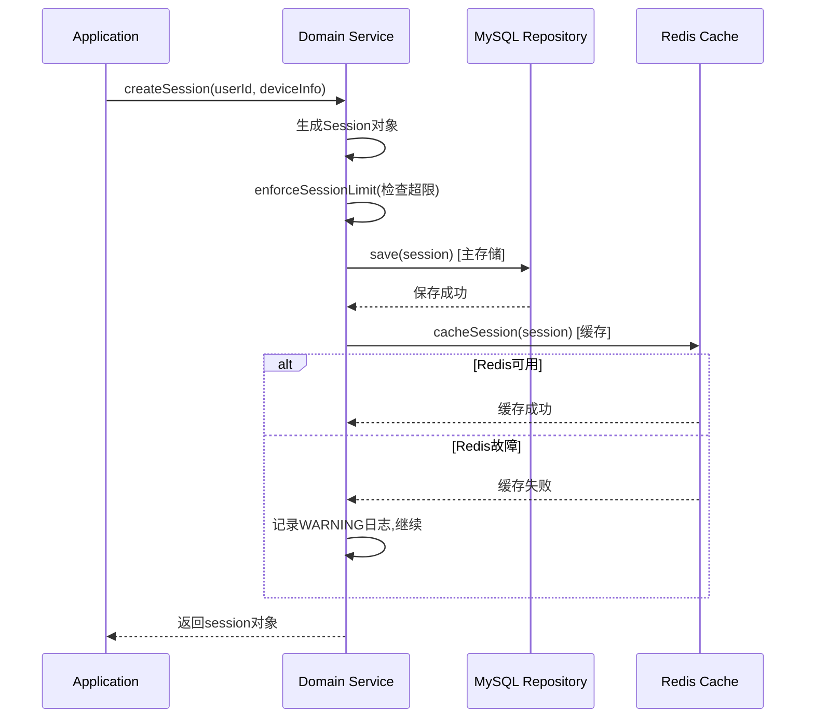
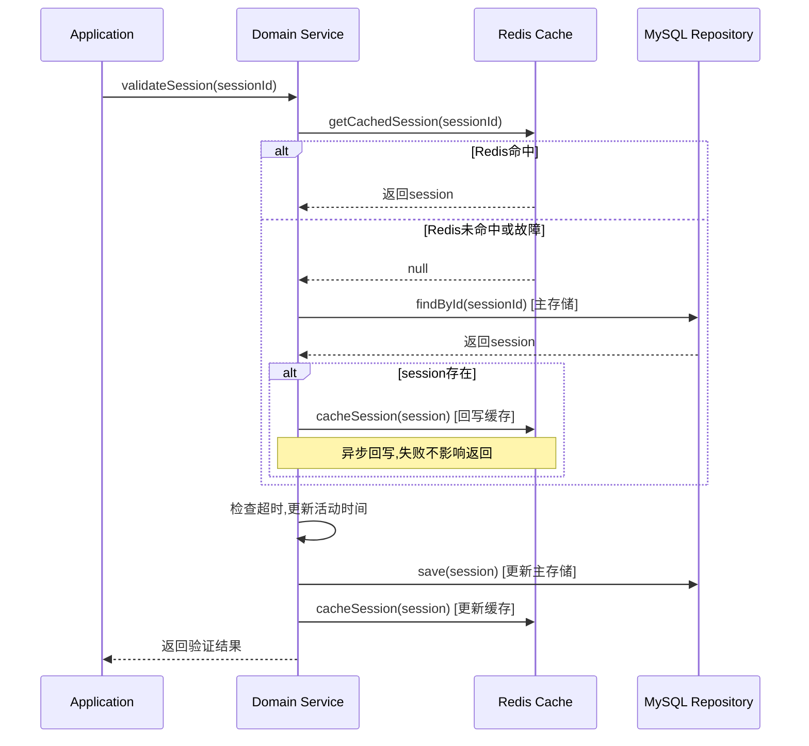
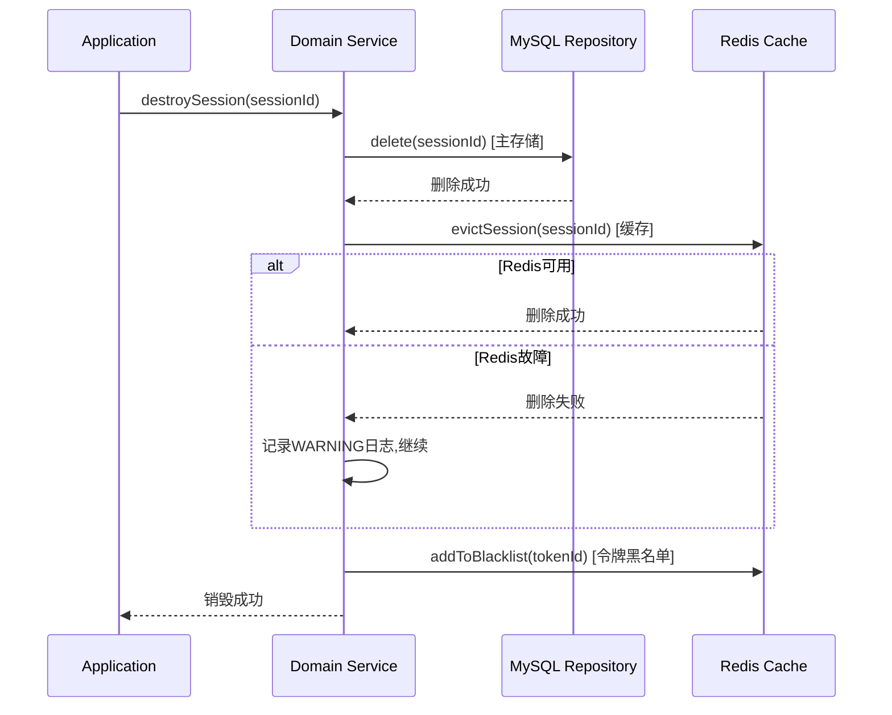

# 会话管理存储策略修正方案

## 问题说明

当前设计中的存储策略存在数据一致性问题:
- 错误地将Redis定位为"主存储"
- 采用"双写"策略,在Redis故障时会导致数据不一致
- 没有明确缓存更新和失效策略

## 正确的存储策略

### 核心原则

**MySQL是主存储(Source of Truth)**:
- 所有写操作必须先写MySQL
- MySQL保证数据持久化和可靠性
- MySQL是数据的唯一真实来源

**Redis是缓存(Cache)**:
- Redis用于提升读性能
- Redis故障不影响数据完整性
- 遵循Cache-Aside模式

### Cache-Aside模式

#### 写操作流程

```
1. 写入MySQL(主存储)
2. 如果MySQL写入成功:
   - 更新Redis缓存
   - 如果Redis更新失败,仅记录日志(不影响业务)
3. 如果MySQL写入失败:
   - 返回错误
   - 不更新Redis
```

#### 读操作流程

```
1. 尝试从Redis读取
2. 如果Redis命中:
   - 直接返回数据
3. 如果Redis未命中或故障:
   - 从MySQL读取
   - 如果MySQL有数据:
     - 写入Redis(异步,失败不影响返回)
     - 返回数据
   - 如果MySQL也没有:
     - 返回不存在
```

#### 删除操作流程

```
1. 从MySQL删除
2. 如果MySQL删除成功:
   - 从Redis删除
   - 如果Redis删除失败,仅记录日志
3. 如果MySQL删除失败:
   - 返回错误
   - 不删除Redis
```

### 修正后的业务流程

#### 会话创建流程



#### 会话验证流程



#### 会话销毁流程



### 数据一致性保证

#### 一致性策略

| 场景 | MySQL | Redis | 一致性保证 |
|------|-------|-------|-----------|
| 创建会话 | 先写 | 后写 | MySQL成功即成功,Redis失败不影响 |
| 验证会话 | 后读 | 先读 | Redis未命中则读MySQL并回写 |
| 更新会话 | 先写 | 后写 | MySQL成功即成功,Redis失败不影响 |
| 删除会话 | 先删 | 后删 | MySQL成功即成功,Redis失败不影响 |

#### Redis故障处理

**Redis完全不可用时**:
- 所有读操作直接访问MySQL
- 所有写操作只写MySQL
- 性能下降但功能正常
- 监控系统发出告警

**Redis部分故障时**:
- 读操作失败时降级到MySQL
- 写操作失败时记录日志继续
- 自动重试机制

#### 缓存失效策略

**主动失效**:
- 更新操作后立即更新缓存
- 删除操作后立即删除缓存

**被动失效**:
- 设置TTL,自动过期
- TTL = 会话的绝对超时时长

**缓存预热**:
- 系统启动时不预热
- 按需加载(Lazy Loading)

### 性能影响分析

#### Redis正常时

| 操作 | 响应时间 | 说明 |
|------|---------|------|
| 创建会话 | ~150ms | MySQL写入(100ms) + Redis写入(50ms) |
| 验证会话(命中) | ~10ms | Redis读取 |
| 验证会话(未命中) | ~120ms | MySQL读取(100ms) + Redis回写(20ms) |
| 删除会话 | ~120ms | MySQL删除(100ms) + Redis删除(20ms) |

#### Redis故障时

| 操作 | 响应时间 | 说明 |
|------|---------|------|
| 创建会话 | ~100ms | 仅MySQL写入 |
| 验证会话 | ~100ms | 仅MySQL读取 |
| 删除会话 | ~100ms | 仅MySQL删除 |

**结论**: Redis故障时性能下降约20-30%,但仍能满足性能要求(<200ms)

### 修正后的ADR

**ADR-004: MySQL主存储+Redis缓存(Cache-Aside模式)**

- **决策日期**: 2024-11-28
- **状态**: 已接受
- **背景**: 需要高性能和高可用性,同时保证数据一致性
- **决策**: MySQL作为主存储,Redis作为缓存层,采用Cache-Aside模式
- **理由**:
  - MySQL提供持久化和数据可靠性保证(ACID)
  - Redis提供高性能读取能力(内存访问)
  - Cache-Aside模式是业界成熟的缓存模式
  - 写操作先写MySQL再更新Redis,保证数据不丢失
  - 读操作优先读Redis,未命中则读MySQL并回写Redis
  - Redis故障时自动降级到MySQL,不影响数据完整性
- **替代方案**: 
  - Write-Through模式: 写操作同时写MySQL和Redis,复杂度高
  - Write-Behind模式: 先写Redis再异步写MySQL,数据丢失风险高
- **后果**: 
  - 需要实现缓存更新和失效逻辑
  - Redis故障时性能下降20-30%但功能正常
  - 缓存和数据库可能短暂不一致(最终一致性)

### 需要修改的文档位置

1. **需求文档** (requirements.md)
   - 需求8: 存储和降级 - 修改描述为"MySQL主存储+Redis缓存"

2. **设计文档** (design.md)
   - 1.1 需求概述 - 修改"存储降级"描述
   - 1.1 技术约束 - 修改存储策略描述
   - 2.2 动态行为设计 - 修改所有业务流程图
   - 2.3.1 性能策略 - 修改缓存策略描述
   - 4.3 ADR-004 - 完全重写

3. **配置文件**
   - 修改配置项命名和说明

## 实施建议

1. **立即修正**: 这是架构级别的问题,必须在实现前修正
2. **更新文档**: 系统地更新所有相关文档
3. **代码实现**: 严格按照Cache-Aside模式实现
4. **测试验证**: 
   - 单元测试验证缓存逻辑
   - 集成测试验证Redis故障场景
   - 性能测试验证降级后性能

