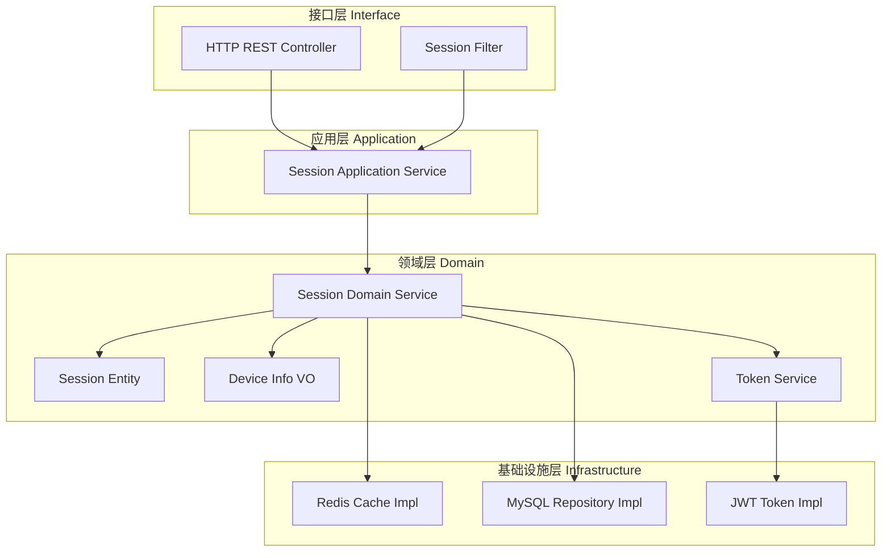
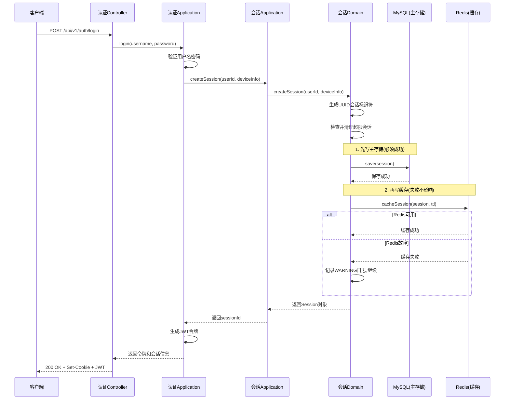
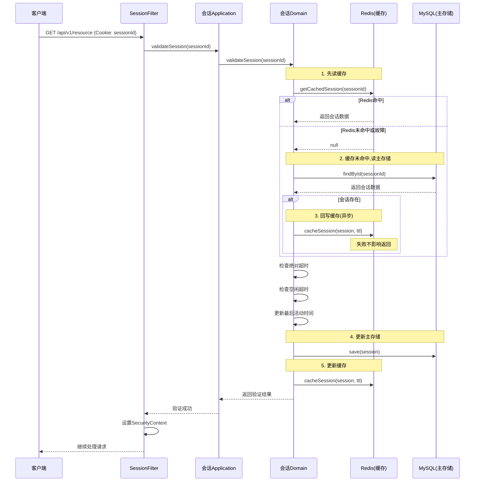
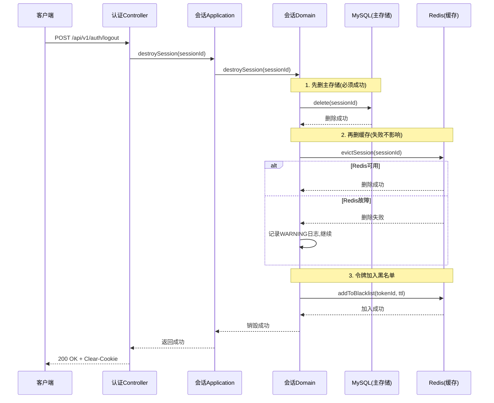
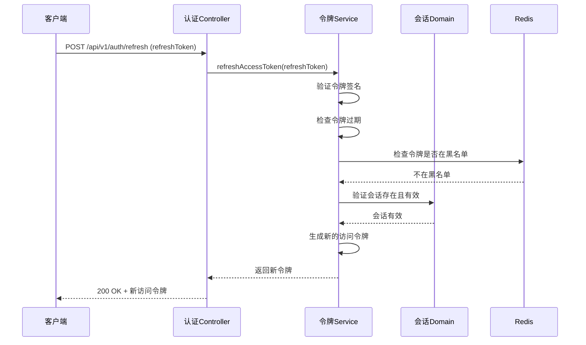
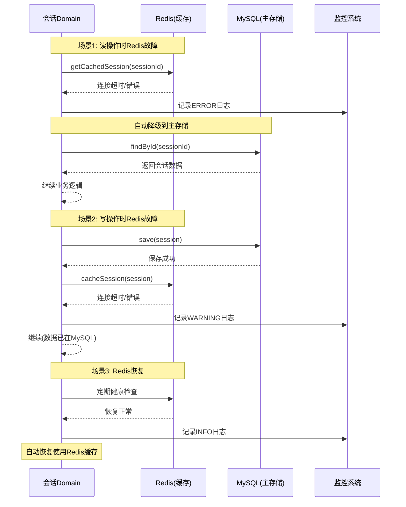
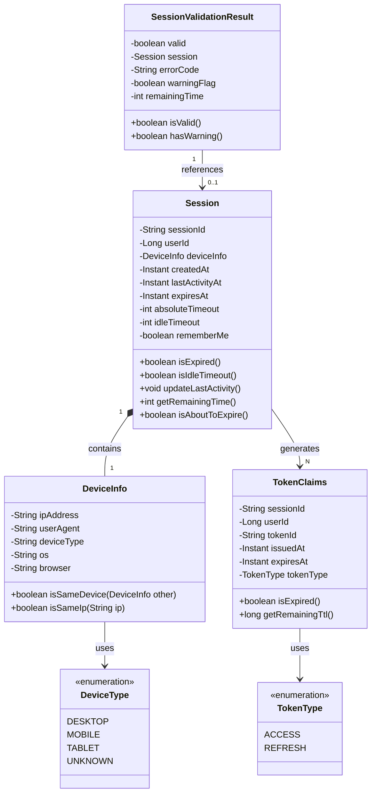
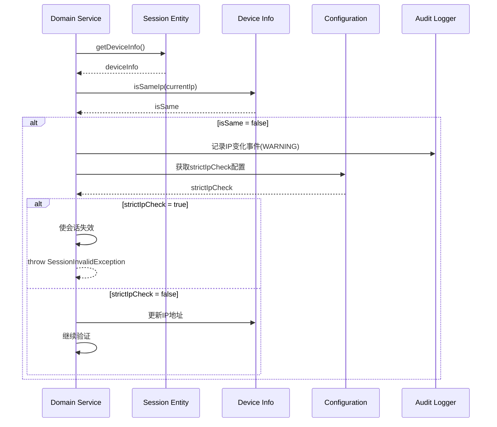
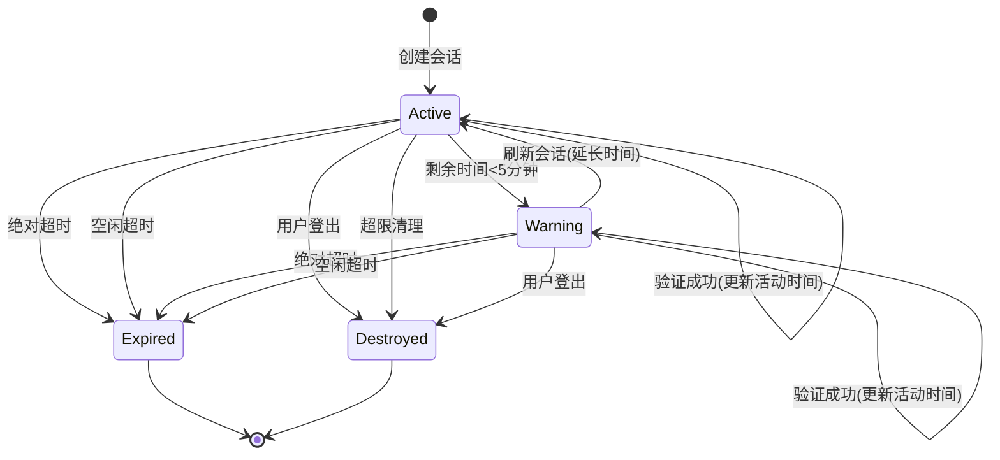

# 会话管理功能设计文档

## 文档信息

| 项目 | 内容 |
|------|------|
| 功能名称 | 会话管理 (Session Management) |
| 功能编号 | F01-4 |
| 设计版本 | v1.3 |
| 创建日期 | 2024-11-28 |
| 最后更新 | 2024-11-28 |
| 设计者 | AI Assistant |
| 审核者 | 待定 |

## 变更历史

| 版本 | 日期 | 变更内容 | 变更人 |
|------|------|----------|--------|
| v1.0 | 2024-11-28 | 初始版本 | AI Assistant |
| v1.1 | 2024-11-28 | 修正存储策略:从"Redis主存储+MySQL降级"改为"MySQL主存储+Redis缓存(Cache-Aside模式)" | AI Assistant |
| v1.2 | 2024-11-28 | 修正异常处理:从自定义异常层次结构改为统一的BusinessException/SystemException+ErrorCode模式 | AI Assistant |
| v1.3 | 2024-11-28 | 修正错误码格式:从"AUTH-XXX-XXX"改为"AUTH_XXX"格式,符合项目ErrorCode接口规范 | AI Assistant |

---

## 第1步: 需求理解与分析

### 1.1 需求概述

会话管理功能(F01-4)是AIOps Service认证系统的核心组件,负责为已认证用户提供安全的会话生命周期管理。该功能需要实现:

**核心业务目标**:
- 为已认证用户创建和维护会话状态
- 在多个HTTP请求之间保持用户认证状态
- 支持多设备并发会话管理
- 防御常见的基于会话的安全攻击
- 提供高性能、高可用的会话服务

**关键功能列表**:
1. **会话创建**: 用户登录成功后创建安全会话
2. **会话验证**: 每次请求时验证会话有效性
3. **会话超时控制**: 支持绝对超时和空闲超时
4. **会话销毁**: 用户登出时销毁会话
5. **多设备管理**: 支持跨设备的多会话管理
6. **安全防护**: 防御会话固定、会话劫持、CSRF、XSS攻击
7. **JWT令牌支持**: 为API客户端提供无状态认证
8. **存储策略**: MySQL主存储+Redis缓存(Cache-Aside模式)
9. **性能保障**: 验证<50ms P95, 创建<200ms P95
10. **配置管理**: 可配置的超时时长和安全策略
11. **审计监控**: 完整的会话操作审计日志


**非功能需求与量化指标**:

| 类别 | 指标 | 目标值 | 验证方法 |
|------|------|--------|----------|
| **性能** | 会话验证响应时间 | < 50ms (P95) | 性能测试 |
| **性能** | 会话创建响应时间 | < 200ms (P95) | 性能测试 |
| **性能** | 并发会话验证 | 1000 QPS | 压力测试 |
| **性能** | 序列化/反序列化 | < 10ms | 单元测试 |
| **容量** | 活跃会话数 | 10,000+ | 容量测试 |
| **容量** | Redis内存使用 | ~20MB (10k会话) | 监控统计 |
| **容量** | 单会话数据大小 | < 5KB | 数据验证 |
| **可用性** | 系统可用性 | 99.9% (24小时) | 监控统计 |
| **可用性** | Redis降级时间 | < 1秒 | 故障演练 |
| **安全** | 会话标识符熵值 | >= 128位 | 代码审查 |
| **安全** | Cookie安全属性 | HttpOnly+Secure+SameSite | 代码审查 |
| **审计** | 审计日志保留 | >= 30天 | 配置验证 |

**技术约束**:
- 必须使用MySQL作为主存储,Redis作为缓存层
- 必须采用Cache-Aside缓存模式
- 必须支持JWT令牌认证
- 必须遵循DDD分层架构
- 必须使用Spring Security框架
- 会话标识符必须使用UUID v4算法

**业务约束**:
- 默认每用户最多5个并发会话
- 默认绝对超时8小时,空闲超时30分钟
- "记住我"功能延长超时至30天
- 支持单设备模式(可配置)

### 1.2 需求分析要点

**关键业务场景**:
1. **Web浏览器认证**: 用户通过浏览器登录,使用Cookie存储会话标识符
2. **API客户端认证**: 移动应用或第三方服务使用JWT令牌认证
3. **多设备使用**: 用户同时在办公室电脑、家里电脑、手机上登录
4. **安全登出**: 用户从一个设备登出,或终止其他设备的会话
5. **会话过期**: 长时间不活动或达到最大时长后自动过期
6. **Redis故障**: Redis不可用时自动降级到MySQL

**核心技术挑战**:
1. **高性能要求**: 验证<50ms,需要高效的缓存策略
2. **安全防护**: 需要防御多种会话攻击
3. **缓存一致性**: 需要保证MySQL和Redis的数据一致性
4. **多设备管理**: 需要高效的会话查询和管理
5. **令牌黑名单**: 需要高效的令牌失效机制
6. **Redis故障处理**: Redis故障时需要自动降级到MySQL

---

## 第2步: 高层设计

### 2.1 静态结构设计

#### 2.1.1 系统边界分析

**系统内部**(需要实现的功能):
- 会话创建服务
- 会话验证服务
- 会话销毁服务
- 多设备会话管理服务
- JWT令牌生成和验证服务
- 令牌黑名单管理
- 会话存储管理(Redis/MySQL)
- 审计日志记录

**系统外部**(外部依赖):
- **认证服务**: 提供用户认证结果,触发会话创建
- **MySQL**: 主存储,提供数据持久化和可靠性保证
- **Redis**: 缓存层,提供高性能读取能力
- **Spring Security**: 提供安全框架支持
- **监控系统**: 接收性能指标和告警

**关键交互**:
- 用户通过HTTP请求与系统交互
- 系统通过JDBC与MySQL交互
- 系统通过Redis客户端与Redis交互
- 系统通过日志框架记录审计日志


#### 2.1.2 功能模块划分

基于DDD分层架构和六边形架构原则,系统划分为以下模块:



**模块职责说明**:

| 模块 | 职责 | 依赖 |
|------|------|------|
| **HTTP REST Controller** | 处理会话管理相关HTTP请求 | Application Service |
| **Session Filter** | 拦截请求,验证会话有效性 | Application Service |
| **Session Application Service** | 编排会话业务用例,控制事务 | Domain Service |
| **Session Domain Service** | 实现核心会话业务逻辑 | Session Entity, Repository, Cache |
| **Session Entity** | 会话聚合根,包含会话数据和业务规则 | - |
| **Device Info VO** | 设备信息值对象 | - |
| **Token Service** | JWT令牌生成和验证 | JWT Implementation |
| **Redis Cache Impl** | Redis会话存储实现 | Redis Client |
| **MySQL Repository Impl** | MySQL会话存储实现 | MyBatis |
| **JWT Token Impl** | JWT令牌具体实现 | JJWT Library |

**架构决策记录 (ADR-001): 采用DDD分层架构**

- **决策**: 采用DDD分层架构和六边形架构
- **理由**:
  - 清晰的职责边界,易于维护和测试
  - 领域逻辑与技术实现解耦
  - 符合项目整体架构风格
  - 支持存储层的灵活切换(Redis/MySQL)
- **替代方案**: 传统三层架构
  - 不选择原因: 业务逻辑容易泄漏到应用层,不利于复杂业务规则的管理
- **影响**: 需要定义清晰的接口边界,增加一定的代码量


#### 2.1.3 技术栈选择

**核心技术栈**:

| 技术域 | 选择 | 版本 | 选择理由 | 替代方案 |
|--------|------|------|----------|----------|
| **编程语言** | Java | 21 LTS | 项目统一技术栈,支持虚拟线程 | - |
| **应用框架** | Spring Boot | 3.4.1 | 项目统一框架,成熟稳定 | - |
| **安全框架** | Spring Security | 6.4.x | 与Spring Boot深度集成,功能完善 | Apache Shiro |
| **JWT库** | JJWT | 0.12.6 | 功能完整,API友好,安全性好 | Auth0 JWT |
| **Redis客户端** | Spring Data Redis | 3.4.x | Spring官方支持,与Spring Boot集成好 | Lettuce, Jedis |
| **数据库** | MySQL | 8.0+ | 项目统一数据库 | - |
| **ORM框架** | MyBatis-Plus | 3.5.7 | 项目统一ORM框架 | - |
| **JSON序列化** | Jackson | 2.17.x | Spring Boot默认,性能好 | Gson, Fastjson |
| **UUID生成** | Java UUID | JDK内置 | 标准库,无需额外依赖 | - |

**架构决策记录 (ADR-002): 选择JJWT作为JWT库**

- **决策**: 使用JJWT (io.jsonwebtoken:jjwt-api:0.12.6)
- **理由**:
  - API设计优雅,易于使用
  - 支持多种签名算法(HS256, RS256等)
  - 安全性经过验证,社区活跃
  - 文档完善,示例丰富
- **替代方案**: Auth0 Java JWT
  - 不选择原因: API相对复杂,学习曲线较陡
- **影响**: 需要添加JJWT依赖,约200KB

**架构决策记录 (ADR-003): 使用Spring Data Redis**

- **决策**: 使用Spring Data Redis作为Redis客户端
- **理由**:
  - 与Spring Boot无缝集成
  - 提供统一的数据访问抽象
  - 支持多种序列化方式
  - 自动配置,开箱即用
- **替代方案**: 直接使用Lettuce或Jedis
  - 不选择原因: 需要手动配置,代码量更大
- **影响**: 依赖Spring Data Redis模块

#### 2.1.4 模块间接口协议

**接口通信方式**:

| 接口类型 | 协议 | 数据格式 | 说明 |
|---------|------|----------|------|
| **HTTP API** | RESTful HTTP/1.1 | JSON | 外部客户端调用 |
| **内部方法调用** | Java方法调用 | Java对象 | 模块间同步调用 |
| **Redis通信** | Redis Protocol | JSON字符串 | 会话数据存储 |
| **MySQL通信** | JDBC | SQL | 会话数据持久化 |

**API设计风格**:
- 遵循RESTful设计原则
- 使用标准HTTP方法(GET, POST, DELETE)
- 使用标准HTTP状态码(200, 401, 404等)
- 统一的响应格式(Result<T>)
- 统一的错误码体系


### 2.2 动态行为设计

#### 2.2.1 关键业务流程

**流程1: 用户登录创建会话**



**流程2: 请求验证会话**



**流程3: 用户登出销毁会话**




**流程4: 刷新访问令牌**



**流程5: Redis故障处理(Cache-Aside模式)**



### 2.3 辅助设计

#### 2.3.1 性能策略

**缓存策略(Cache-Aside模式)**:
- **主存储**: MySQL,提供数据持久化和可靠性保证
- **缓存层**: Redis,提供高性能读取能力
- **缓存键设计**: 
  - 会话数据: `session:{sessionId}`
  - 用户会话列表: `user:sessions:{userId}` (Set类型)
  - 令牌黑名单: `token:blacklist:{tokenId}`
- **TTL策略**: 
  - 会话数据TTL = 绝对超时时长
  - 黑名单TTL = 令牌剩余有效期
- **缓存更新策略**:
  - 写操作: 先写MySQL,再更新Redis
  - 读操作: 先读Redis,未命中则读MySQL并回写Redis
  - 删除操作: 先删MySQL,再删Redis
- **缓存失效**: TTL自动过期 + 主动删除

**异步处理**:
- 会话清理任务异步执行(MySQL定时清理)
- 审计日志异步写入

**批量操作**:
- 查询用户所有会话时批量从Redis获取
- 终止其他会话时批量删除

**性能优化措施**:
- 使用连接池管理Redis和MySQL连接
- 序列化使用高效的JSON库(Jackson)
- 避免在验证路径上进行复杂计算
- 使用索引优化MySQL查询


#### 2.3.2 安全策略

**会话安全**:
- **会话标识符生成**: 使用UUID v4算法,保证128位熵值
- **会话固定防护**: 认证成功后重新生成会话标识符
- **Cookie安全属性**:
  - `HttpOnly`: 防止JavaScript访问
  - `Secure`: 仅HTTPS传输
  - `SameSite=Strict`: 防止CSRF攻击
- **IP地址检查**: 
  - 记录会话创建时的IP地址
  - 检测IP变化并记录安全事件
  - 可配置严格模式(IP变化时失效会话)

**令牌安全**:
- **签名算法**: 使用HS256算法签名JWT
- **密钥管理**: JWT密钥从配置文件读取,不硬编码
- **令牌过期**: 访问令牌15分钟,刷新令牌30天
- **令牌黑名单**: 登出时将刷新令牌加入黑名单

**数据安全**:
- 敏感数据不存储在会话中(如密码)
- 会话数据序列化为JSON存储
- 传输层使用HTTPS加密

**审计安全**:
- 记录所有会话创建、销毁事件
- 记录IP地址变化事件
- 记录验证失败事件

#### 2.3.3 可观测性策略

**日志策略**:
- **INFO级别**: 会话创建、销毁、令牌刷新
- **WARNING级别**: IP地址变化、验证失败、性能超标
- **ERROR级别**: Redis故障、存储失败

**监控指标**:
- 会话验证响应时间(P50, P95, P99)
- 会话创建响应时间(P50, P95, P99)
- 活跃会话数量
- Redis命中率
- Redis故障次数
- 验证失败次数

**链路追踪**:
- 使用Micrometer Tracing自动生成traceId
- 日志中包含traceId便于问题排查

**告警规则**:
- 验证响应时间P95 > 50ms
- 创建响应时间P95 > 200ms
- Redis连接失败
- Redis内存使用 > 50MB
- 验证失败率 > 5%

---

## 第3步: 详细设计

### 3.1 静态结构设计

#### 3.1.1 接口定义

**HTTP API接口规范 (OpenAPI 3.0)**

```yaml
openapi: 3.0.0
info:
  title: Session Management API
  version: 1.0.0
  description: 会话管理API接口

paths:
  /api/v1/sessions:
    get:
      summary: 查询当前用户的所有活跃会话
      operationId: listSessions
      tags:
        - Session Management
      security:
        - bearerAuth: []
      responses:
        '200':
          description: 查询成功
          content:
            application/json:
              schema:
                $ref: '#/components/schemas/SessionListResponse'
        '401':
          description: 未认证
          content:
            application/json:
              schema:
                $ref: '#/components/schemas/ErrorResponse'

  /api/v1/sessions/{sessionId}:
    delete:
      summary: 终止指定会话
      operationId: terminateSession
      tags:
        - Session Management
      security:
        - bearerAuth: []
      parameters:
        - name: sessionId
          in: path
          required: true
          schema:
            type: string
            format: uuid
      responses:
        '200':
          description: 终止成功
          content:
            application/json:
              schema:
                $ref: '#/components/schemas/SuccessResponse'
        '403':
          description: 无权限终止该会话
        '404':
          description: 会话不存在

  /api/v1/sessions/terminate-others:
    post:
      summary: 终止除当前会话外的所有其他会话
      operationId: terminateOtherSessions
      tags:
        - Session Management
      security:
        - bearerAuth: []
      responses:
        '200':
          description: 终止成功
          content:
            application/json:
              schema:
                $ref: '#/components/schemas/TerminateOthersResponse'

  /api/v1/auth/refresh:
    post:
      summary: 刷新访问令牌
      operationId: refreshToken
      tags:
        - Authentication
      requestBody:
        required: true
        content:
          application/json:
            schema:
              $ref: '#/components/schemas/RefreshTokenRequest'
      responses:
        '200':
          description: 刷新成功
          content:
            application/json:
              schema:
                $ref: '#/components/schemas/RefreshTokenResponse'
        '401':
          description: 刷新令牌无效或已过期

components:
  securitySchemes:
    bearerAuth:
      type: http
      scheme: bearer
      bearerFormat: JWT

  schemas:
    SessionListResponse:
      type: object
      properties:
        success:
          type: boolean
          example: true
        data:
          type: object
          properties:
            sessions:
              type: array
              items:
                $ref: '#/components/schemas/SessionInfo'

    SessionInfo:
      type: object
      properties:
        sessionId:
          type: string
          format: uuid
          description: 会话标识符
        deviceType:
          type: string
          description: 设备类型
          example: "Desktop"
        browser:
          type: string
          description: 浏览器名称和版本
          example: "Chrome 120.0"
        os:
          type: string
          description: 操作系统
          example: "Windows 11"
        ipAddress:
          type: string
          description: IP地址
          example: "192.168.1.100"
        loginTime:
          type: string
          format: date-time
          description: 登录时间
        lastActivityTime:
          type: string
          format: date-time
          description: 最后活动时间
        isCurrent:
          type: boolean
          description: 是否为当前会话

    RefreshTokenRequest:
      type: object
      required:
        - refreshToken
      properties:
        refreshToken:
          type: string
          description: 刷新令牌

    RefreshTokenResponse:
      type: object
      properties:
        success:
          type: boolean
        data:
          type: object
          properties:
            accessToken:
              type: string
              description: 新的访问令牌
            expiresIn:
              type: integer
              description: 过期时间(秒)
              example: 900

    TerminateOthersResponse:
      type: object
      properties:
        success:
          type: boolean
        data:
          type: object
          properties:
            terminatedCount:
              type: integer
              description: 终止的会话数量

    SuccessResponse:
      type: object
      properties:
        success:
          type: boolean
          example: true
        message:
          type: string
          example: "操作成功"

    ErrorResponse:
      type: object
      properties:
        success:
          type: boolean
          example: false
        code:
          type: string
          description: 错误码
          example: "AUTH_101"
        message:
          type: string
          description: 错误消息
          example: "您的会话已过期。请重新登录。"
```


**错误码定义**

| 错误码 | HTTP状态码 | 描述 | 用户消息 |
|--------|-----------|------|----------|
| AUTH_101 | 401 | 会话已过期(绝对超时) | 您的会话已过期。请重新登录。 |
| AUTH_102 | 401 | 会话空闲超时 | 您的会话已过期。请重新登录。 |
| AUTH_103 | 401 | 会话不存在 | 会话不存在或已失效。请重新登录。 |
| AUTH_104 | 401 | 会话数据损坏 | 会话数据异常。请重新登录。 |
| AUTH_201 | 401 | 令牌已过期 | 令牌已过期。请刷新令牌或重新登录。 |
| AUTH_202 | 401 | 令牌无效 | 令牌无效。请重新登录。 |
| AUTH_203 | 401 | 令牌已被列入黑名单 | 令牌已失效。请重新登录。 |
| AUTHZ_001 | 403 | 无权限操作 | 您无权执行此操作。 |
| SYS_001 | 500 | Redis连接失败 | 缓存服务暂时不可用 |
| SYS_002 | 500 | MySQL连接失败 | 系统暂时不可用,请稍后重试 |
| SYS_003 | 500 | 数据序列化失败 | 数据处理异常 |

**内部接口定义 (Java)**

```java
// Application Service 接口
public interface SessionApplicationService {
    /**
     * 创建会话
     * @param userId 用户ID
     * @param deviceInfo 设备信息
     * @param rememberMe 是否记住我
     * @return 会话对象
     */
    Session createSession(Long userId, DeviceInfo deviceInfo, boolean rememberMe);
    
    /**
     * 验证会话
     * @param sessionId 会话标识符
     * @return 验证结果
     * @throws BusinessException 会话过期或不存在时抛出
     *         - SessionErrorCode.SESSION_EXPIRED: 会话绝对超时
     *         - SessionErrorCode.SESSION_IDLE_TIMEOUT: 会话空闲超时
     *         - SessionErrorCode.SESSION_NOT_FOUND: 会话不存在
     *         - SessionErrorCode.SESSION_CORRUPTED: 会话数据损坏
     */
    SessionValidationResult validateSession(String sessionId);
    
    /**
     * 销毁会话
     * @param sessionId 会话标识符
     */
    void destroySession(String sessionId);
    
    /**
     * 查询用户的所有活跃会话
     * @param userId 用户ID
     * @return 会话列表
     */
    List<Session> listUserSessions(Long userId);
    
    /**
     * 终止指定会话
     * @param sessionId 会话标识符
     * @param currentUserId 当前用户ID
     * @throws BusinessException 无权限终止该会话
     *         - SessionErrorCode.FORBIDDEN: 无权限操作
     *         - SessionErrorCode.SESSION_NOT_FOUND: 会话不存在
     */
    void terminateSession(String sessionId, Long currentUserId);
    
    /**
     * 终止除当前会话外的所有其他会话
     * @param currentSessionId 当前会话标识符
     * @param userId 用户ID
     * @return 终止的会话数量
     */
    int terminateOtherSessions(String currentSessionId, Long userId);
}

// Domain Service 接口
public interface SessionDomainService {
    /**
     * 创建会话
     * @param userId 用户ID
     * @param deviceInfo 设备信息
     * @param absoluteTimeout 绝对超时时长(秒)
     * @param idleTimeout 空闲超时时长(秒)
     * @return 会话实体
     */
    Session createSession(Long userId, DeviceInfo deviceInfo, 
                         int absoluteTimeout, int idleTimeout);
    
    /**
     * 验证会话
     * @param sessionId 会话标识符
     * @return 会话实体
     * @throws BusinessException 会话验证失败
     *         - SessionErrorCode.SESSION_EXPIRED: 会话绝对超时
     *         - SessionErrorCode.SESSION_IDLE_TIMEOUT: 会话空闲超时
     *         - SessionErrorCode.SESSION_NOT_FOUND: 会话不存在
     *         - SessionErrorCode.SESSION_CORRUPTED: 会话数据损坏
     */
    Session validateAndRefreshSession(String sessionId);
    
    /**
     * 销毁会话
     * @param sessionId 会话标识符
     */
    void destroySession(String sessionId);
    
    /**
     * 查询用户的所有会话
     * @param userId 用户ID
     * @return 会话列表
     */
    List<Session> findUserSessions(Long userId);
    
    /**
     * 检查并清理超限会话
     * @param userId 用户ID
     * @param maxSessions 最大会话数
     */
    void enforceSessionLimit(Long userId, int maxSessions);
    
    /**
     * 检查IP地址变化
     * @param session 会话对象
     * @param currentIp 当前IP地址
     * @return 是否发生变化
     */
    boolean checkIpChange(Session session, String currentIp);
}

// Token Service 接口
public interface TokenService {
    /**
     * 生成访问令牌
     * @param sessionId 会话标识符
     * @param userId 用户ID
     * @return JWT访问令牌
     */
    String generateAccessToken(String sessionId, Long userId);
    
    /**
     * 生成刷新令牌
     * @param sessionId 会话标识符
     * @param userId 用户ID
     * @return JWT刷新令牌
     */
    String generateRefreshToken(String sessionId, Long userId);
    
    /**
     * 验证访问令牌
     * @param token 访问令牌
     * @return 令牌声明
     * @throws BusinessException 令牌验证失败
     *         - SessionErrorCode.TOKEN_EXPIRED: 令牌已过期
     *         - SessionErrorCode.TOKEN_INVALID: 令牌无效
     */
    TokenClaims validateAccessToken(String token);
    
    /**
     * 验证刷新令牌
     * @param token 刷新令牌
     * @return 令牌声明
     * @throws BusinessException 令牌验证失败
     *         - SessionErrorCode.TOKEN_EXPIRED: 令牌已过期
     *         - SessionErrorCode.TOKEN_INVALID: 令牌无效
     *         - SessionErrorCode.TOKEN_BLACKLISTED: 令牌已被列入黑名单
     */
    TokenClaims validateRefreshToken(String token);
    
    /**
     * 将令牌加入黑名单
     * @param token 令牌
     * @param ttl 生存时间(秒)
     */
    void blacklistToken(String token, long ttl);
    
    /**
     * 检查令牌是否在黑名单中
     * @param token 令牌
     * @return 是否在黑名单中
     */
    boolean isTokenBlacklisted(String token);
}

// Repository 接口
public interface SessionRepository {
    /**
     * 保存会话
     * @param session 会话实体
     */
    void save(Session session);
    
    /**
     * 根据ID查询会话
     * @param sessionId 会话标识符
     * @return 会话实体,不存在返回null
     */
    Session findById(String sessionId);
    
    /**
     * 根据用户ID查询所有会话
     * @param userId 用户ID
     * @return 会话列表
     */
    List<Session> findByUserId(Long userId);
    
    /**
     * 删除会话
     * @param sessionId 会话标识符
     */
    void delete(String sessionId);
    
    /**
     * 批量删除会话
     * @param sessionIds 会话标识符列表
     */
    void batchDelete(List<String> sessionIds);
    
    /**
     * 删除过期会话(MySQL清理任务使用)
     * @return 删除的会话数量
     */
    int deleteExpiredSessions();
}

// Cache Service 接口
public interface SessionCacheService {
    /**
     * 缓存会话
     * @param session 会话实体
     * @param ttl 生存时间(秒)
     */
    void cacheSession(Session session, long ttl);
    
    /**
     * 获取缓存的会话
     * @param sessionId 会话标识符
     * @return 会话实体,不存在返回null
     */
    Session getCachedSession(String sessionId);
    
    /**
     * 删除缓存的会话
     * @param sessionId 会话标识符
     */
    void evictSession(String sessionId);
    
    /**
     * 缓存用户会话列表
     * @param userId 用户ID
     * @param sessionIds 会话标识符集合
     */
    void cacheUserSessions(Long userId, Set<String> sessionIds);
    
    /**
     * 获取用户会话列表
     * @param userId 用户ID
     * @return 会话标识符集合
     */
    Set<String> getUserSessionIds(Long userId);
    
    /**
     * 将令牌加入黑名单
     * @param tokenId 令牌ID
     * @param ttl 生存时间(秒)
     */
    void addToBlacklist(String tokenId, long ttl);
    
    /**
     * 检查令牌是否在黑名单中
     * @param tokenId 令牌ID
     * @return 是否在黑名单中
     */
    boolean isInBlacklist(String tokenId);
}
```


#### 3.1.2 数据结构设计

**核心实体和值对象**

| 实体/值对象 | 类型 | 属性 | 类型 | 必需 | 描述 | 约束 |
|------------|------|------|------|------|------|------|
| **Session** | 聚合根 | sessionId | String | 是 | 会话标识符 | UUID v4格式 |
| | | userId | Long | 是 | 用户ID | > 0 |
| | | deviceInfo | DeviceInfo | 是 | 设备信息 | 值对象 |
| | | createdAt | Instant | 是 | 创建时间 | ISO8601 |
| | | lastActivityAt | Instant | 是 | 最后活动时间 | ISO8601 |
| | | expiresAt | Instant | 是 | 过期时间 | ISO8601 |
| | | absoluteTimeout | int | 是 | 绝对超时(秒) | > 0 |
| | | idleTimeout | int | 是 | 空闲超时(秒) | > 0 |
| | | rememberMe | boolean | 是 | 是否记住我 | - |
| **DeviceInfo** | 值对象 | ipAddress | String | 是 | IP地址 | IPv4/IPv6格式 |
| | | userAgent | String | 是 | User-Agent | 最长500字符 |
| | | deviceType | String | 是 | 设备类型 | Desktop/Mobile/Tablet |
| | | os | String | 否 | 操作系统 | 如"Windows 11" |
| | | browser | String | 否 | 浏览器 | 如"Chrome 120.0" |
| **TokenClaims** | 值对象 | sessionId | String | 是 | 会话标识符 | UUID格式 |
| | | userId | Long | 是 | 用户ID | > 0 |
| | | tokenId | String | 是 | 令牌ID | UUID格式 |
| | | issuedAt | Instant | 是 | 颁发时间 | ISO8601 |
| | | expiresAt | Instant | 是 | 过期时间 | ISO8601 |
| | | tokenType | TokenType | 是 | 令牌类型 | ACCESS/REFRESH |
| **SessionValidationResult** | 值对象 | valid | boolean | 是 | 是否有效 | - |
| | | session | Session | 否 | 会话对象 | 有效时返回 |
| | | errorCode | String | 否 | 错误码 | 无效时返回 |
| | | warningFlag | boolean | 是 | 警告标志 | 即将过期时为true |
| | | remainingTime | int | 否 | 剩余时间(秒) | 警告时返回 |

**实体关系**

| 实体A | 关系 | 实体B | 多重性 | 描述 |
|-------|------|-------|--------|------|
| User | has | Session | 1:N | 一个用户可以有多个会话 |
| Session | contains | DeviceInfo | 1:1 | 每个会话包含一个设备信息 |
| Session | generates | TokenClaims | 1:N | 一个会话可以生成多个令牌 |

**枚举定义**

| 枚举类型 | 值 | 描述 |
|---------|---|------|
| **TokenType** | ACCESS | 访问令牌 |
| | REFRESH | 刷新令牌 |
| **DeviceType** | DESKTOP | 桌面设备 |
| | MOBILE | 移动设备 |
| | TABLET | 平板设备 |
| | UNKNOWN | 未知设备 |

**UML类图**




**数据存储格式**

**Redis存储格式 (JSON)**

```json
// 会话数据: session:{sessionId}
{
  "sessionId": "550e8400-e29b-41d4-a716-446655440000",
  "userId": 12345,
  "deviceInfo": {
    "ipAddress": "192.168.1.100",
    "userAgent": "Mozilla/5.0 (Windows NT 10.0; Win64; x64) Chrome/120.0.0.0",
    "deviceType": "DESKTOP",
    "os": "Windows 11",
    "browser": "Chrome 120.0"
  },
  "createdAt": "2024-11-28T10:00:00Z",
  "lastActivityAt": "2024-11-28T10:30:00Z",
  "expiresAt": "2024-11-28T18:00:00Z",
  "absoluteTimeout": 28800,
  "idleTimeout": 1800,
  "rememberMe": false
}

// 用户会话列表: user:sessions:{userId} (Set类型)
[
  "550e8400-e29b-41d4-a716-446655440000",
  "660e8400-e29b-41d4-a716-446655440001"
]

// 令牌黑名单: token:blacklist:{tokenId} (String类型,值为"1")
"1"
```

**MySQL持久化说明**

会话数据将在实现阶段根据Session实体映射到MySQL表结构,具体表结构由ORM框架(MyBatis-Plus)根据实体定义自动生成。主要包含会话标识符、用户ID、设备信息(JSON)、时间戳等字段,并在user_id和expires_at字段上创建索引以优化查询性能。

#### 3.1.3 核心方法定义

**Session实体的核心方法**

```java
public class Session {
    // 业务方法
    
    /**
     * 检查会话是否已过期(绝对超时)
     * @return 是否过期
     */
    public boolean isExpired() {
        return Instant.now().isAfter(expiresAt);
    }
    
    /**
     * 检查会话是否空闲超时
     * @return 是否超时
     */
    public boolean isIdleTimeout() {
        Instant idleExpireTime = lastActivityAt.plusSeconds(idleTimeout);
        return Instant.now().isAfter(idleExpireTime);
    }
    
    /**
     * 更新最后活动时间
     */
    public void updateLastActivity() {
        this.lastActivityAt = Instant.now();
    }
    
    /**
     * 获取剩余有效时间(秒)
     * @return 剩余时间,已过期返回0
     */
    public int getRemainingTime() {
        long remaining = expiresAt.getEpochSecond() - Instant.now().getEpochSecond();
        return (int) Math.max(0, remaining);
    }
    
    /**
     * 检查会话是否即将过期(剩余时间<5分钟)
     * @return 是否即将过期
     */
    public boolean isAboutToExpire() {
        return getRemainingTime() < 300 && getRemainingTime() > 0;
    }
    
    // Getter方法省略...
}
```

**DeviceInfo值对象的核心方法**

```java
public class DeviceInfo {
    /**
     * 检查是否为同一设备
     * @param other 另一个设备信息
     * @return 是否相同
     */
    public boolean isSameDevice(DeviceInfo other) {
        return this.userAgent.equals(other.userAgent);
    }
    
    /**
     * 检查是否为同一IP
     * @param ip IP地址
     * @return 是否相同
     */
    public boolean isSameIp(String ip) {
        return this.ipAddress.equals(ip);
    }
    
    // Getter方法省略...
}
```

**TokenClaims值对象的核心方法**

```java
public class TokenClaims {
    /**
     * 检查令牌是否已过期
     * @return 是否过期
     */
    public boolean isExpired() {
        return Instant.now().isAfter(expiresAt);
    }
    
    /**
     * 获取剩余TTL(秒)
     * @return 剩余时间
     */
    public long getRemainingTtl() {
        long remaining = expiresAt.getEpochSecond() - Instant.now().getEpochSecond();
        return Math.max(0, remaining);
    }
    
    // Getter方法省略...
}
```

 Domain->>Session: updateLastActivity()
    Domain->>Cache: cacheSession(session, ttl)
    
    Domain->>Session: isAboutToExpire()
    Session-->>Domain: aboutToExpire
    
    alt aboutToExpire = true
        Domain->>Domain: 设置警告标志
    end
    
    Domain-->>App: 返回SessionValidationResult
```

**流程3: IP地址变化检测流程**




#### 3.2.2 实体状态变化

**会话状态机**



**会话状态转换表**

| 当前状态 | 触发事件 | 条件 | 目标状态 | 副作用 |
|---------|---------|------|---------|--------|
| Active | 验证请求 | 未过期且未空闲超时 | Active | 更新lastActivityAt |
| Active | 验证请求 | 剩余时间<5分钟 | Warning | 更新lastActivityAt,设置警告标志 |
| Active | 验证请求 | 绝对超时 | Expired | 删除会话数据 |
| Active | 验证请求 | 空闲超时 | Expired | 删除会话数据 |
| Active | 用户登出 | - | Destroyed | 删除会话数据,令牌加入黑名单 |
| Active | 超限清理 | 会话数>maxSessions | Destroyed | 删除最旧会话 |
| Warning | 验证请求 | 未过期且未空闲超时 | Warning | 更新lastActivityAt,保持警告 |
| Warning | 验证请求 | 绝对超时 | Expired | 删除会话数据 |
| Warning | 验证请求 | 空闲超时 | Expired | 删除会话数据 |
| Warning | 用户登出 | - | Destroyed | 删除会话数据,令牌加入黑名单 |
| Warning | 刷新会话 | 用户延长会话 | Active | 更新expiresAt,清除警告 |

### 3.3 辅助设计

#### 3.3.1 详细性能设计

**缓存策略详细设计**

| 缓存项 | Redis键格式 | 数据类型 | TTL策略 | 更新策略 |
|--------|------------|---------|---------|---------|
| 会话数据 | `session:{sessionId}` | String (JSON) | 绝对超时时长 | 每次验证时更新 |
| 用户会话列表 | `user:sessions:{userId}` | Set | 无TTL | 创建/删除会话时更新 |
| 令牌黑名单 | `token:blacklist:{tokenId}` | String | 令牌剩余有效期 | 登出时添加 |

**序列化性能优化**

- 使用Jackson进行JSON序列化/反序列化
- 配置Jackson忽略null值,减少数据量
- 使用@JsonProperty注解优化字段名
- 预估单个会话序列化后大小: ~2KB

**数据库查询优化**

- 在user_id字段上创建索引
- 在expires_at字段上创建索引(用于清理任务)
- 使用批量查询减少数据库往返次数
- 清理任务使用LIMIT分批删除,避免长事务

**连接池配置**

| 连接池 | 最小连接数 | 最大连接数 | 超时时间 |
|--------|-----------|-----------|---------|
| Redis | 5 | 20 | 2000ms |
| MySQL | 5 | 20 | 3000ms |


#### 3.3.2 详细安全设计

**JWT令牌结构**

**访问令牌 (Access Token)**
```json
{
  "header": {
    "alg": "HS256",
    "typ": "JWT"
  },
  "payload": {
    "sub": "12345",
    "sessionId": "550e8400-e29b-41d4-a716-446655440000",
    "tokenId": "660e8400-e29b-41d4-a716-446655440001",
    "iat": 1701172800,
    "exp": 1701173700,
    "iss": "aiops-service"
  },
  "signature": "..."
}
```

**刷新令牌 (Refresh Token)**
```json
{
  "header": {
    "alg": "HS256",
    "typ": "JWT"
  },
  "payload": {
    "sub": "12345",
    "sessionId": "550e8400-e29b-41d4-a716-446655440000",
    "tokenId": "770e8400-e29b-41d4-a716-446655440002",
    "type": "refresh",
    "iat": 1701172800,
    "exp": 1703764800,
    "iss": "aiops-service"
  },
  "signature": "..."
}
```

**Cookie安全配置**

| Cookie名称 | 属性 | 值 | 说明 |
|-----------|------|---|------|
| SESSION_ID | HttpOnly | true | 防止JavaScript访问 |
| | Secure | true | 仅HTTPS传输 |
| | SameSite | Strict | 防止CSRF |
| | Path | / | 全站有效 |
| | MaxAge | 28800 | 8小时(秒) |
| | Domain | .aiops.com | 主域名 |

**安全检查清单**

| 检查项 | 实现方式 | 验证方法 |
|--------|---------|---------|
| 会话标识符随机性 | UUID v4,128位熵值 | 单元测试验证UUID格式 |
| 会话固定防护 | 认证后重新生成sessionId | 集成测试验证 |
| Cookie安全属性 | 设置HttpOnly+Secure+SameSite | 代码审查 |
| IP地址检查 | 记录并检测IP变化 | 集成测试验证 |
| 令牌签名验证 | JJWT库验证签名 | 单元测试验证 |
| 令牌黑名单 | Redis存储已失效令牌 | 集成测试验证 |
| 敏感数据保护 | 不在会话中存储密码 | 代码审查 |
| HTTPS传输 | 生产环境强制HTTPS | 配置验证 |

#### 3.3.3 详细错误处理

**异常处理模式**

遵循项目统一的异常处理规范,使用**BusinessException/SystemException + ErrorCode枚举**模式:

```java
// 业务异常示例
throw new BusinessException(SessionErrorCode.SESSION_EXPIRED);
throw new BusinessException(SessionErrorCode.SESSION_NOT_FOUND);
throw new BusinessException(SessionErrorCode.TOKEN_BLACKLISTED);

// 系统异常示例
throw new SystemException(StorageErrorCode.REDIS_CONNECTION_FAILED, cause);
throw new SystemException(StorageErrorCode.MYSQL_CONNECTION_FAILED, cause);
```

**错误码枚举定义**

```java
/**
 * 会话相关错误码
 * 
 * <p>错误码格式: AUTH_{序号}</p>
 * <p>HTTP状态码: 401 Unauthorized (AUTH_前缀)</p>
 */
public enum SessionErrorCode implements ErrorCode {
    // 会话过期相关
    SESSION_EXPIRED("AUTH_101", "您的会话已过期。请重新登录。"),
    SESSION_IDLE_TIMEOUT("AUTH_102", "您的会话已过期。请重新登录。"),
    
    // 会话不存在
    SESSION_NOT_FOUND("AUTH_103", "会话不存在或已失效。请重新登录。"),
    
    // 会话数据异常
    SESSION_CORRUPTED("AUTH_104", "会话数据异常。请重新登录。"),
    
    // 令牌相关
    TOKEN_EXPIRED("AUTH_201", "令牌已过期。请刷新令牌或重新登录。"),
    TOKEN_INVALID("AUTH_202", "令牌无效。请重新登录。"),
    TOKEN_BLACKLISTED("AUTH_203", "令牌已失效。请重新登录。"),
    
    // 权限相关
    FORBIDDEN("AUTHZ_001", "您无权执行此操作。");
    
    private final String code;
    private final String message;
    
    SessionErrorCode(String code, String message) {
        this.code = code;
        this.message = message;
    }
    
    @Override
    public String getCode() {
        return code;
    }
    
    @Override
    public String getMessage() {
        return message;
    }
}

/**
 * 存储相关错误码
 * 
 * <p>错误码格式: SYS_{序号}</p>
 * <p>HTTP状态码: 500 Internal Server Error (SYS_前缀)</p>
 */
public enum StorageErrorCode implements ErrorCode {
    REDIS_CONNECTION_FAILED("SYS_001", "缓存服务暂时不可用"),
    MYSQL_CONNECTION_FAILED("SYS_002", "系统暂时不可用,请稍后重试"),
    SERIALIZATION_FAILED("SYS_003", "数据处理异常");
    
    private final String code;
    private final String message;
    
    StorageErrorCode(String code, String message) {
        this.code = code;
        this.message = message;
    }
    
    @Override
    public String getCode() {
        return code;
    }
    
    @Override
    public String getMessage() {
        return message;
    }
}
```

**错误处理策略**

| 场景 | 异常类型 | 错误码枚举 | 错误码 | HTTP状态码 | 日志级别 | 用户消息 |
|------|---------|-----------|--------|-----------|---------|---------|
| 会话绝对超时 | BusinessException | SESSION_EXPIRED | AUTH_101 | 401 | INFO | 您的会话已过期。请重新登录。 |
| 会话空闲超时 | BusinessException | SESSION_IDLE_TIMEOUT | AUTH_102 | 401 | INFO | 您的会话已过期。请重新登录。 |
| 会话不存在 | BusinessException | SESSION_NOT_FOUND | AUTH_103 | 401 | WARNING | 会话不存在或已失效。请重新登录。 |
| 会话数据损坏 | BusinessException | SESSION_CORRUPTED | AUTH_104 | 401 | WARNING | 会话数据异常。请重新登录。 |
| 令牌过期 | BusinessException | TOKEN_EXPIRED | AUTH_201 | 401 | INFO | 令牌已过期。请刷新令牌或重新登录。 |
| 令牌无效 | BusinessException | TOKEN_INVALID | AUTH_202 | 401 | WARNING | 令牌无效。请重新登录。 |
| 令牌已列入黑名单 | BusinessException | TOKEN_BLACKLISTED | AUTH_203 | 401 | WARNING | 令牌已失效。请重新登录。 |
| 无权限操作 | BusinessException | FORBIDDEN | AUTHZ_001 | 403 | WARNING | 您无权执行此操作。 |
| Redis连接失败 | SystemException | REDIS_CONNECTION_FAILED | SYS_001 | 500 | ERROR | 缓存服务暂时不可用(降级到MySQL) |
| MySQL连接失败 | SystemException | MYSQL_CONNECTION_FAILED | SYS_002 | 500 | ERROR | 系统暂时不可用,请稍后重试 |
| 数据序列化失败 | SystemException | SERIALIZATION_FAILED | SYS_003 | 500 | ERROR | 数据处理异常 |
| IP地址变化 | - | - | - | - | WARNING | 记录日志,可选失效会话 |

**异常处理流程**

```java
// Domain Service中抛出异常
public Session validateAndRefreshSession(String sessionId) {
    Session session = findSession(sessionId);
    
    if (session == null) {
        throw new BusinessException(SessionErrorCode.SESSION_NOT_FOUND);
    }
    
    if (session.isExpired()) {
        throw new BusinessException(SessionErrorCode.SESSION_EXPIRED);
    }
    
    if (session.isIdleTimeout()) {
        throw new BusinessException(SessionErrorCode.SESSION_IDLE_TIMEOUT);
    }
    
    // 更新会话...
    return session;
}

// GlobalExceptionHandler统一处理
@ExceptionHandler(BusinessException.class)
public Result<Void> handleBusinessException(BusinessException e) {
    log.warn("Business exception: code={}, message={}", e.getErrorCode(), e.getErrorMessage());
    return Result.fail(e.getErrorCode(), e.getErrorMessage());
}

@ExceptionHandler(SystemException.class)
public Result<Void> handleSystemException(SystemException e) {
    log.error("System exception: code={}, message={}", e.getErrorCode(), e.getErrorMessage(), e);
    return Result.fail(e.getErrorCode(), e.getErrorMessage());
}
```

**重试策略**

| 操作 | 重试次数 | 重试间隔 | 降级策略 |
|------|---------|---------|---------|
| Redis读取 | 2次 | 100ms | 降级到MySQL |
| Redis写入 | 2次 | 100ms | 仅记录日志 |
| MySQL读取 | 3次 | 200ms | 返回错误 |
| MySQL写入 | 3次 | 200ms | 返回错误 |


---

## 第4步: 设计文档组织

### 4.1 模块文件组织

```
domain/
├── domain-api/
│   └── src/main/java/.../domain/
│       ├── model/
│       │   └── session/
│       │       ├── Session.java              # 会话聚合根
│       │       ├── DeviceInfo.java           # 设备信息值对象
│       │       ├── TokenClaims.java          # 令牌声明值对象
│       │       └── SessionValidationResult.java  # 验证结果值对象
│       └── service/
│           └── session/
│               ├── SessionDomainService.java  # 会话领域服务接口
│               └── TokenService.java          # 令牌服务接口
│
├── domain-impl/
│   └── src/main/java/.../domain/
│       └── service/
│           └── session/
│               ├── SessionDomainServiceImpl.java  # 会话领域服务实现
│               └── TokenServiceImpl.java          # 令牌服务实现
│
├── repository-api/
│   └── src/main/java/.../repository/
│       └── session/
│           ├── SessionRepository.java         # 会话仓储接口
│           └── entity/
│               └── SessionEntity.java         # 会话实体(持久化)
│
└── cache-api/
    └── src/main/java/.../cache/
        └── session/
            └── SessionCacheService.java       # 会话缓存服务接口

application/
├── application-api/
│   └── src/main/java/.../application/
│       └── service/
│           └── session/
│               └── SessionApplicationService.java  # 会话应用服务接口
│
└── application-impl/
    └── src/main/java/.../application/
        └── service/
            └── session/
                └── SessionApplicationServiceImpl.java  # 会话应用服务实现

interface/
└── interface-http/
    └── src/main/java/.../http/
        ├── controller/
        │   └── session/
        │       └── SessionController.java     # 会话管理Controller
        ├── filter/
        │   └── SessionValidationFilter.java   # 会话验证过滤器
        ├── request/
        │   └── session/
        │       └── RefreshTokenRequest.java   # 刷新令牌请求
        └── response/
            └── session/
                ├── SessionListResponse.java   # 会话列表响应
                └── RefreshTokenResponse.java  # 刷新令牌响应

infrastructure/
├── cache/
│   └── redis-impl/
│       └── src/main/java/.../cache/
│           └── session/
│               └── SessionCacheServiceImpl.java  # Redis缓存实现
│
├── repository/
│   └── mysql-impl/
│       └── src/main/java/.../repository/
│           └── session/
│               ├── SessionRepositoryImpl.java    # MySQL仓储实现
│               ├── mapper/
│               │   └── SessionMapper.java        # MyBatis Mapper
│               └── po/
│                   └── SessionPO.java            # 持久化对象
│
└── security/
    └── security-impl/
        └── src/main/java/.../security/
            └── jwt/
                └── JwtTokenServiceImpl.java      # JWT令牌实现
```

### 4.2 配置文件

**application.yml (会话管理配置)**

```yaml
aiops:
  session:
    # 超时配置
    timeout:
      absolute: 28800          # 绝对超时(秒),默认8小时
      idle: 1800               # 空闲超时(秒),默认30分钟
      remember-me: 2592000     # "记住我"超时(秒),默认30天
      warning-threshold: 300   # 过期警告阈值(秒),默认5分钟
    
    # 令牌配置
    token:
      access-token-expiration: 900      # 访问令牌过期时间(秒),默认15分钟
      refresh-token-expiration: 2592000 # 刷新令牌过期时间(秒),默认30天
      jwt-secret: ${JWT_SECRET:your-secret-key-change-in-production}
      jwt-issuer: aiops-service
    
    # 设备管理配置
    device:
      max-devices-per-user: 5   # 每用户最大设备数,默认5
      single-device-mode: false # 单设备模式,默认false
    
    # 安全配置
    security:
      strict-ip-check: false    # 严格IP检查,默认false
      session-fixation-protection: true  # 会话固定防护,默认true
    
    # Cookie配置
    cookie:
      name: SESSION_ID
      http-only: true
      secure: true
      same-site: Strict
      domain: .aiops.com
      path: /
    
    # 存储配置(Cache-Aside模式)
    storage:
      mysql-primary: true          # MySQL作为主存储
      redis-cache-enabled: true    # Redis作为缓存层
      cache-write-through: false   # 不使用Write-Through模式
      cleanup-cron: "0 0 * * * ?"  # 每小时清理一次MySQL过期会话
    
    # 审计配置
    audit:
      enabled: true
      retention-days: 30

# Spring Data Redis配置
spring:
  data:
    redis:
      host: ${REDIS_HOST:localhost}
      port: ${REDIS_PORT:6379}
      password: ${REDIS_PASSWORD:}
      database: 0
      timeout: 2000ms
      lettuce:
        pool:
          min-idle: 5
          max-idle: 10
          max-active: 20
          max-wait: 2000ms

# 数据源配置
  datasource:
    url: jdbc:mysql://${MYSQL_HOST:localhost}:${MYSQL_PORT:3306}/aiops?useSSL=true
    username: ${MYSQL_USERNAME:root}
    password: ${MYSQL_PASSWORD:}
    hikari:
      minimum-idle: 5
      maximum-pool-size: 20
      connection-timeout: 3000
```


### 4.3 架构决策记录汇总

**ADR-001: 采用DDD分层架构**
- **决策日期**: 2024-11-28
- **状态**: 已接受
- **背景**: 需要清晰的职责边界和可维护的代码结构
- **决策**: 采用DDD分层架构和六边形架构
- **理由**: 
  - 清晰的职责边界,易于维护和测试
  - 领域逻辑与技术实现解耦
  - 符合项目整体架构风格
  - 支持存储层的灵活切换
- **后果**: 需要定义清晰的接口边界,增加一定的代码量

**ADR-002: 选择JJWT作为JWT库**
- **决策日期**: 2024-11-28
- **状态**: 已接受
- **背景**: 需要生成和验证JWT令牌
- **决策**: 使用JJWT (io.jsonwebtoken:jjwt-api:0.12.6)
- **理由**:
  - API设计优雅,易于使用
  - 支持多种签名算法
  - 安全性经过验证,社区活跃
  - 文档完善
- **后果**: 需要添加JJWT依赖,约200KB

**ADR-003: 使用Spring Data Redis**
- **决策日期**: 2024-11-28
- **状态**: 已接受
- **背景**: 需要高性能的会话存储
- **决策**: 使用Spring Data Redis作为Redis客户端
- **理由**:
  - 与Spring Boot无缝集成
  - 提供统一的数据访问抽象
  - 支持多种序列化方式
  - 自动配置,开箱即用
- **后果**: 依赖Spring Data Redis模块

**ADR-004: MySQL主存储+Redis缓存(Cache-Aside模式)**
- **决策日期**: 2024-11-28
- **状态**: 已接受
- **背景**: 需要高性能和高可用性,同时保证数据一致性
- **决策**: MySQL作为主存储,Redis作为缓存层,采用Cache-Aside模式
- **理由**:
  - MySQL提供持久化和数据可靠性保证(ACID)
  - Redis提供高性能读取能力(内存访问)
  - Cache-Aside模式是业界成熟的缓存模式
  - 写操作先写MySQL再更新Redis,保证数据不丢失
  - 读操作优先读Redis,未命中则读MySQL并回写Redis
  - Redis故障时自动降级到MySQL,不影响数据完整性
- **替代方案**: 
  - Write-Through模式: 写操作同时写MySQL和Redis,复杂度高
  - Write-Behind模式: 先写Redis再异步写MySQL,数据丢失风险高
- **后果**: 
  - 需要实现缓存更新和失效逻辑
  - Redis故障时性能下降20-30%但功能正常
  - 缓存和数据库可能短暂不一致(最终一致性)

**ADR-005: 使用UUID v4作为会话标识符**
- **决策日期**: 2024-11-28
- **状态**: 已接受
- **背景**: 需要生成安全的会话标识符
- **决策**: 使用UUID v4算法生成会话标识符
- **理由**:
  - 128位熵值,安全性高
  - 全局唯一,无需中心化生成
  - JDK内置支持,无需额外依赖
  - 性能开销小
- **后果**: 会话标识符长度为36字符

**ADR-006: Cookie + JWT双令牌机制**
- **决策日期**: 2024-11-28
- **状态**: 已接受
- **背景**: 需要同时支持Web浏览器和API客户端
- **决策**: Web使用Cookie存储sessionId,API使用JWT令牌
- **理由**:
  - Cookie适合浏览器,自动携带
  - JWT适合API客户端,无状态
  - 双机制满足不同场景需求
  - 访问令牌短期,刷新令牌长期
- **后果**: 需要维护两套认证机制

---

## 第5步: 设计验证

### 5.1 需求覆盖检查

| 需求编号 | 需求描述 | 设计覆盖 | 验证方式 |
|---------|---------|---------|---------|
| 需求1 | 会话创建 | ✅ 完全覆盖 | 创建流程+Session实体 |
| 需求2 | 会话验证 | ✅ 完全覆盖 | 验证流程+验证方法 |
| 需求3 | 会话超时控制 | ✅ 完全覆盖 | 超时检查+状态机 |
| 需求4 | 会话销毁 | ✅ 完全覆盖 | 销毁流程+黑名单 |
| 需求5 | 多设备会话管理 | ✅ 完全覆盖 | 用户会话列表+限制策略 |
| 需求6 | 安全防护 | ✅ 完全覆盖 | Cookie安全+IP检查+会话固定防护 |
| 需求7 | JWT令牌支持 | ✅ 完全覆盖 | TokenService+刷新流程 |
| 需求8 | 存储策略 | ✅ 完全覆盖 | MySQL主存储+Redis缓存+Cache-Aside模式 |
| 需求9 | 性能和容量 | ✅ 完全覆盖 | 缓存策略+性能优化 |
| 需求10 | 配置管理 | ✅ 完全覆盖 | 配置文件+配置读取 |
| 需求11 | 审计和监控 | ✅ 完全覆盖 | 审计日志+监控指标 |

### 5.2 非功能需求验证

| 非功能需求 | 目标值 | 设计保障 | 验证计划 |
|-----------|--------|---------|---------|
| 会话验证响应时间 | < 50ms P95 | Redis缓存+高效序列化 | 性能测试 |
| 会话创建响应时间 | < 200ms P95 | 异步写MySQL+批量操作 | 性能测试 |
| 并发处理能力 | 1000 QPS | 连接池+无锁设计 | 压力测试 |
| 系统可用性 | 99.9% | MySQL主存储+Redis缓存降级+重试机制 | 故障演练 |
| 会话标识符安全性 | >= 128位熵值 | UUID v4算法 | 代码审查 |
| Cookie安全性 | HttpOnly+Secure+SameSite | Cookie配置 | 代码审查 |

### 5.3 设计一致性检查

**接口一致性**:
- ✅ HTTP API遵循OpenAPI规范
- ✅ 内部接口遵循Java接口定义
- ✅ 错误码统一定义
- ✅ 响应格式统一

**数据一致性**:
- ✅ 实体定义清晰
- ✅ 值对象不可变
- ✅ 枚举类型明确
- ✅ 关系定义清楚

**流程一致性**:
- ✅ 序列图与接口定义一致
- ✅ 状态机与实体方法一致
- ✅ 错误处理与异常定义一致

### 5.4 技术可行性验证

| 技术点 | 可行性 | 风险 | 缓解措施 |
|--------|--------|------|---------|
| Redis TTL自动过期 | ✅ 可行 | 无 | Redis原生支持 |
| JWT签名验证 | ✅ 可行 | 无 | JJWT库成熟 |
| UUID v4生成 | ✅ 可行 | 无 | JDK内置 |
| Redis降级到MySQL | ✅ 可行 | 性能下降 | 监控+告警 |
| Cookie SameSite=Strict | ✅ 可行 | 跨站请求受限 | 文档说明 |
| 序列化性能 | ✅ 可行 | 数据量大时慢 | 限制会话数据大小 |

### 5.5 设计完整性检查

**已完成**:
- ✅ 需求理解与分析
- ✅ 高层设计(静态结构+动态行为+辅助设计)
- ✅ 详细设计(接口定义+数据结构+核心方法+业务流程+状态机+辅助设计)
- ✅ 模块文件组织
- ✅ 配置文件定义
- ✅ 架构决策记录
- ✅ 设计验证

**设计质量评估**:
- 完整性: ✅ 优秀 (覆盖所有需求)
- 清晰性: ✅ 优秀 (使用标准化表达)
- 可实现性: ✅ 优秀 (技术可行,风险可控)
- 可维护性: ✅ 优秀 (DDD分层,职责清晰)
- 可扩展性: ✅ 良好 (接口抽象,易于扩展)

---

## 第6步: 后续工作

### 6.1 实现阶段准备

**开发顺序建议**:
1. **第一阶段**: 核心领域模型
   - Session实体
   - DeviceInfo值对象
   - TokenClaims值对象
   - 领域服务接口

2. **第二阶段**: 基础设施层
   - Redis缓存实现
   - MySQL仓储实现
   - JWT令牌实现

3. **第三阶段**: 应用层和接口层
   - 应用服务实现
   - HTTP Controller
   - Session Filter

4. **第四阶段**: 测试和优化
   - 单元测试
   - 集成测试
   - 性能测试
   - 安全测试

### 6.2 测试策略

**单元测试** (70%覆盖率目标):
- Session实体业务方法测试
- DeviceInfo值对象测试
- TokenClaims值对象测试
- 领域服务业务逻辑测试
- 应用服务编排逻辑测试

**集成测试** (20%覆盖率目标):
- 会话创建完整流程测试
- 会话验证完整流程测试
- 会话销毁完整流程测试
- Redis降级测试
- 多设备管理测试

**E2E测试** (10%覆盖率目标):
- 用户登录创建会话
- 访问受保护资源验证会话
- 用户登出销毁会话
- 刷新令牌流程
- 多设备登录场景

### 6.3 监控和运维

**关键监控指标**:
- 会话验证响应时间(P50, P95, P99)
- 会话创建响应时间(P50, P95, P99)
- 活跃会话数量
- Redis命中率
- Redis故障次数
- 验证失败次数
- IP地址变化次数

**告警规则**:
- 验证响应时间P95 > 50ms
- 创建响应时间P95 > 200ms
- Redis连接失败
- Redis内存使用 > 50MB
- 验证失败率 > 5%

**运维工具**:
- 会话管理后台(查看活跃会话,强制下线)
- 配置热更新(超时时长,安全策略)
- 性能监控面板(Grafana)
- 日志查询工具(ELK)

---

## 附录

### A. 术语表

| 术语 | 英文 | 定义 |
|------|------|------|
| 会话 | Session | 服务器端数据结构,维护用户认证状态 |
| 会话标识符 | Session Identifier | 唯一标识会话的UUID |
| 访问令牌 | Access Token | 短期JWT令牌,用于API认证 |
| 刷新令牌 | Refresh Token | 长期令牌,用于获取新的访问令牌 |
| 绝对超时 | Absolute Timeout | 会话最大存在时间 |
| 空闲超时 | Idle Timeout | 最大不活动时间 |
| 令牌黑名单 | Token Blacklist | 已失效令牌列表 |
| 会话固定攻击 | Session Fixation | 攻击者预设会话标识符的攻击 |
| 会话劫持 | Session Hijacking | 攻击者窃取会话标识符的攻击 |

### B. 参考资料

1. **OWASP Session Management Cheat Sheet**
   - https://cheatsheetseries.owasp.org/cheatsheets/Session_Management_Cheat_Sheet.html

2. **JWT Best Practices**
   - https://tools.ietf.org/html/rfc8725

3. **Spring Security Documentation**
   - https://docs.spring.io/spring-security/reference/

4. **Redis Documentation**
   - https://redis.io/documentation

5. **JJWT Documentation**
   - https://github.com/jwtk/jjwt

### C. 变更记录

| 版本 | 日期 | 变更内容 | 变更人 |
|------|------|----------|--------|
| v1.0 | 2024-11-28 | 初始版本,完成完整设计 | AI Assistant |

---

**设计文档完成日期**: 2024-11-28  
**设计文档状态**: 待审核  
**下一步**: 等待用户确认设计方案


---

## 重要设计修正说明

### 存储策略修正 (v1.1)

**修正日期**: 2024-11-28

**修正原因**: 
原设计采用"Redis主存储+MySQL降级"策略存在数据一致性问题。在Redis故障时,如果采用双写策略,会导致数据不一致。

**修正内容**:
- **修正前**: Redis作为主存储,MySQL作为降级存储,采用双写策略
- **修正后**: MySQL作为主存储,Redis作为缓存层,采用Cache-Aside模式

**Cache-Aside模式核心原则**:
1. **写操作**: 先写MySQL(主存储),再更新Redis(缓存)
2. **读操作**: 先读Redis(缓存),未命中则读MySQL并回写Redis
3. **删除操作**: 先删MySQL(主存储),再删Redis(缓存)
4. **数据一致性**: MySQL是唯一真实数据源,Redis故障不影响数据完整性

**影响范围**:
- 业务流程图(流程1、流程2、流程3、流程5)
- 缓存策略描述
- ADR-004架构决策记录
- 配置文件说明
- 需求覆盖检查表

**性能影响**:
- Redis正常时: 验证响应时间~10ms(缓存命中),创建响应时间~150ms
- Redis故障时: 所有操作~100ms,性能下降20-30%但仍满足要求(<200ms)

**详细修正方案**: 参见 `.kiro/specs/F01-4-session-management/design-storage-fix.md`

---

### 异常处理修正 (v1.2)

**修正日期**: 2024-11-28

**修正原因**:
原设计使用自定义异常层次结构(SessionException、TokenException等),不符合项目统一的异常处理规范。

**修正内容**:
- **修正前**: 自定义异常层次结构(SessionException、SessionExpiredException、TokenException等)
- **修正后**: 使用项目统一的BusinessException/SystemException + ErrorCode枚举模式

**设计依据**:
- `common/src/main/java/com/catface996/aiops/common/exception/BusinessException.java`
- `common/src/main/java/com/catface996/aiops/common/exception/SystemException.java`
- `common/src/main/java/com/catface996/aiops/common/enums/ErrorCode.java`

**核心原则**:
1. **业务异常**: 使用BusinessException + SessionErrorCode枚举
2. **系统异常**: 使用SystemException + StorageErrorCode枚举
3. **错误码格式**: 遵循项目规范(AUTH_XXX, SYS_XXX)
4. **统一处理**: GlobalExceptionHandler统一捕获和处理

---

### 错误码格式修正 (v1.3)

**修正日期**: 2024-11-28

**修正原因**:
原设计中错误码格式使用连字符(如"AUTH-SESSION-EXPIRED"),不符合项目ErrorCode接口规范。

**修正内容**:
- **修正前**: 错误码格式为"AUTH-SESSION-EXPIRED", "SYS-STORAGE-UNAVAILABLE"等
- **修正后**: 错误码格式为"AUTH_101", "SYS_001"等,符合`{类别}_{序号}`规范

**设计依据**:
- `common/src/main/java/com/catface996/aiops/common/enums/ErrorCode.java`接口规范
- 错误码格式: `{类别}_{序号}`,例如: AUTH_001, SYS_001
- 类别前缀决定HTTP状态码:
  - AUTH_ → 401 Unauthorized
  - AUTHZ_ → 403 Forbidden  
  - SYS_ → 500 Internal Server Error

**错误码映射表**:

| 原错误码 | 新错误码 | 说明 |
|---------|---------|------|
| AUTH-SESSION-EXPIRED | AUTH_101 | 会话绝对超时 |
| AUTH-SESSION-IDLE-TIMEOUT | AUTH_102 | 会话空闲超时 |
| AUTH-SESSION-NOT-FOUND | AUTH_103 | 会话不存在 |
| AUTH-SESSION-CORRUPTED | AUTH_104 | 会话数据损坏 |
| AUTH-TOKEN-EXPIRED | AUTH_201 | 令牌已过期 |
| AUTH-TOKEN-INVALID | AUTH_202 | 令牌无效 |
| AUTH-TOKEN-BLACKLISTED | AUTH_203 | 令牌已被列入黑名单 |
| AUTH-FORBIDDEN | AUTHZ_001 | 无权限操作 |
| SYS-REDIS-UNAVAILABLE | SYS_001 | Redis连接失败 |
| SYS-STORAGE-UNAVAILABLE | SYS_002 | MySQL连接失败 |
| SYS-SERIALIZATION-ERROR | SYS_003 | 数据序列化失败 |

**影响范围**:
- 错误码定义表格
- SessionErrorCode枚举定义
- StorageErrorCode枚举定义
- 错误处理策略表格
- OpenAPI规范中的错误响应示例

**影响范围**:
- 3.3.3 详细错误处理章节
- 错误码定义表
- 异常处理示例代码

---

**设计文档完成日期**: 2024-11-28  
**设计文档状态**: v1.2 已修正,待审核  
**下一步**: 等待用户确认修正后的设计方案

