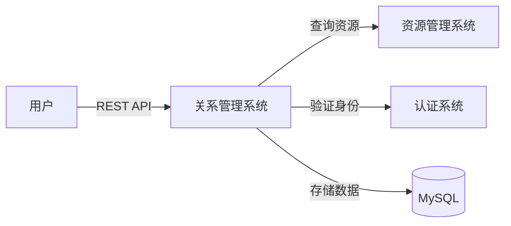
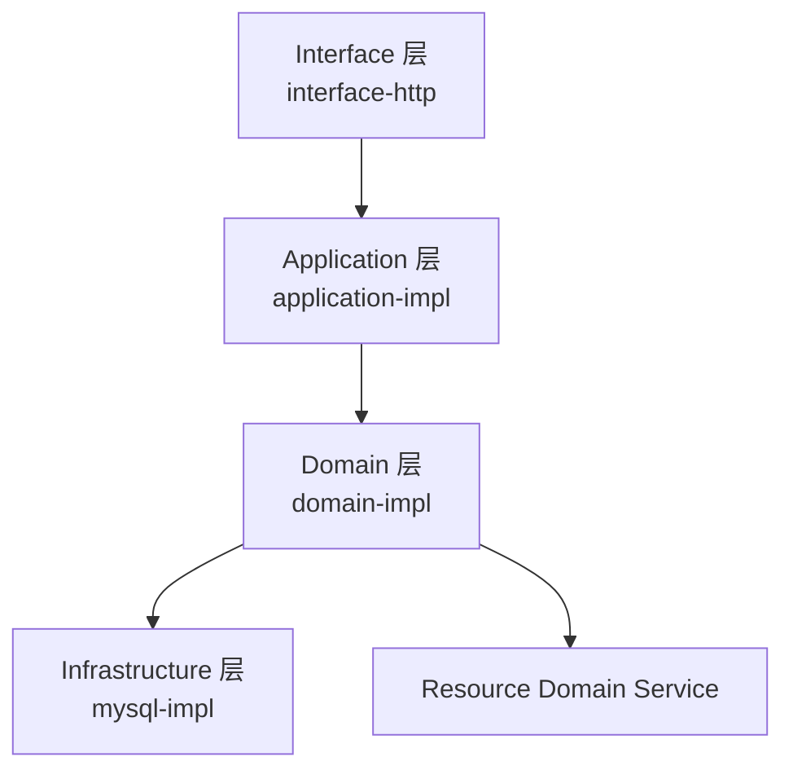
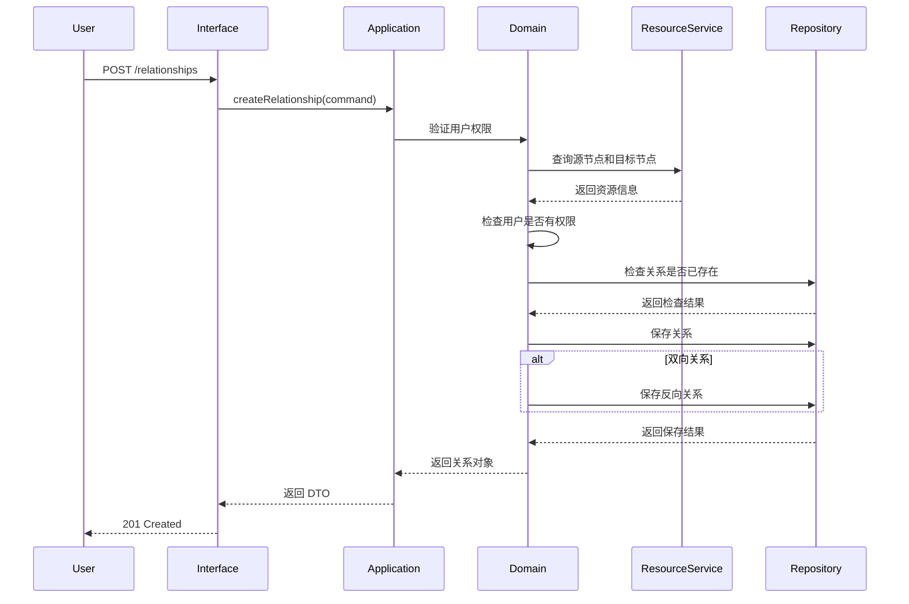
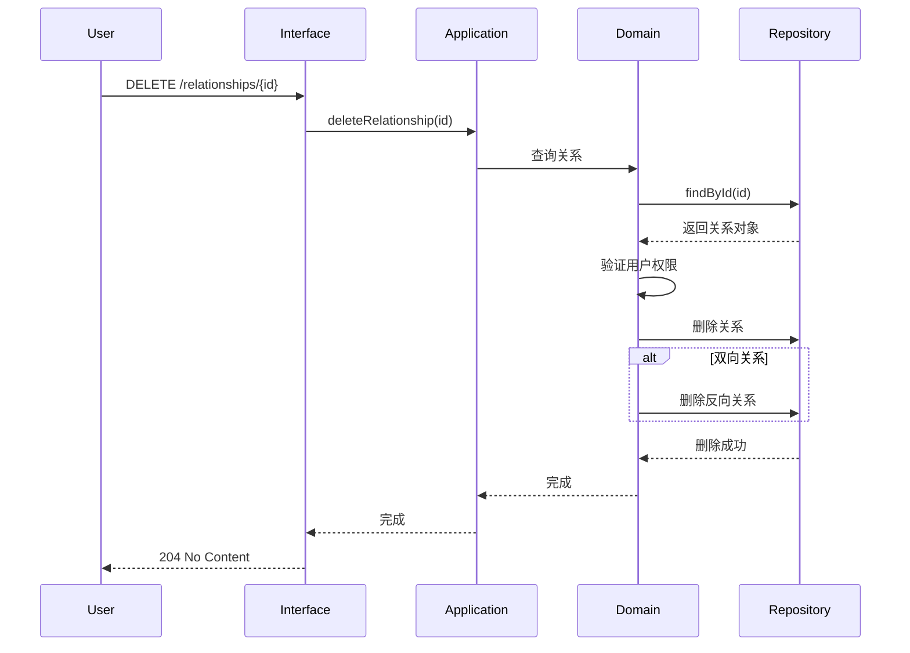
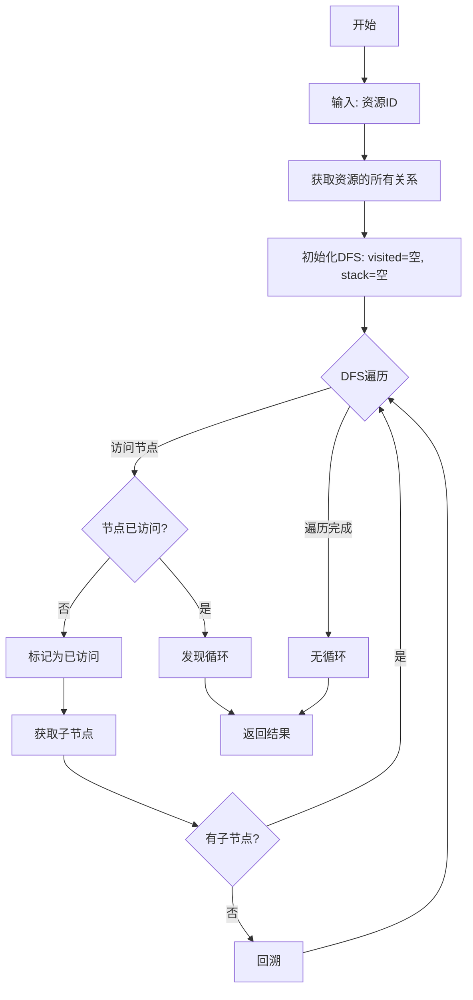
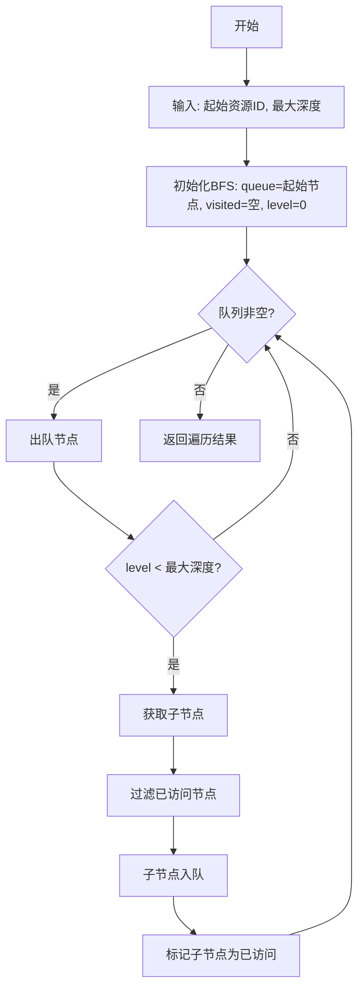

# 资源关系管理 设计文档

## 1. 概述

### 1.1 项目背景和设计目标

**项目背景**:
AIOps Service 平台需要建立和管理 IT 资源之间的关系,帮助运维工程师了解系统依赖结构,支持影响分析和故障定位。

**设计目标**:
1. 提供完整的关系管理能力(创建、查询、更新、删除)
2. 支持多种关系类型、方向和强度
3. 实现高效的图遍历算法(循环依赖检测、广度优先遍历)
4. 确保数据一致性和权限控制
5. 满足性能要求(查询 < 500ms,支持 50000 条关系)

### 1.2 设计范围和边界

**系统内部**(我们需要实现):
- 关系管理模块(创建、查询、更新、删除)
- 关系验证模块(节点存在性、重复检测)
- 图遍历模块(循环依赖检测、广度优先遍历)
- 权限验证模块(Owner 权限检查)

**系统外部**(外部依赖):
- 资源管理系统:用于验证资源是否存在、获取资源权限信息
- 认证系统:用于获取当前用户身份

### 1.3 关键约束和假设

**技术约束**:
- 必须使用 Spring Boot 3.4.1 + Java 21
- 必须使用 MySQL 8.0+ 作为数据存储
- 必须遵循 DDD 分层架构

**性能约束**:
- 查询响应时间 < 500ms
- 支持至少 50000 条关系
- 图遍历不超时

**业务约束**:
- 只有资源 Owner 可以编辑/删除关系
- 删除资源时自动级联删除关系
- 不允许创建重复关系

## 2. 高级设计

### 2.1 静态结构

#### 2.1.1 系统边界



#### 2.1.2 架构模式和模块划分

**架构模式**: DDD 分层架构(详见 ADR-001)



**模块职责**:

| 模块 | 职责 | 依赖 |
|------|------|------|
| Interface 层 | HTTP 请求处理、参数验证、DTO 转换 | Application 层 |
| Application 层 | 用例编排、事务控制、权限验证 | Domain 层 |
| Domain 层 | 核心业务逻辑、关系验证、图遍历算法 | Repository API, Resource Domain Service |
| Infrastructure 层 | 数据持久化、MyBatis 实现 | Repository API |

#### 2.1.3 技术栈选择

| 技术域 | 选择 | 版本 | ADR |
|--------|------|------|-----|
| 后端框架 | Spring Boot | 3.4.1 | 项目约束 |
| 编程语言 | Java | 21 | 项目约束 |
| 数据存储 | MySQL | 8.0+ | ADR-002 |
| ORM 框架 | MyBatis-Plus | 3.5.7 | 项目约束 |
| 图遍历算法 | 自实现(BFS/DFS) | - | ADR-003 |

#### 2.1.4 模块间接口协议

**通信协议**: RESTful API (HTTP/JSON)

**API 设计风格**:
- 资源导向的 URL 设计
- 使用标准 HTTP 方法(GET, POST, PUT, DELETE)
- 使用标准 HTTP 状态码
- JSON 格式的请求和响应

### 2.2 动态行为

#### 2.2.1 关键业务流程

**流程1: 创建关系**



**流程2: 删除关系**



**流程3: 检测循环依赖**



**流程4: 广度优先遍历**



### 2.3 辅助设计

#### 2.3.1 性能策略

**目标**: 查询响应时间 < 500ms,支持 50000 条关系

**策略**:

1. **数据库索引优化**:
   - `idx_source_resource`: source_resource_id 索引(加速下游查询)
   - `idx_target_resource`: target_resource_id 索引(加速上游查询)
   - `idx_type`: relationship_type 索引(加速类型筛选)
   - `uk_source_target_type`: 复合唯一索引(防止重复,加速重复检测)

2. **分页查询**: 避免一次性加载大量数据,默认每页 20 条

3. **图遍历优化**:
   - 设置最大遍历深度(默认 10 层,防止无限循环)
   - 使用 HashSet 记录已访问节点(避免重复访问)
   - 批量查询关系(减少数据库往返)

#### 2.3.2 安全策略

**认证**: 使用现有的 JWT 认证机制

**授权模型**:
- 创建关系:用户必须对源节点和目标节点都有访问权限(Viewer 或 Owner)
- 编辑关系:用户必须是源节点或目标节点的 Owner
- 删除关系:用户必须是源节点或目标节点的 Owner
- 查询关系:用户只能查看有权限访问的资源的关系

**数据验证**:
- 输入参数验证:使用 @Valid 注解和 Hibernate Validator
- 业务规则验证:节点存在性、关系唯一性、权限检查

#### 2.3.3 可观测性策略

**日志策略**:
- INFO 级别:记录关系创建、更新、删除操作
- WARN 级别:记录权限验证失败、业务规则违反
- ERROR 级别:记录系统异常

**监控指标**:
- 业务指标:关系总数、每日新增/删除关系数、各类型关系分布
- 性能指标:查询响应时间、图遍历执行时间
- 错误指标:权限拒绝次数、重复关系创建次数

## 3. 详细设计

### 3.1 静态结构

#### 3.1.1 Interface 层

**RelationshipController**

```java
@RestController
@RequestMapping("/api/v1/relationships")
public interface RelationshipController {
    
    /**
     * 创建关系
     * @param request 创建关系请求
     * @return 关系响应
     */
    @PostMapping
    Result<RelationshipResponse> createRelationship(
        @Valid @RequestBody CreateRelationshipRequest request);
    
    /**
     * 查询关系列表
     * @param sourceResourceId 源资源ID(可选)
     * @param targetResourceId 目标资源ID(可选)
     * @param relationshipType 关系类型(可选)
     * @param status 关系状态(可选)
     * @param pageNum 页码
     * @param pageSize 每页大小
     * @return 关系列表
     */
    @GetMapping
    Result<PageResult<RelationshipResponse>> listRelationships(
        @RequestParam(required = false) Long sourceResourceId,
        @RequestParam(required = false) Long targetResourceId,
        @RequestParam(required = false) String relationshipType,
        @RequestParam(required = false) String status,
        @RequestParam(defaultValue = "1") Integer pageNum,
        @RequestParam(defaultValue = "20") Integer pageSize);
    
    /**
     * 查询资源的关系
     * @param resourceId 资源ID
     * @return 资源关系响应
     */
    @GetMapping("/resource/{resourceId}")
    Result<ResourceRelationshipsResponse> getResourceRelationships(
        @PathVariable Long resourceId);
    
    /**
     * 更新关系
     * @param relationshipId 关系ID
     * @param request 更新关系请求
     * @return 关系响应
     */
    @PutMapping("/{relationshipId}")
    Result<RelationshipResponse> updateRelationship(
        @PathVariable Long relationshipId,
        @Valid @RequestBody UpdateRelationshipRequest request);
    
    /**
     * 删除关系
     * @param relationshipId 关系ID
     * @return 无内容
     */
    @DeleteMapping("/{relationshipId}")
    Result<Void> deleteRelationship(@PathVariable Long relationshipId);
    
    /**
     * 检测循环依赖
     * @param resourceId 资源ID
     * @return 循环依赖检测结果
     */
    @GetMapping("/resource/{resourceId}/cycle-detection")
    Result<CycleDetectionResponse> detectCycle(@PathVariable Long resourceId);
    
    /**
     * 广度优先遍历
     * @param resourceId 起始资源ID
     * @param maxDepth 最大深度
     * @return 遍历结果
     */
    @GetMapping("/resource/{resourceId}/traverse")
    Result<TraverseResponse> traverse(
        @PathVariable Long resourceId,
        @RequestParam(defaultValue = "10") Integer maxDepth);
}
```

**HTTP API 定义 (OpenAPI 规范)**

```yaml
openapi: 3.0.0
info:
  title: Resource Relationship API
  version: 1.0.0

paths:
  /api/v1/relationships:
    post:
      summary: 创建关系
      operationId: createRelationship
      requestBody:
        required: true
        content:
          application/json:
            schema:
              $ref: '#/components/schemas/CreateRelationshipRequest'
      responses:
        '201':
          description: 关系创建成功
          content:
            application/json:
              schema:
                $ref: '#/components/schemas/RelationshipResponse'
        '400':
          description: 请求参数无效
        '403':
          description: 无权限访问资源
        '409':
          description: 关系已存在

    get:
      summary: 查询关系列表
      operationId: listRelationships
      parameters:
        - name: sourceResourceId
          in: query
          schema:
            type: integer
            format: int64
        - name: targetResourceId
          in: query
          schema:
            type: integer
            format: int64
        - name: relationshipType
          in: query
          schema:
            type: string
            enum: [DEPENDENCY, CALL, DEPLOYMENT, OWNERSHIP, ASSOCIATION]
        - name: status
          in: query
          schema:
            type: string
            enum: [NORMAL, ABNORMAL]
        - name: pageNum
          in: query
          schema:
            type: integer
            default: 1
        - name: pageSize
          in: query
          schema:
            type: integer
            default: 20
      responses:
        '200':
          description: 查询成功
          content:
            application/json:
              schema:
                $ref: '#/components/schemas/PageResult'

  /api/v1/relationships/{relationshipId}:
    put:
      summary: 更新关系
      operationId: updateRelationship
      parameters:
        - name: relationshipId
          in: path
          required: true
          schema:
            type: integer
            format: int64
      requestBody:
        required: true
        content:
          application/json:
            schema:
              $ref: '#/components/schemas/UpdateRelationshipRequest'
      responses:
        '200':
          description: 更新成功
        '403':
          description: 无权限操作
        '404':
          description: 关系不存在

    delete:
      summary: 删除关系
      operationId: deleteRelationship
      parameters:
        - name: relationshipId
          in: path
          required: true
          schema:
            type: integer
            format: int64
      responses:
        '204':
          description: 删除成功
        '403':
          description: 无权限操作
        '404':
          description: 关系不存在

components:
  schemas:
    CreateRelationshipRequest:
      type: object
      required: [sourceResourceId, targetResourceId, relationshipType, direction, strength]
      properties:
        sourceResourceId:
          type: integer
          format: int64
          description: 源资源ID
        targetResourceId:
          type: integer
          format: int64
          description: 目标资源ID
        relationshipType:
          type: string
          enum: [DEPENDENCY, CALL, DEPLOYMENT, OWNERSHIP, ASSOCIATION]
          description: 关系类型
        direction:
          type: string
          enum: [UNIDIRECTIONAL, BIDIRECTIONAL]
          description: 关系方向
        strength:
          type: string
          enum: [STRONG, WEAK]
          description: 关系强度
        description:
          type: string
          maxLength: 500
          description: 关系描述

    UpdateRelationshipRequest:
      type: object
      properties:
        relationshipType:
          type: string
          enum: [DEPENDENCY, CALL, DEPLOYMENT, OWNERSHIP, ASSOCIATION]
        strength:
          type: string
          enum: [STRONG, WEAK]
        status:
          type: string
          enum: [NORMAL, ABNORMAL]
        description:
          type: string
          maxLength: 500

    RelationshipResponse:
      type: object
      properties:
        id:
          type: integer
          format: int64
        sourceResourceId:
          type: integer
          format: int64
        sourceResourceName:
          type: string
        targetResourceId:
          type: integer
          format: int64
        targetResourceName:
          type: string
        relationshipType:
          type: string
        direction:
          type: string
        strength:
          type: string
        status:
          type: string
        description:
          type: string
        createdAt:
          type: string
          format: date-time
        updatedAt:
          type: string
          format: date-time
```

#### 3.1.2 Application 层

**RelationshipApplicationService**

```java
public interface RelationshipApplicationService {
    
    /**
     * 创建关系
     * @param command 创建关系命令
     * @return 关系DTO
     * @throws BusinessException 业务异常
     */
    RelationshipDTO createRelationship(CreateRelationshipCommand command);
    
    /**
     * 查询关系列表
     * @param command 查询命令
     * @return 关系列表
     */
    PageResult<RelationshipDTO> listRelationships(RelationshipQueryCommand command);
    
    /**
     * 查询资源的关系
     * @param resourceId 资源ID
     * @return 资源关系DTO
     */
    ResourceRelationshipsDTO getResourceRelationships(Long resourceId);
    
    /**
     * 更新关系
     * @param relationshipId 关系ID
     * @param command 更新命令
     * @return 关系DTO
     * @throws BusinessException 业务异常
     */
    RelationshipDTO updateRelationship(Long relationshipId, UpdateRelationshipCommand command);
    
    /**
     * 删除关系
     * @param relationshipId 关系ID
     * @throws BusinessException 业务异常
     */
    void deleteRelationship(Long relationshipId);
    
    /**
     * 检测循环依赖
     * @param resourceId 资源ID
     * @return 循环依赖检测结果
     */
    CycleDetectionDTO detectCycle(Long resourceId);
    
    /**
     * 广度优先遍历
     * @param resourceId 起始资源ID
     * @param maxDepth 最大深度
     * @return 遍历结果
     */
    TraverseDTO traverse(Long resourceId, Integer maxDepth);
}
```

#### 3.1.3 Domain 层

**Relationship 聚合根**

```java
public class Relationship {
    private Long id;
    private Long sourceResourceId;
    private Long targetResourceId;
    private RelationshipType relationshipType;
    private RelationshipDirection direction;
    private RelationshipStrength strength;
    private RelationshipStatus status;
    private String description;
    private LocalDateTime createdAt;
    private LocalDateTime updatedAt;
    
    // 业务方法
    public void updateType(RelationshipType newType);
    public void updateStrength(RelationshipStrength newStrength);
    public void updateStatus(RelationshipStatus newStatus);
    public void updateDescription(String newDescription);
    public boolean isOwner(Long accountId, Resource sourceResource, Resource targetResource);
    public boolean isBidirectional();
}
```

**枚举定义**

| 枚举类型 | 值 | 描述 |
|---------|---|------|
| RelationshipType | DEPENDENCY | 依赖 |
| | CALL | 调用 |
| | DEPLOYMENT | 部署 |
| | OWNERSHIP | 归属 |
| | ASSOCIATION | 关联 |
| RelationshipDirection | UNIDIRECTIONAL | 单向 |
| | BIDIRECTIONAL | 双向 |
| RelationshipStrength | STRONG | 强依赖 |
| | WEAK | 弱依赖 |
| RelationshipStatus | NORMAL | 正常 |
| | ABNORMAL | 异常 |

**RelationshipDomainService**

```java
public interface RelationshipDomainService {
    
    /**
     * 创建关系
     * @param sourceResourceId 源资源ID
     * @param targetResourceId 目标资源ID
     * @param type 关系类型
     * @param direction 关系方向
     * @param strength 关系强度
     * @param description 描述
     * @return 关系对象
     * @throws BusinessException 业务异常
     */
    Relationship createRelationship(
        Long sourceResourceId,
        Long targetResourceId,
        RelationshipType type,
        RelationshipDirection direction,
        RelationshipStrength strength,
        String description);
    
    /**
     * 查询关系列表
     * @param sourceResourceId 源资源ID
     * @param targetResourceId 目标资源ID
     * @param type 关系类型
     * @param status 关系状态
     * @param pageNum 页码
     * @param pageSize 每页大小
     * @return 关系列表
     */
    PageResult<Relationship> listRelationships(
        Long sourceResourceId,
        Long targetResourceId,
        RelationshipType type,
        RelationshipStatus status,
        Integer pageNum,
        Integer pageSize);
    
    /**
     * 查询资源的上游依赖
     * @param resourceId 资源ID
     * @return 上游依赖列表
     */
    List<Relationship> getUpstreamDependencies(Long resourceId);
    
    /**
     * 查询资源的下游依赖
     * @param resourceId 资源ID
     * @return 下游依赖列表
     */
    List<Relationship> getDownstreamDependencies(Long resourceId);
    
    /**
     * 更新关系
     * @param relationshipId 关系ID
     * @param type 关系类型
     * @param strength 关系强度
     * @param status 关系状态
     * @param description 描述
     * @return 关系对象
     * @throws BusinessException 业务异常
     */
    Relationship updateRelationship(
        Long relationshipId,
        RelationshipType type,
        RelationshipStrength strength,
        RelationshipStatus status,
        String description);
    
    /**
     * 删除关系
     * @param relationshipId 关系ID
     * @throws BusinessException 业务异常
     */
    void deleteRelationship(Long relationshipId);
    
    /**
     * 删除资源的所有关系
     * @param resourceId 资源ID
     */
    void deleteRelationshipsByResource(Long resourceId);
    
    /**
     * 检测循环依赖
     * @param resourceId 资源ID
     * @return 循环依赖检测结果
     */
    CycleDetectionResult detectCycle(Long resourceId);
    
    /**
     * 广度优先遍历
     * @param resourceId 起始资源ID
     * @param maxDepth 最大深度
     * @return 遍历结果
     */
    TraverseResult traverse(Long resourceId, Integer maxDepth);
}
```

**RelationshipRepository 接口**

```java
public interface RelationshipRepository {
    
    Relationship save(Relationship relationship);
    Relationship update(Relationship relationship);
    Optional<Relationship> findById(Long id);
    List<Relationship> findBySourceResourceId(Long sourceResourceId);
    List<Relationship> findByTargetResourceId(Long targetResourceId);
    PageResult<Relationship> findByConditions(
        Long sourceResourceId,
        Long targetResourceId,
        RelationshipType type,
        RelationshipStatus status,
        Integer pageNum,
        Integer pageSize);
    boolean existsBySourceAndTarget(
        Long sourceResourceId,
        Long targetResourceId,
        RelationshipType type);
    void deleteById(Long id);
    void deleteBySourceAndTarget(
        Long sourceResourceId,
        Long targetResourceId,
        RelationshipType type);
    void deleteByResourceId(Long resourceId);
}
```

#### 3.1.4 Infrastructure 层

**数据库表设计**

| 字段 | 类型 | 约束 | 描述 |
|------|------|------|------|
| id | BIGINT | PK, AUTO_INCREMENT | 关系ID |
| source_resource_id | BIGINT | NOT NULL, FK | 源资源ID |
| target_resource_id | BIGINT | NOT NULL, FK | 目标资源ID |
| relationship_type | VARCHAR(50) | NOT NULL | 关系类型 |
| direction | VARCHAR(20) | NOT NULL | 关系方向 |
| strength | VARCHAR(20) | NOT NULL | 关系强度 |
| status | VARCHAR(20) | NOT NULL, DEFAULT 'NORMAL' | 关系状态 |
| description | VARCHAR(500) | NULL | 关系描述 |
| created_at | DATETIME | NOT NULL | 创建时间 |
| updated_at | DATETIME | NOT NULL | 更新时间 |

**索引设计**:
- `idx_source_resource`: (source_resource_id)
- `idx_target_resource`: (target_resource_id)
- `idx_type`: (relationship_type)
- `idx_status`: (status)
- `uk_source_target_type`: UNIQUE (source_resource_id, target_resource_id, relationship_type)

**外键约束**:
- `fk_source_resource`: source_resource_id REFERENCES resource(id) ON DELETE CASCADE
- `fk_target_resource`: target_resource_id REFERENCES resource(id) ON DELETE CASCADE

### 3.2 动态行为

#### 3.2.1 详细业务流程

详细的业务流程已在高级设计的时序图中展示,这里补充关键算法的伪代码。

**循环依赖检测算法(DFS)**

```
function detectCycle(startResourceId):
    visited = new Set()
    stack = new Stack()
    
    function dfs(resourceId):
        if resourceId in stack:
            return true  // 发现循环
        
        if resourceId in visited:
            return false  // 已访问过,无循环
        
        visited.add(resourceId)
        stack.push(resourceId)
        
        relationships = getDownstreamRelationships(resourceId)
        for each relationship in relationships:
            if dfs(relationship.targetResourceId):
                return true
        
        stack.pop()
        return false
    
    return dfs(startResourceId)
```

**广度优先遍历算法(BFS)**

```
function traverse(startResourceId, maxDepth):
    queue = new Queue()
    visited = new Set()
    result = new Tree()
    
    queue.enqueue({resourceId: startResourceId, level: 0})
    visited.add(startResourceId)
    
    while queue is not empty:
        node = queue.dequeue()
        
        if node.level >= maxDepth:
            continue
        
        relationships = getDownstreamRelationships(node.resourceId)
        for each relationship in relationships:
            targetId = relationship.targetResourceId
            if targetId not in visited:
                visited.add(targetId)
                queue.enqueue({resourceId: targetId, level: node.level + 1})
                result.addNode(node.resourceId, targetId, relationship)
    
    return result
```

#### 3.2.2 状态变化

**关系状态转换**

| 当前状态 | 触发事件 | 条件 | 目标状态 | 副作用 |
|---------|---------|------|---------|--------|
| NORMAL | 系统检测到源节点或目标节点异常 | 节点状态异常 | ABNORMAL | 记录日志 |
| ABNORMAL | 系统检测到源节点和目标节点恢复正常 | 节点状态正常 | NORMAL | 记录日志 |
| * | 用户手动更新状态 | 用户是Owner | 指定状态 | 记录操作日志 |

### 3.3 辅助设计

#### 3.3.1 详细性能设计

**数据库查询优化**:
1. 使用索引覆盖查询(Covering Index)
2. 避免 SELECT *,只查询需要的字段
3. 使用批量查询减少数据库往返

**图遍历优化**:
1. 设置最大遍历深度(默认 10 层)
2. 使用 HashSet 记录已访问节点
3. 批量查询关系(一次查询获取多个节点的关系)
4. 设置超时时间(5 秒)

**并发控制**:
1. 使用数据库唯一索引防止重复关系
2. 使用乐观锁(version 字段)处理并发更新
3. 使用事务保证双向关系的一致性

#### 3.3.2 详细安全设计

**认证流程**:
1. 用户请求携带 JWT Token
2. JwtAuthenticationFilter 验证 Token
3. 从 Token 中提取用户信息
4. 将用户信息存入 SecurityContext

**授权检查点**:
1. Controller 层:@PreAuthorize 注解进行粗粒度权限检查
2. Application 层:调用 Resource Domain Service 检查资源权限
3. Domain 层:Relationship.isOwner() 方法检查关系权限

**数据加密**:
- 敏感字段(如描述)不加密(非敏感数据)
- 传输层使用 HTTPS

#### 3.3.3 详细错误处理

**错误分类**:

| 错误类型 | HTTP 状态码 | 错误码 | 处理策略 |
|---------|------------|--------|---------|
| 参数验证错误 | 400 | PARAM_INVALID | 返回详细的验证错误信息 |
| 资源不存在 | 404 | RESOURCE_NOT_FOUND | 返回友好的错误提示 |
| 权限不足 | 403 | PERMISSION_DENIED | 返回权限不足提示 |
| 关系已存在 | 409 | RELATIONSHIP_EXISTS | 返回冲突提示 |
| 系统错误 | 500 | SYSTEM_ERROR | 记录详细日志,返回通用错误 |

**重试策略**:
- 数据库连接失败:重试 3 次,间隔 1 秒
- 外部服务调用失败:重试 2 次,间隔 500ms

**降级方案**:
- 图遍历超时:返回部分结果
- 资源服务不可用:跳过资源名称查询

## 4. 架构决策记录 (ADR)

### ADR-001: 选择 DDD 分层架构

**状态**: 已接受

**上下文**: 需要选择系统架构模式,项目已采用 DDD 分层架构

**决策**: 采用 DDD 分层架构(Interface、Application、Domain、Infrastructure)

**理由**:
- 符合项目现有架构规范
- 职责边界清晰,易于维护
- 团队熟悉该架构模式
- 关系管理是核心业务域,适合 DDD

**后果**:
- 正面:代码结构清晰,易于测试和扩展
- 负面:需要严格遵守依赖规则,增加一定的代码量

### ADR-002: 选择 MySQL 而非图数据库

**状态**: 已接受

**上下文**: 需要选择数据存储方案,考虑关系型数据库和图数据库

**决策**: 选择 MySQL 作为数据存储

**理由**:
- 项目已使用 MySQL,无需引入新的数据库
- 当前规模(50000 条关系)MySQL 性能足够
- 支持外键级联删除,简化数据一致性维护
- 团队熟悉 MySQL,降低学习成本

**替代方案**: Neo4j 图数据库
- 优点:专为图查询优化,性能更好
- 缺点:增加运维复杂度,需要学习新技术,当前规模不需要

**后果**:
- 正面:降低技术复杂度,利用现有基础设施
- 负面:未来如果关系数量大幅增长(>100万),可能需要迁移到图数据库

### ADR-003: 自实现图遍历算法

**状态**: 已接受

**上下文**: 需要实现循环依赖检测和广度优先遍历

**决策**: 自实现 DFS 和 BFS 算法

**理由**:
- 需求明确且简单(循环检测、BFS 遍历)
- 自实现可控性强,易于优化
- 避免引入额外的图算法库依赖

**替代方案**: 使用 JGraphT 图算法库
- 优点:功能丰富,经过充分测试
- 缺点:引入额外依赖,学习成本,可能过度设计

**后果**:
- 正面:代码简洁,性能可控
- 负面:需要自己测试算法正确性,未来如果需要复杂图算法需要重新评估

## 5. 风险和缓解措施

### 5.1 技术风险

| 风险 | 影响 | 概率 | 缓解措施 |
|------|------|------|---------|
| 图遍历性能不足 | 高 | 中 | 设置最大深度,批量查询,超时控制 |
| 并发创建重复关系 | 中 | 中 | 使用数据库唯一索引 |
| 级联删除性能问题 | 中 | 低 | 使用数据库外键级联,异步处理 |

### 5.2 依赖风险

| 风险 | 影响 | 概率 | 缓解措施 |
|------|------|------|---------|
| 资源服务不可用 | 高 | 低 | 降级处理,跳过资源名称查询 |
| 数据库连接池耗尽 | 高 | 低 | 设置合理的连接池大小,监控连接使用情况 |

### 5.3 性能风险

| 风险 | 影响 | 概率 | 缓解措施 |
|------|------|------|---------|
| 查询响应时间超过 500ms | 高 | 中 | 数据库索引优化,分页查询,性能测试 |
| 图遍历超时 | 中 | 中 | 设置最大深度和超时时间,返回部分结果 |

---

**创建日期**: 2024-12-03  
**最后更新**: 2024-12-03  
**文档版本**: v1.0
