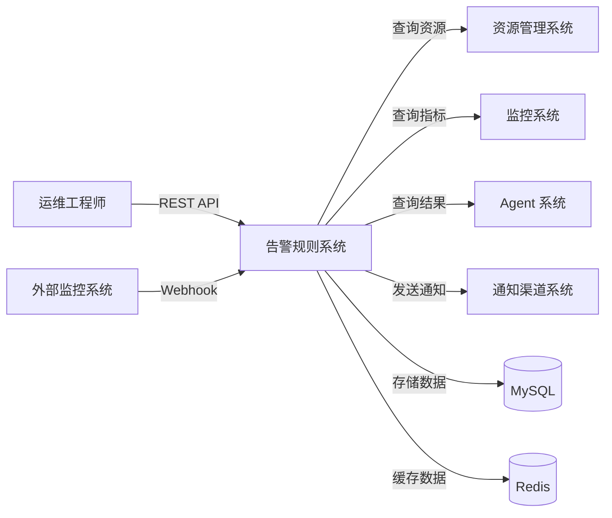
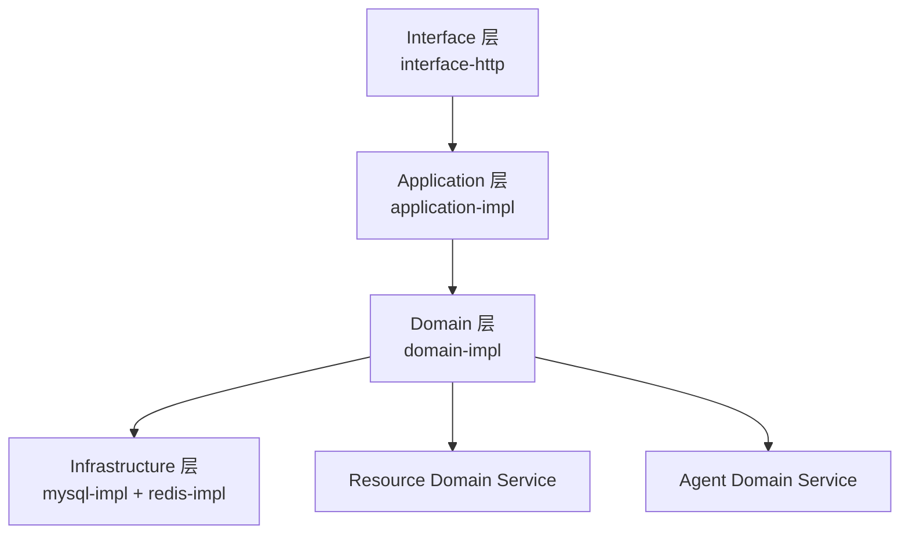
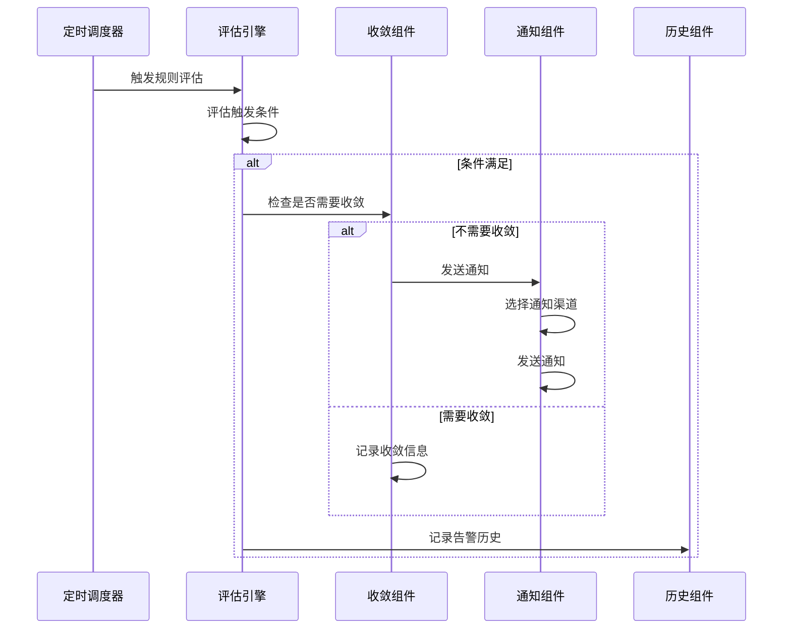
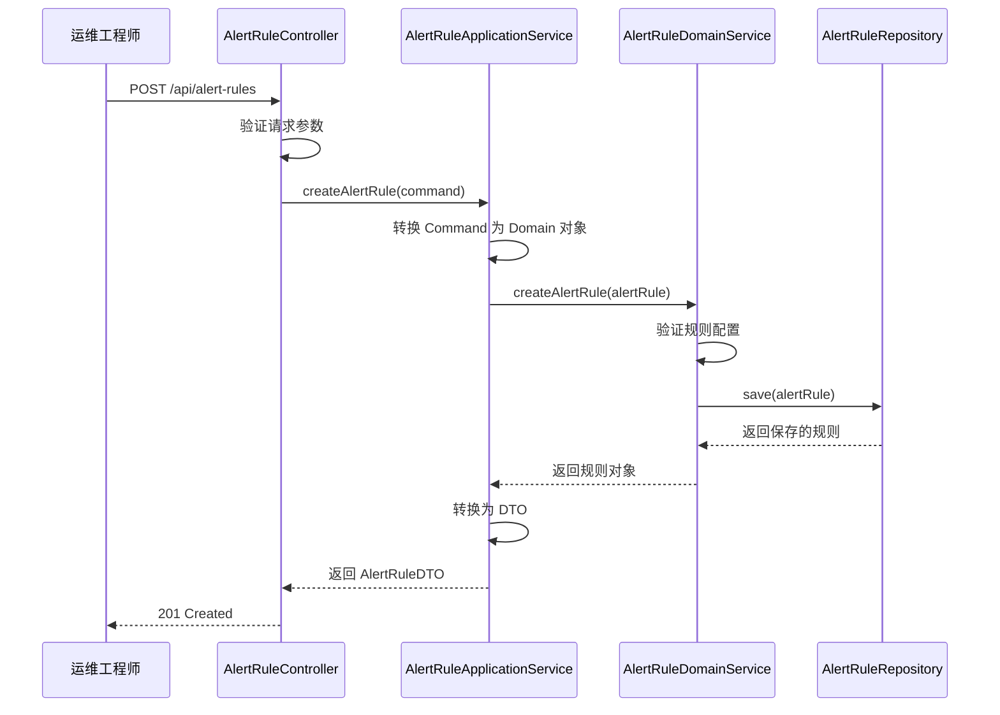
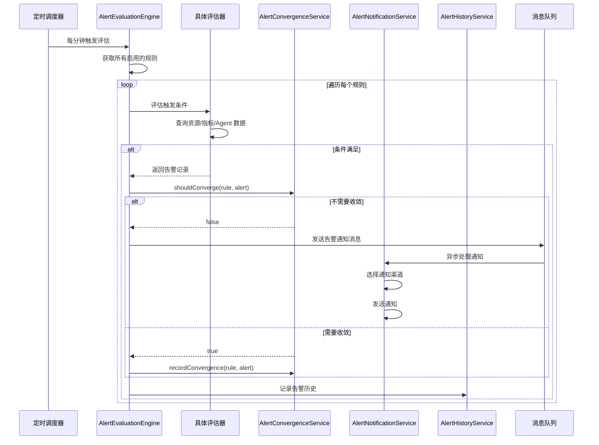
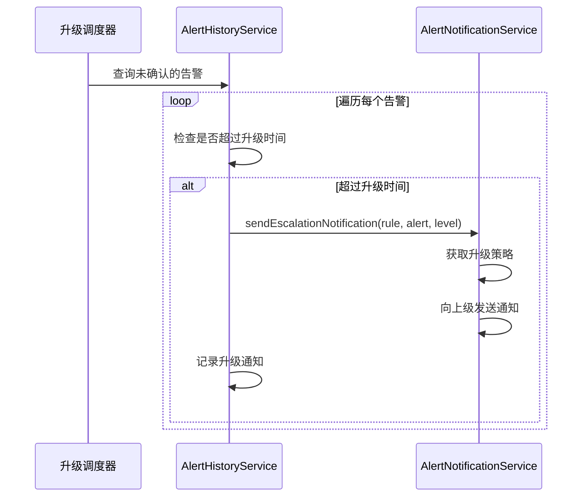

# 告警规则配置 设计文档

## 1. 概述

### 1.1 项目背景和设计目标

**项目背景**:
AIOps Service 平台需要提供智能告警能力，帮助运维团队及时发现和响应系统问题。告警规则配置功能是告警系统的核心，支持多种触发条件、灵活的通知策略和智能的告警收敛机制。

**设计目标**:
1. 支持四种触发条件：资源状态变化、指标阈值、Agent 执行结果、外部告警
2. 提供标准5级告警分类（INFO、WARNING、ERROR、CRITICAL、EMERGENCY）
3. 实现多通道通知、分级策略和升级机制
4. 提供完整的告警抑制和收敛能力（去重、时间窗口、拓扑关联、静默期）
5. 确保高性能（评估 < 1秒，通知 < 5秒，支持 1000 告警/秒）

### 1.2 设计范围和边界

**系统内部**（我们需要实现）:
- 告警规则管理模块（创建、查询、更新、删除、启用/禁用）
- 告警评估引擎（监控触发条件、评估规则）
- 告警通知模块（多通道发送、分级策略、升级机制）
- 告警收敛模块（去重、时间窗口、拓扑关联、静默期）
- 告警历史和统计模块

**系统外部**（外部依赖）:
- 资源管理系统：获取资源状态和拓扑关系
- 监控系统：获取指标数据
- Agent 系统：获取 Agent 执行结果
- 通知渠道系统（F24）：实际发送通知
- 认证系统：获取当前用户身份

### 1.3 关键约束和假设

**技术约束**:
- 必须使用 Spring Boot 3.4.1 + Java 21
- 必须使用 MySQL 8.0+ 作为数据存储
- 必须使用 Redis 7.0+ 用于告警去重和收敛
- 必须遵循 DDD 分层架构

**性能约束**:
- 单个规则评估时间 < 1 秒
- 告警通知发送时间 < 5 秒
- 支持每秒处理 1000 个告警
- 告警历史查询响应时间 < 500ms

**业务约束**:
- 只有规则创建者和管理员可以编辑/删除规则
- 告警历史保留 180 天
- 静默期内的告警仍需记录
- 通知失败最多重试 3 次

## 2. 架构设计

### 2.1 系统架构

#### 2.1.1 系统边界



#### 2.1.2 DDD 分层架构



**模块职责**:

| 模块 | 职责 | 依赖 |
|------|------|------|
| Interface 层 | HTTP 请求处理、Webhook 接收、参数验证、DTO 转换 | Application 层 |
| Application 层 | 用例编排、事务控制、权限验证 | Domain 层 |
| Domain 层 | 核心业务逻辑、规则评估、告警收敛、通知策略 | Repository API, Cache API, Resource/Agent Domain Service |
| Infrastructure 层 | 数据持久化、缓存实现、MyBatis/Redis 实现 | Repository API, Cache API |

#### 2.1.3 技术栈选择

| 技术域 | 选择 | 版本 | 理由 |
|--------|------|------|------|
| 后端框架 | Spring Boot | 3.4.1 | 项目标准 |
| 编程语言 | Java | 21 | 项目标准 |
| 数据存储 | MySQL | 8.0+ | 持久化告警规则和历史 |
| 缓存 | Redis | 7.0+ | 告警去重和收敛 |
| ORM 框架 | MyBatis-Plus | 3.5.7 | 项目标准 |
| 任务调度 | Spring Scheduler | 6.2.x | 定时评估规则 |
| 消息队列 | AWS SQS | 2.20.0 | 异步处理告警通知 |

### 2.2 组件和接口

#### 2.2.1 核心组件

**1. 告警规则管理组件**
- 职责：管理告警规则的 CRUD 操作
- 接口：AlertRuleDomainService
- 实现：AlertRuleDomainServiceImpl

**2. 告警评估引擎**
- 职责：评估触发条件，判断是否产生告警
- 接口：AlertEvaluationEngine
- 实现：AlertEvaluationEngineImpl
- 子组件：
  - ResourceStatusEvaluator：评估资源状态变化
  - MetricThresholdEvaluator：评估指标阈值
  - AgentResultEvaluator：评估 Agent 执行结果
  - ExternalAlertReceiver：接收外部告警

**3. 告警通知组件**
- 职责：根据策略发送告警通知
- 接口：AlertNotificationService
- 实现：AlertNotificationServiceImpl
- 子组件：
  - MultiChannelNotifier：多通道通知
  - LevelBasedNotifier：分级通知策略
  - EscalationNotifier：升级通知机制

**4. 告警收敛组件**
- 职责：减少告警噪音
- 接口：AlertConvergenceService
- 实现：AlertConvergenceServiceImpl
- 子组件：
  - DeduplicationService：告警去重
  - TimeWindowConvergence：时间窗口收敛
  - TopologyCorrelation：拓扑关联收敛
  - SilencePeriodManager：静默期管理

**5. 告警历史组件**
- 职责：记录和查询告警历史
- 接口：AlertHistoryService
- 实现：AlertHistoryServiceImpl

#### 2.2.2 组件交互



## 3. 数据模型

### 3.1 领域模型

#### 3.1.1 核心实体

**AlertRule（告警规则）- 聚合根**
```java
public class AlertRule {
    private Long id;                          // 规则 ID
    private String name;                      // 规则名称
    private String description;               // 规则描述
    private Long creatorId;                   // 创建者 ID
    private AlertRuleStatus status;           // 规则状态（ENABLED/DISABLED）
    private TriggerCondition triggerCondition; // 触发条件
    private AlertLevel level;                 // 告警级别
    private NotificationConfig notificationConfig; // 通知配置
    private ConvergenceConfig convergenceConfig;   // 收敛配置
    private LocalDateTime createdAt;          // 创建时间
    private LocalDateTime updatedAt;          // 更新时间
}
```

**TriggerCondition（触发条件）- 值对象**
```java
public class TriggerCondition {
    private TriggerType type;                 // 触发类型
    private ResourceStatusCondition resourceStatusCondition;   // 资源状态条件
    private MetricThresholdCondition metricThresholdCondition; // 指标阈值条件
    private AgentResultCondition agentResultCondition;         // Agent 结果条件
    private ExternalAlertCondition externalAlertCondition;     // 外部告警条件
}
```

**NotificationConfig（通知配置）- 值对象**
```java
public class NotificationConfig {
    private List<NotificationChannel> channels;        // 通知渠道列表
    private LevelBasedPolicy levelBasedPolicy;         // 分级策略
    private EscalationPolicy escalationPolicy;         // 升级策略
}
```

**ConvergenceConfig（收敛配置）- 值对象**
```java
public class ConvergenceConfig {
    private boolean deduplicationEnabled;              // 是否启用去重
    private Integer deduplicationWindowMinutes;        // 去重时间窗口（分钟）
    private boolean timeWindowEnabled;                 // 是否启用时间窗口收敛
    private Integer timeWindowMinutes;                 // 收敛时间窗口（分钟）
    private boolean topologyCorrelationEnabled;        // 是否启用拓扑关联
    private List<SilencePeriod> silencePeriods;       // 静默期列表
}
```

**AlertRecord（告警记录）- 实体**
```java
public class AlertRecord {
    private Long id;                          // 告警 ID
    private Long ruleId;                      // 规则 ID
    private String ruleName;                  // 规则名称
    private AlertLevel level;                 // 告警级别
    private String content;                   // 告警内容
    private Long resourceId;                  // 关联资源 ID
    private AlertStatus status;               // 告警状态（NEW/CONFIRMED/RESOLVED/SILENCED）
    private Long confirmedBy;                 // 确认人 ID
    private LocalDateTime confirmedAt;        // 确认时间
    private Long resolvedBy;                  // 解决人 ID
    private LocalDateTime resolvedAt;         // 解决时间
    private LocalDateTime triggeredAt;        // 触发时间
    private List<NotificationRecord> notifications; // 通知记录
}
```

#### 3.1.2 枚举类型

**AlertLevel（告警级别）**
```java
public enum AlertLevel {
    INFO,        // 信息
    WARNING,     // 警告
    ERROR,       // 错误
    CRITICAL,    // 严重
    EMERGENCY    // 紧急
}
```

**TriggerType（触发类型）**
```java
public enum TriggerType {
    RESOURCE_STATUS,    // 资源状态变化
    METRIC_THRESHOLD,   // 指标阈值
    AGENT_RESULT,       // Agent 执行结果
    EXTERNAL_ALERT      // 外部告警
}
```

**AlertRuleStatus（规则状态）**
```java
public enum AlertRuleStatus {
    ENABLED,     // 已启用
    DISABLED     // 已禁用
}
```

**AlertStatus（告警状态）**
```java
public enum AlertStatus {
    NEW,         // 新告警
    CONFIRMED,   // 已确认
    RESOLVED,    // 已解决
    SILENCED     // 已静默
}
```

### 3.2 数据库设计

#### 3.2.1 表结构

**alert_rule（告警规则表）**
```sql
CREATE TABLE alert_rule (
    id BIGINT PRIMARY KEY AUTO_INCREMENT,
    name VARCHAR(100) NOT NULL COMMENT '规则名称',
    description VARCHAR(500) COMMENT '规则描述',
    creator_id BIGINT NOT NULL COMMENT '创建者 ID',
    status VARCHAR(20) NOT NULL COMMENT '规则状态',
    trigger_type VARCHAR(50) NOT NULL COMMENT '触发类型',
    trigger_condition JSON NOT NULL COMMENT '触发条件（JSON）',
    alert_level VARCHAR(20) NOT NULL COMMENT '告警级别',
    notification_config JSON NOT NULL COMMENT '通知配置（JSON）',
    convergence_config JSON COMMENT '收敛配置（JSON）',
    created_at DATETIME NOT NULL DEFAULT CURRENT_TIMESTAMP,
    updated_at DATETIME NOT NULL DEFAULT CURRENT_TIMESTAMP ON UPDATE CURRENT_TIMESTAMP,
    INDEX idx_creator_id (creator_id),
    INDEX idx_status (status),
    INDEX idx_trigger_type (trigger_type)
) ENGINE=InnoDB DEFAULT CHARSET=utf8mb4 COMMENT='告警规则表';
```

**alert_record（告警记录表）**
```sql
CREATE TABLE alert_record (
    id BIGINT PRIMARY KEY AUTO_INCREMENT,
    rule_id BIGINT NOT NULL COMMENT '规则 ID',
    rule_name VARCHAR(100) NOT NULL COMMENT '规则名称',
    alert_level VARCHAR(20) NOT NULL COMMENT '告警级别',
    content TEXT NOT NULL COMMENT '告警内容',
    resource_id BIGINT COMMENT '关联资源 ID',
    status VARCHAR(20) NOT NULL COMMENT '告警状态',
    confirmed_by BIGINT COMMENT '确认人 ID',
    confirmed_at DATETIME COMMENT '确认时间',
    resolved_by BIGINT COMMENT '解决人 ID',
    resolved_at DATETIME COMMENT '解决时间',
    triggered_at DATETIME NOT NULL COMMENT '触发时间',
    created_at DATETIME NOT NULL DEFAULT CURRENT_TIMESTAMP,
    INDEX idx_rule_id (rule_id),
    INDEX idx_alert_level (alert_level),
    INDEX idx_status (status),
    INDEX idx_resource_id (resource_id),
    INDEX idx_triggered_at (triggered_at)
) ENGINE=InnoDB DEFAULT CHARSET=utf8mb4 COMMENT='告警记录表';
```

**alert_notification_record（告警通知记录表）**
```sql
CREATE TABLE alert_notification_record (
    id BIGINT PRIMARY KEY AUTO_INCREMENT,
    alert_id BIGINT NOT NULL COMMENT '告警 ID',
    channel VARCHAR(50) NOT NULL COMMENT '通知渠道',
    recipient VARCHAR(200) NOT NULL COMMENT '接收人',
    status VARCHAR(20) NOT NULL COMMENT '通知状态（SUCCESS/FAILED）',
    error_message VARCHAR(500) COMMENT '错误信息',
    sent_at DATETIME NOT NULL COMMENT '发送时间',
    retry_count INT DEFAULT 0 COMMENT '重试次数',
    created_at DATETIME NOT NULL DEFAULT CURRENT_TIMESTAMP,
    INDEX idx_alert_id (alert_id),
    INDEX idx_channel (channel),
    INDEX idx_status (status)
) ENGINE=InnoDB DEFAULT CHARSET=utf8mb4 COMMENT='告警通知记录表';
```

### 3.3 Redis 数据结构

**告警去重缓存**
```
Key: alert:dedup:{ruleId}:{resourceId}
Type: String
Value: alertId
TTL: 去重时间窗口（分钟）
```

**时间窗口收敛缓存**
```
Key: alert:convergence:{ruleId}
Type: List
Value: [alertId1, alertId2, ...]
TTL: 收敛时间窗口（分钟）
```

**静默期缓存**
```
Key: alert:silence:{ruleId}
Type: String
Value: silenceEndTime
TTL: 静默期结束时间
```

## 4. 组件和接口设计

### 4.1 Domain 层接口

#### 4.1.1 AlertRuleDomainService

```java
public interface AlertRuleDomainService {
    /**
     * 创建告警规则
     */
    AlertRule createAlertRule(AlertRule alertRule);
    
    /**
     * 更新告警规则
     */
    AlertRule updateAlertRule(AlertRule alertRule);
    
    /**
     * 删除告警规则
     */
    void deleteAlertRule(Long ruleId, Long operatorId);
    
    /**
     * 启用告警规则
     */
    void enableAlertRule(Long ruleId);
    
    /**
     * 禁用告警规则
     */
    void disableAlertRule(Long ruleId);
    
    /**
     * 查询告警规则
     */
    AlertRule getAlertRule(Long ruleId);
    
    /**
     * 查询用户的告警规则列表
     */
    List<AlertRule> listAlertRules(Long userId, AlertRuleStatus status);
}
```

#### 4.1.2 AlertEvaluationEngine

```java
public interface AlertEvaluationEngine {
    /**
     * 评估所有启用的告警规则
     */
    void evaluateAllRules();
    
    /**
     * 评估单个告警规则
     */
    Optional<AlertRecord> evaluateRule(AlertRule rule);
    
    /**
     * 接收外部告警
     */
    AlertRecord receiveExternalAlert(ExternalAlertRequest request);
}
```

#### 4.1.3 AlertConvergenceService

```java
public interface AlertConvergenceService {
    /**
     * 检查告警是否需要收敛
     * @return true 表示需要收敛（不发送通知），false 表示不需要收敛（发送通知）
     */
    boolean shouldConverge(AlertRule rule, AlertRecord alert);
    
    /**
     * 记录收敛信息
     */
    void recordConvergence(AlertRule rule, AlertRecord alert);
    
    /**
     * 检查是否在静默期
     */
    boolean isInSilencePeriod(AlertRule rule);
}
```

#### 4.1.4 AlertNotificationService

```java
public interface AlertNotificationService {
    /**
     * 发送告警通知
     */
    void sendNotification(AlertRule rule, AlertRecord alert);
    
    /**
     * 发送升级通知
     */
    void sendEscalationNotification(AlertRule rule, AlertRecord alert, int escalationLevel);
}
```

### 4.2 Application 层接口

#### 4.2.1 AlertRuleApplicationService

```java
public interface AlertRuleApplicationService {
    /**
     * 创建告警规则
     */
    AlertRuleDTO createAlertRule(CreateAlertRuleCommand command);
    
    /**
     * 更新告警规则
     */
    AlertRuleDTO updateAlertRule(UpdateAlertRuleCommand command);
    
    /**
     * 删除告警规则
     */
    void deleteAlertRule(Long ruleId);
    
    /**
     * 启用/禁用告警规则
     */
    void toggleAlertRule(Long ruleId, boolean enabled);
    
    /**
     * 查询告警规则
     */
    AlertRuleDTO getAlertRule(Long ruleId);
    
    /**
     * 查询告警规则列表
     */
    PageResult<AlertRuleDTO> listAlertRules(ListAlertRulesQuery query);
}
```

#### 4.2.2 AlertHistoryApplicationService

```java
public interface AlertHistoryApplicationService {
    /**
     * 查询告警历史
     */
    PageResult<AlertRecordDTO> listAlertHistory(ListAlertHistoryQuery query);
    
    /**
     * 查询告警详情
     */
    AlertRecordDetailDTO getAlertDetail(Long alertId);
    
    /**
     * 确认告警
     */
    void confirmAlert(Long alertId);
    
    /**
     * 解决告警
     */
    void resolveAlert(Long alertId, String resolution);
    
    /**
     * 查询告警统计
     */
    AlertStatisticsDTO getAlertStatistics(AlertStatisticsQuery query);
}
```

## 5. 核心业务流程

### 5.1 创建告警规则流程



### 5.2 告警评估和通知流程



### 5.3 告警升级流程



## 6. 错误处理

### 6.1 异常类型

| 异常类型 | HTTP 状态码 | 说明 |
|---------|------------|------|
| AlertRuleNotFoundException | 404 | 告警规则不存在 |
| AlertRuleValidationException | 400 | 告警规则配置无效 |
| PermissionDeniedException | 403 | 无权限操作告警规则 |
| NotificationFailedException | 500 | 通知发送失败 |
| EvaluationException | 500 | 规则评估失败 |

### 6.2 错误处理策略

**规则评估失败**:
- 记录错误日志
- 跳过当前规则，继续评估其他规则
- 如果连续失败 3 次，禁用该规则并通知管理员

**通知发送失败**:
- 自动重试最多 3 次
- 记录失败原因
- 如果所有渠道都失败，记录错误日志

**外部告警接收失败**:
- 返回 HTTP 400 错误
- 记录错误日志
- 不影响其他告警处理

## 7. 测试策略

### 7.1 单元测试

**测试覆盖**:
- Domain Service 的业务逻辑
- 各种评估器的评估逻辑
- 收敛算法的正确性
- 通知策略的选择逻辑

**测试工具**:
- JUnit 5
- Mockito
- AssertJ

### 7.2 集成测试

**测试场景**:
- 完整的告警规则创建流程
- 告警评估和通知流程
- 告警收敛机制
- 告警历史查询

**测试工具**:
- Spring Boot Test
- TestContainers（MySQL + Redis）
- WireMock（模拟外部服务）

