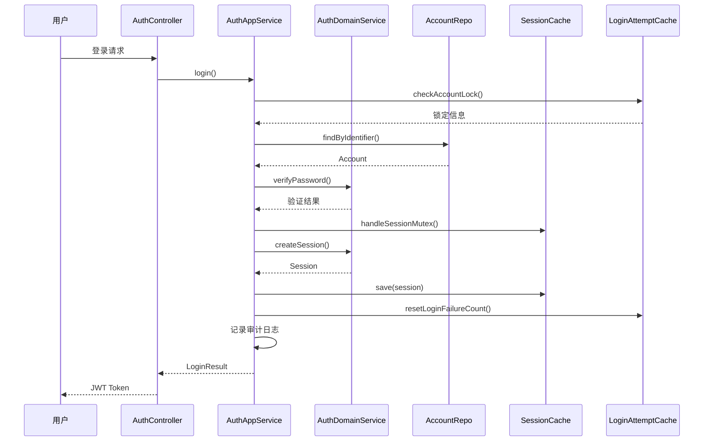
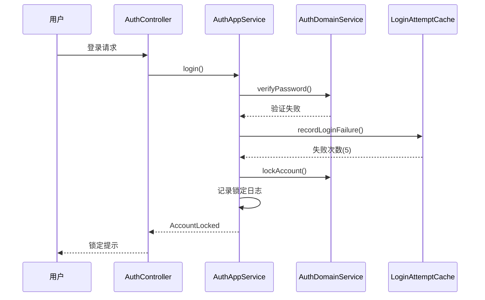
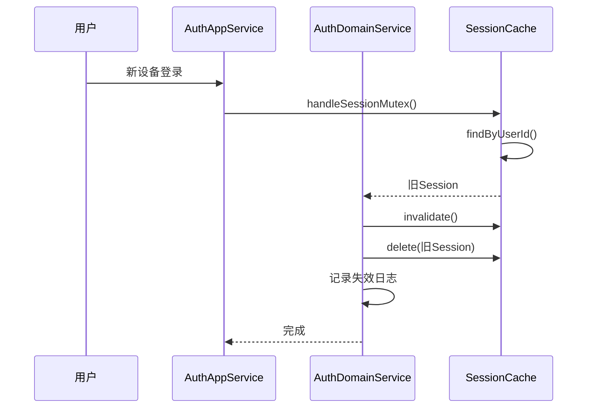
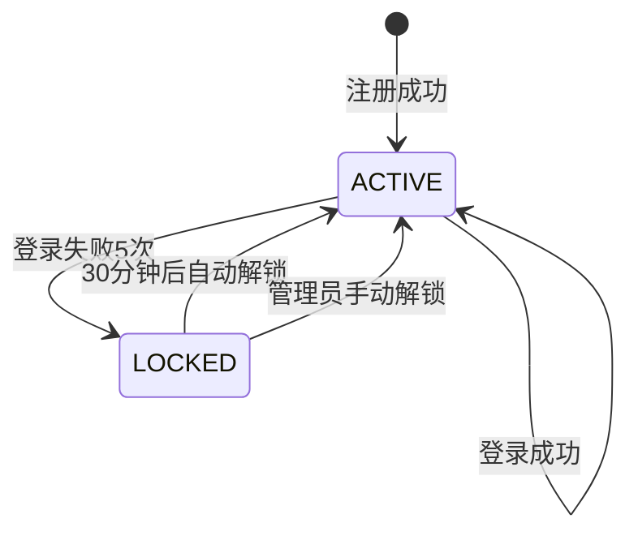
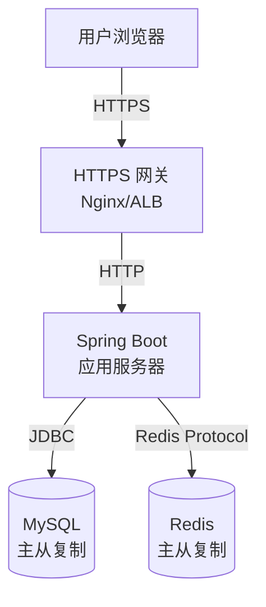

# 用户名密码登录 - 技术设计文档

**项目名称**: 用户名密码登录  
**文档版本**: v1.0.0  
**创建日期**: 2025-01-23  
**最后更新**: 2025-01-23  
**文档状态**: 进行中

---

## 1. 概述

### 1.1 设计目标

为 AIOps 平台实现基于用户名或邮箱的本地账号登录功能，提供安全可靠的身份认证能力。

### 1.2 设计范围

本设计涵盖：
- 用户注册和登录
- 密码加密和验证
- 会话管理和互斥
- 防暴力破解
- 审计日志记录

### 1.3 关键约束

- 必须使用 Spring Security 框架
- 必须使用 BCrypt 加密算法（Work Factor ≥ 10）
- 必须使用 JWT Token 进行会话管理
- 必须使用 Redis 存储登录失败计数（MySQL 降级）
- 网关层卸载 HTTPS，应用层使用 HTTP
- 同一用户只能有一个活跃会话

---

## 2. 概要设计

### 2.1 静态结构

#### 2.1.1 系统边界

**系统内**：
- 用户认证模块（注册、登录、登出）
- 密码管理模块（加密、验证、强度检查）
- 会话管理模块（创建、验证、互斥、过期）
- 账号锁定模块（防暴力破解、手动解锁）

**系统外**：
- MySQL 数据库（存储用户账号、会话信息）
- Redis 缓存（存储登录失败计数、会话信息）
- HTTPS 网关（提供 HTTPS 加密传输）
- 前端应用（提供登录/注册界面）

**关键交互**：
- 用户通过 HTTP/HTTPS 与系统交互（RESTful API）
- 系统通过 JDBC 与 MySQL 交互
- 系统通过 Redis Client 与 Redis 交互
- 系统使用 JWT Token 进行客户端会话管理


#### 2.1.2 架构模式选择

**选择**：DDD 分层架构（单体应用）

**理由**：
1. 符合现有架构（项目已采用 DDD 分层）
2. 业务复杂度适中，不需要微服务拆分
3. 团队规模小，单体应用开发效率更高
4. 运维简单，降低部署和运维复杂度
5. 性能足够（1000 并发用户，单体应用完全可以满足）

**备选方案**：
- 微服务架构：优点是独立部署和扩展，但缺点是增加运维复杂度、网络开销，对于 MVP 阶段过度设计

**ADR-001：选择 DDD 分层架构而非微服务**
- **状态**：已接受
- **背景**：需要确定系统架构模式，团队规模较小，业务复杂度中等
- **决策**：采用 DDD 分层架构（单体应用）
- **理由**：
  - 团队规模小，不需要独立部署
  - 业务复杂度可控
  - 降低运维复杂度
  - 开发和调试更简单
- **后果**：
  - 正面：开发效率高，运维简单，易于调试
  - 负面：未来扩展需要重构，模块边界需要严格控制


#### 2.1.3 模块划分

系统按 DDD 分层架构划分为以下模块：

**1. Interface Layer（接口层）**
- **AuthController**：统一的认证控制器
  - 认证接口：POST /auth/register, POST /auth/login, POST /auth/logout
  - 会话管理：GET /session/validate, POST /session/force-logout-others
  - 管理员接口：POST /admin/accounts/{id}/unlock

**2. Application Layer（应用层）**
- **AuthApplicationService**：统一的认证应用服务
  - 登录流程（用户名/邮箱）
  - 注册流程
  - 登出流程
  - 会话管理（创建、验证、互斥）
  - 账号锁定/解锁流程

**3. Domain Layer（领域层）**
- **领域实体**：
  - Account（账号）：用户名、邮箱、密码、角色、状态
  - Session（会话）：会话ID、用户ID、过期时间、设备信息
- **AuthDomainService**：统一的认证领域服务
  - 密码加密、验证、强度检查
  - 会话创建、验证、互斥逻辑
  - 账号锁定/解锁逻辑
- **仓储接口**：
  - AccountRepository
  - SessionRepository
  - LoginAttemptRepository

**4. Infrastructure Layer（基础设施层）**
- **Repository 实现**（MySQL）：
  - AccountRepositoryImpl
  - SessionRepositoryImpl（降级）
- **Cache 实现**（Redis）：
  - LoginAttemptCache（登录失败计数）
  - SessionCache（会话存储）
- **Security 组件**：
  - JwtTokenProvider（JWT Token 生成和验证）
  - BCryptPasswordEncoder（Spring Security 提供）

**5. Common Layer（公共层）**
- 异常定义：AuthenticationException, AccountLockedException, InvalidPasswordException
- 常量定义：SecurityConstants（锁定时间、会话时长等）
- 工具类：ValidationUtils（邮箱、用户名验证）


#### 2.1.4 技术栈选择

| 技术领域 | 技术选型 | 版本 | 选择理由 |
|---------|---------|------|---------|
| 编程语言 | Java | 21 | LTS 版本，项目已采用 |
| 后端框架 | Spring Boot | 3.4.1 | 主框架，项目已采用 |
| 安全框架 | Spring Security | 6.x | 需求约束，与 Spring Boot 3 完美集成 |
| 密码加密 | BCrypt | - | 需求约束，Spring Security 提供 |
| 会话管理 | JWT + Redis | - | 无状态，高性能 |
| 数据库 | MySQL | 8.x | 项目已采用，支持事务 |
| 缓存 | Redis | 7.x | 需求约束，高性能，支持 TTL |
| ORM | MyBatis-Plus | 3.5.7 | 项目已采用，简化 CRUD |
| 连接池 | Druid | 1.2.20 | 项目已采用，监控功能强大 |
| 日志 | Logback + Logstash | 7.4 | 项目已采用，结构化日志 |

**ADR-002：选择 JWT Token 进行会话管理**
- **状态**：已接受
- **背景**：需要选择会话管理方案
- **决策**：使用 JWT Token + Redis
- **理由**：
  - JWT：无状态，适合分布式，客户端存储
  - Redis：高性能会话存储，支持 TTL 自动过期
  - 结合两者优势：JWT 用于客户端验证，Redis 用于会话互斥和失效控制
- **后果**：
  - 正面：无状态，性能高，易于扩展
  - 负面：Token 无法主动失效（通过 Redis 黑名单解决）


#### 2.1.5 模块间接口协议

**通信方式**：
- Interface Layer ↔ Application Layer：Java 方法调用（同进程）
- Application Layer ↔ Domain Layer：Java 方法调用（同进程）
- Application Layer ↔ Infrastructure Layer：Java 接口调用（依赖倒置）
- 前端 ↔ Interface Layer：HTTP/HTTPS + JSON（RESTful API）
- Infrastructure Layer ↔ MySQL：JDBC（MyBatis-Plus）
- Infrastructure Layer ↔ Redis：Redis Protocol（Spring Data Redis）

**API 设计风格**：
- RESTful API：使用标准 HTTP 方法（POST/GET/DELETE）
- 数据格式：JSON
- 认证方式：JWT Token（Header: Authorization: Bearer <token>）
- 错误响应：统一错误码和错误消息格式

**接口协议规范**：
- 所有 API 返回统一的响应格式：`{ code, message, data }`
- 使用 HTTP 状态码表示请求结果（200/400/401/403/423/500）
- JWT Token 通过 HTTP Header 传递
- CSRF Token 通过 Cookie 或 Header 传递

**详细 API 规范**：参见 `api-specification.yaml`


### 2.2 动态行为

#### 2.2.1 关键业务流程（概要）

**流程1：用户登录流程**
1. 用户提交登录请求（用户名/邮箱 + 密码） - Interface Layer
2. 检查账号是否被锁定 - Application Layer
3. 验证用户凭据（密码） - Domain Layer
4. 检查会话互斥，使旧会话失效 - Domain Layer
5. 创建新会话，生成 JWT Token - Domain Layer
6. 存储会话到 Redis - Infrastructure Layer
7. 记录审计日志（应用日志） - Application Layer
8. 返回 JWT Token 给用户 - Interface Layer

**流程2：用户注册流程**
1. 用户提交注册请求（用户名 + 邮箱 + 密码） - Interface Layer
2. 验证用户名和邮箱唯一性 - Application Layer
3. 验证密码强度 - Domain Layer
4. 加密密码（BCrypt） - Domain Layer
5. 创建账号实体 - Domain Layer
6. 持久化账号到 MySQL - Infrastructure Layer
7. 记录审计日志（应用日志） - Application Layer
8. 返回注册成功 - Interface Layer

**流程3：防暴力破解流程**
1. 用户登录失败 - Application Layer
2. 增加登录失败计数（Redis） - Infrastructure Layer
3. 检查失败次数是否达到阈值（5次） - Domain Layer
4. 如果达到阈值，锁定账号（30分钟） - Domain Layer
5. 记录账号锁定日志（应用日志） - Application Layer
6. 返回账号锁定提示 - Interface Layer

**流程4：会话互斥流程**
1. 用户在新设备登录 - Application Layer
2. 查询该用户的旧会话 - Infrastructure Layer
3. 使旧会话失效 - Domain Layer
4. 删除旧会话（Redis） - Infrastructure Layer
5. 创建新会话 - Domain Layer
6. 记录会话失效日志（应用日志） - Application Layer


### 2.3 辅助设计

#### 2.3.1 性能策略

**策略1：Redis 缓存优先**
- 用途：登录失败计数、会话存储
- 理由：Redis 内存操作，响应时间 < 10ms，远低于 MySQL
- 降级方案：Redis 不可用时，使用 MySQL 存储

**策略2：BCrypt Work Factor 优化**
- 用途：密码加密和验证
- 理由：Work Factor = 10，单次验证约 100-200ms，满足 < 500ms 要求
- 权衡：Work Factor 越高越安全，但性能越低

**策略3：数据库连接池**
- 用途：MySQL 连接复用
- 理由：Druid 连接池，避免频繁创建连接
- 配置：初始连接数 10，最大连接数 50

**策略4：结构化审计日志**
- 用途：审计日志记录
- 理由：使用 Logback AsyncAppender，不阻塞主流程，JSON 格式便于分析
- 实现：配置 logback-spring.xml

#### 2.3.2 安全策略

**认证方案**：
- JWT Token：无状态，客户端存储，包含用户ID、角色、过期时间
- Token 签名：使用 HMAC-SHA256 算法
- Token 过期：默认 2 小时，"记住我" 30 天

**授权模型**：
- 基于角色的访问控制（RBAC）：普通用户（ROLE_USER）、管理员（ROLE_ADMIN）
- Spring Security 注解：@PreAuthorize("hasRole('ADMIN')")

**数据加密**：
- 密码加密：BCrypt，Work Factor = 10
- 传输加密：HTTPS（网关层卸载）
- Cookie 安全：Secure + HttpOnly 标志

**攻击防护**：
- SQL 注入：MyBatis-Plus 参数化查询
- XSS：Spring Security 自动转义输出
- CSRF：Spring Security CSRF Token
- 暴力破解：5次失败锁定30分钟

#### 2.3.3 可观测性策略

**日志策略**：
- 结构化日志：使用 Logstash Encoder，JSON 格式
- 日志级别：
  - INFO：正常业务操作（登录成功、注册成功）
  - WARN：异常情况（登录失败、账号锁定）
  - ERROR：系统错误（Redis 不可用、数据库异常）
- 日志内容：时间戳、用户ID、操作类型、IP地址、结果

**监控指标**：
- 业务指标：登录成功率、注册数量、账号锁定数量
- 性能指标：API 响应时间、BCrypt 耗时、Redis 命中率
- 系统指标：JVM 内存、CPU 使用率、数据库连接数


---

## 3. 详细设计

### 3.1 静态结构

#### 3.1.1 HTTP API 接口定义

详细的 HTTP API 接口定义请参见 `api-specification.yaml`（OpenAPI 3.0 规范）。

**核心接口列表**：
- POST /auth/register - 用户注册
- POST /auth/login - 用户登录
- POST /auth/logout - 用户登出
- GET /session/validate - 验证会话
- POST /session/force-logout-others - 强制登出其他设备
- POST /admin/accounts/{id}/unlock - 管理员手动解锁账号

**统一响应格式**：
```json
{
  "code": 0,
  "message": "操作成功",
  "data": { }
}
```

**错误响应格式**：
```json
{
  "code": 400,
  "message": "请求参数无效",
  "data": {
    "field": "password",
    "detail": "密码长度至少为8个字符"
  }
}
```


#### 3.1.2 数据结构设计

##### 实体属性表

| 实体 | 属性 | 类型 | 必填 | 说明 | 约束 |
|------|------|------|------|------|------|
| Account | id | Long | 是 | 账号ID | 主键，自增 |
| Account | username | String | 是 | 用户名 | 唯一，3-20字符，字母数字下划线 |
| Account | email | String | 是 | 邮箱 | 唯一，最大100字符，邮箱格式 |
| Account | password | String | 是 | 加密后的密码 | BCrypt 加密，60字符 |
| Account | role | String | 是 | 角色 | ROLE_USER 或 ROLE_ADMIN |
| Account | status | String | 是 | 账号状态 | ACTIVE, LOCKED, DISABLED |
| Account | createdAt | DateTime | 是 | 创建时间 | ISO8601 格式 |
| Account | updatedAt | DateTime | 是 | 更新时间 | ISO8601 格式 |
| Session | id | String | 是 | 会话ID | UUID |
| Session | userId | Long | 是 | 用户ID | 外键关联 Account.id |
| Session | token | String | 是 | JWT Token | 加密存储 |
| Session | expiresAt | DateTime | 是 | 过期时间 | ISO8601 格式 |
| Session | deviceInfo | String | 否 | 设备信息 | JSON 格式 |
| Session | createdAt | DateTime | 是 | 创建时间 | ISO8601 格式 |

##### 实体关系表

| 实体A | 关系 | 实体B | 多重性 | 说明 |
|-------|------|-------|--------|------|
| Account | has | Session | 1:1 | 一个账号同时只能有一个活跃会话（会话互斥） |

##### 枚举定义表

| 枚举类型 | 值 | 说明 |
|---------|-----|------|
| AccountRole | ROLE_USER | 普通用户 |
| AccountRole | ROLE_ADMIN | 系统管理员 |
| AccountStatus | ACTIVE | 活跃状态 |
| AccountStatus | LOCKED | 锁定状态 |
| AccountStatus | DISABLED | 禁用状态 |

##### 数据库表设计（MySQL）

**account 表**：
```sql
CREATE TABLE account (
    id BIGINT AUTO_INCREMENT PRIMARY KEY COMMENT '账号ID',
    username VARCHAR(20) NOT NULL UNIQUE COMMENT '用户名',
    email VARCHAR(100) NOT NULL UNIQUE COMMENT '邮箱',
    password VARCHAR(60) NOT NULL COMMENT '加密后的密码',
    role VARCHAR(20) NOT NULL DEFAULT 'ROLE_USER' COMMENT '角色',
    status VARCHAR(20) NOT NULL DEFAULT 'ACTIVE' COMMENT '账号状态',
    created_at DATETIME NOT NULL DEFAULT CURRENT_TIMESTAMP COMMENT '创建时间',
    updated_at DATETIME NOT NULL DEFAULT CURRENT_TIMESTAMP ON UPDATE CURRENT_TIMESTAMP COMMENT '更新时间',
    INDEX idx_username (username),
    INDEX idx_email (email)
) ENGINE=InnoDB DEFAULT CHARSET=utf8mb4 COMMENT='用户账号表';
```

**session 表**（降级方案）：
```sql
CREATE TABLE session (
    id VARCHAR(36) PRIMARY KEY COMMENT '会话ID',
    user_id BIGINT NOT NULL COMMENT '用户ID',
    token TEXT NOT NULL COMMENT 'JWT Token',
    expires_at DATETIME NOT NULL COMMENT '过期时间',
    device_info TEXT COMMENT '设备信息',
    created_at DATETIME NOT NULL DEFAULT CURRENT_TIMESTAMP COMMENT '创建时间',
    INDEX idx_user_id (user_id),
    INDEX idx_expires_at (expires_at)
) ENGINE=InnoDB DEFAULT CHARSET=utf8mb4 COMMENT='会话表（降级方案）';
```

##### Redis 数据结构设计

**登录失败计数**：
- Key: `login:fail:{identifier}` (identifier 为用户名或邮箱)
- Value: 失败次数（整数）
- TTL: 30 分钟（锁定时长）

**会话存储**：
- Key: `session:{sessionId}`
- Value: Session 对象（JSON 序列化）
- TTL: 2 小时（默认）或 30 天（记住我）

**会话互斥**：
- Key: `session:user:{userId}`
- Value: 当前活跃的 sessionId
- TTL: 与会话相同


#### 3.1.3 核心方法定义

##### Interface Layer - AuthController

```java
@RestController
@RequestMapping("/api/v1/auth")
public class AuthController {
    
    @PostMapping("/register")
    public ResponseEntity<ApiResponse<RegisterResult>> register(@Valid @RequestBody RegisterRequest request);
    
    @PostMapping("/login")
    public ResponseEntity<ApiResponse<LoginResult>> login(@Valid @RequestBody LoginRequest request);
    
    @PostMapping("/logout")
    public ResponseEntity<ApiResponse<Void>> logout(@RequestHeader("Authorization") String token);
    
    @GetMapping("/session/validate")
    public ResponseEntity<ApiResponse<SessionValidationResult>> validateSession(@RequestHeader("Authorization") String token);
    
    @PostMapping("/session/force-logout-others")
    public ResponseEntity<ApiResponse<LoginResult>> forceLogoutOthers(
        @RequestHeader("Authorization") String token,
        @Valid @RequestBody ForceLogoutRequest request);
    
    @PostMapping("/admin/accounts/{accountId}/unlock")
    @PreAuthorize("hasRole('ADMIN')")
    public ResponseEntity<ApiResponse<Void>> unlockAccount(
        @RequestHeader("Authorization") String token,
        @PathVariable Long accountId);
}
```

##### Application Layer - AuthApplicationService

```java
public interface AuthApplicationService {
    RegisterResult register(RegisterRequest request);
    LoginResult login(LoginRequest request);
    void logout(String token);
    SessionValidationResult validateSession(String token);
    LoginResult forceLogoutOthers(String token, String password);
    void unlockAccount(String adminToken, Long accountId);
}
```

##### Domain Layer - AuthDomainService

```java
public interface AuthDomainService {
    String encryptPassword(String rawPassword);
    boolean verifyPassword(String rawPassword, String encodedPassword);
    PasswordStrengthResult validatePasswordStrength(String password, String username, String email);
    Session createSession(Account account, boolean rememberMe, DeviceInfo deviceInfo);
    Session validateSession(String sessionId);
    void invalidateSession(String sessionId);
    void handleSessionMutex(Account account, Session newSession);
    int recordLoginFailure(String identifier);
    Optional<AccountLockInfo> checkAccountLock(String identifier);
    void lockAccount(String identifier, int lockDurationMinutes);
    void unlockAccount(Long accountId);
    void resetLoginFailureCount(String identifier);
}
```

##### Domain Layer - Repository Interfaces

```java
public interface AccountRepository {
    Optional<Account> findById(Long id);
    Optional<Account> findByUsername(String username);
    Optional<Account> findByEmail(String email);
    Account save(Account account);
    void updateStatus(Long id, AccountStatus status);
}

public interface SessionRepository {
    Optional<Session> findById(String sessionId);
    Optional<Session> findByUserId(Long userId);
    Session save(Session session);
    void deleteById(String sessionId);
    void deleteByUserId(Long userId);
}
```


### 3.2 动态行为

#### 3.2.1 详细业务流程（UML 序列图）

##### 流程1：用户登录流程



##### 流程2：登录失败处理流程



##### 流程3：会话互斥流程




#### 3.2.2 实体状态变化

##### Account 状态机



##### Account 状态转换表

| 当前状态 | 触发事件 | 条件 | 目标状态 | 副作用 |
|---------|---------|------|---------|--------|
| ACTIVE | 登录失败5次 | 连续失败5次 | LOCKED | 记录锁定日志，设置锁定时间 |
| LOCKED | 30分钟后 | 锁定时间到期 | ACTIVE | 清除登录失败计数 |
| LOCKED | 管理员解锁 | 管理员操作 | ACTIVE | 记录解锁日志，清除登录失败计数 |
| ACTIVE | 登录成功 | - | ACTIVE | 清除登录失败计数 |


### 3.3 辅助设计

#### 3.3.1 详细的性能设计

##### BCrypt 性能优化

**配置**：
- Work Factor: 10
- 预期性能：单次加密/验证 100-200ms

**性能测试**：
```java
@Test
public void testBCryptPerformance() {
    BCryptPasswordEncoder encoder = new BCryptPasswordEncoder(10);
    String password = "SecureP@ss123";
    
    // 加密性能测试
    long start = System.currentTimeMillis();
    String encoded = encoder.encode(password);
    long encodeTime = System.currentTimeMillis() - start;
    
    // 验证性能测试
    start = System.currentTimeMillis();
    boolean matches = encoder.matches(password, encoded);
    long matchTime = System.currentTimeMillis() - start;
    
    // 断言：加密和验证时间都应小于 500ms
    assertTrue(encodeTime < 500);
    assertTrue(matchTime < 500);
}
```

##### Redis 缓存策略

**登录失败计数缓存**：
- 缓存 Key: `login:fail:{identifier}`
- 缓存策略：写入时设置 TTL 30 分钟
- 降级策略：Redis 不可用时，使用 MySQL 临时表

**会话缓存**：
- 缓存 Key: `session:{sessionId}`
- 缓存策略：写入时设置 TTL（2小时或30天）
- 降级策略：Redis 不可用时，使用 MySQL session 表

**缓存预热**：
- 系统启动时，不需要预热（按需加载）

**缓存失效**：
- 登录成功：删除登录失败计数
- 登出：删除会话缓存
- 会话互斥：删除旧会话缓存

##### 数据库连接池配置

```yaml
spring:
  datasource:
    druid:
      initial-size: 10
      max-active: 50
      min-idle: 10
      max-wait: 60000
      validation-query: SELECT 1
      test-while-idle: true
      test-on-borrow: false
      test-on-return: false
```


#### 3.3.2 详细的安全设计

##### JWT Token 设计

**Token 结构**：
```json
{
  "header": {
    "alg": "HS256",
    "typ": "JWT"
  },
  "payload": {
    "sub": "12345",
    "username": "john_doe",
    "role": "ROLE_USER",
    "iat": 1706000000,
    "exp": 1706007200
  },
  "signature": "..."
}
```

**Token 生成**：
```java
public String generateToken(Account account, boolean rememberMe) {
    long expirationTime = rememberMe ? 30 * 24 * 60 * 60 * 1000 : 2 * 60 * 60 * 1000;
    Date expirationDate = new Date(System.currentTimeMillis() + expirationTime);
    
    return Jwts.builder()
        .setSubject(account.getId().toString())
        .claim("username", account.getUsername())
        .claim("role", account.getRole())
        .setIssuedAt(new Date())
        .setExpiration(expirationDate)
        .signWith(SignatureAlgorithm.HS256, secretKey)
        .compact();
}
```

**Token 验证**：
```java
public Claims validateToken(String token) {
    try {
        return Jwts.parser()
            .setSigningKey(secretKey)
            .parseClaimsJws(token)
            .getBody();
    } catch (ExpiredJwtException e) {
        throw new SessionExpiredException("Token 已过期");
    } catch (JwtException e) {
        throw new InvalidTokenException("Token 无效");
    }
}
```

##### 密码强度验证规则

**规则1：长度要求**
- 最小长度：8 个字符
- 最大长度：64 个字符

**规则2：字符类型要求**
- 至少包含以下 3 类字符：
  - 大写字母（A-Z）
  - 小写字母（a-z）
  - 数字（0-9）
  - 特殊字符（!@#$%^&*()_+-=[]{}|;:,.<>?）

**规则3：不包含用户名或邮箱**
- 密码不能包含用户名的任何部分
- 密码不能包含邮箱的任何部分（@之前）

**规则4：不是常见弱密码**
- 不包含连续字符（如 "123456", "abcdef"）
- 不包含重复字符（如 "aaaaaa", "111111"）
- 不包含键盘序列（如 "qwerty", "asdfgh"）
- 不是常见模式（如 "password", "admin", "123456"）

**实现示例**：
```java
public PasswordStrengthResult validatePasswordStrength(String password, String username, String email) {
    List<String> errors = new ArrayList<>();
    
    // 规则1：长度检查
    if (password.length() < 8) {
        errors.add("密码长度至少为8个字符");
    }
    if (password.length() > 64) {
        errors.add("密码长度最多为64个字符");
    }
    
    // 规则2：字符类型检查
    int typeCount = 0;
    if (password.matches(".*[A-Z].*")) typeCount++;
    if (password.matches(".*[a-z].*")) typeCount++;
    if (password.matches(".*[0-9].*")) typeCount++;
    if (password.matches(".*[!@#$%^&*()_+\\-=\\[\\]{}|;:,.<>?].*")) typeCount++;
    
    if (typeCount < 3) {
        errors.add("密码必须包含大写字母、小写字母、数字、特殊字符中的至少3类");
    }
    
    // 规则3：不包含用户名或邮箱
    if (password.toLowerCase().contains(username.toLowerCase())) {
        errors.add("密码不能包含用户名");
    }
    String emailPrefix = email.split("@")[0];
    if (password.toLowerCase().contains(emailPrefix.toLowerCase())) {
        errors.add("密码不能包含邮箱");
    }
    
    // 规则4：弱密码检查
    if (isWeakPassword(password)) {
        errors.add("密码过于简单，请使用更复杂的密码");
    }
    
    return new PasswordStrengthResult(errors.isEmpty(), errors);
}

private boolean isWeakPassword(String password) {
    String lower = password.toLowerCase();
    
    // 检查连续字符
    if (lower.matches(".*(?:012|123|234|345|456|567|678|789|abc|bcd|cde|def|efg|fgh|ghi|hij|ijk|jkl|klm|lmn|mno|nop|opq|pqr|qrs|rst|stu|tuv|uvw|vwx|wxy|xyz).*")) {
        return true;
    }
    
    // 检查重复字符
    if (lower.matches(".*(.)\\1{5,}.*")) {
        return true;
    }
    
    // 检查键盘序列
    if (lower.matches(".*(qwerty|asdfgh|zxcvbn).*")) {
        return true;
    }
    
    // 检查常见模式
    String[] commonPatterns = {"password", "admin", "123456", "qwerty", "letmein"};
    for (String pattern : commonPatterns) {
        if (lower.contains(pattern)) {
            return true;
        }
    }
    
    return false;
}
```


#### 3.3.3 详细的错误处理

##### 错误分类

**业务错误**（4xx）：
- 400 Bad Request：请求参数无效
- 401 Unauthorized：认证失败（用户名或密码错误）
- 403 Forbidden：无权限（非管理员）
- 404 Not Found：资源不存在（账号不存在）
- 409 Conflict：资源冲突（用户名或邮箱已存在）
- 423 Locked：账号已锁定

**系统错误**（5xx）：
- 500 Internal Server Error：系统内部错误
- 503 Service Unavailable：服务不可用（Redis 不可用）

##### 错误码定义

| 错误码 | HTTP状态码 | 错误消息 | 说明 |
|-------|-----------|---------|------|
| 0 | 200 | 操作成功 | 成功 |
| 400001 | 400 | 请求参数无效 | 参数验证失败 |
| 401001 | 401 | 用户名或密码错误 | 认证失败 |
| 401002 | 401 | Token 无效或已过期 | Token 验证失败 |
| 403001 | 403 | 无权限访问 | 非管理员 |
| 404001 | 404 | 账号不存在 | 账号未找到 |
| 409001 | 409 | 用户名已存在 | 用户名冲突 |
| 409002 | 409 | 邮箱已存在 | 邮箱冲突 |
| 423001 | 423 | 账号已锁定 | 账号被锁定 |
| 500001 | 500 | 系统内部错误 | 未知错误 |
| 503001 | 503 | 缓存服务不可用 | Redis 不可用 |

##### 异常处理策略

**全局异常处理器**：
```java
@RestControllerAdvice
public class GlobalExceptionHandler {
    
    @ExceptionHandler(AuthenticationException.class)
    public ResponseEntity<ApiResponse<Void>> handleAuthenticationException(AuthenticationException e) {
        return ResponseEntity.status(HttpStatus.UNAUTHORIZED)
            .body(ApiResponse.error(401001, "用户名或密码错误"));
    }
    
    @ExceptionHandler(AccountLockedException.class)
    public ResponseEntity<ApiResponse<AccountLockInfo>> handleAccountLockedException(AccountLockedException e) {
        return ResponseEntity.status(HttpStatus.LOCKED)
            .body(ApiResponse.error(423001, e.getMessage(), e.getLockInfo()));
    }
    
    @ExceptionHandler(DuplicateUsernameException.class)
    public ResponseEntity<ApiResponse<Void>> handleDuplicateUsernameException(DuplicateUsernameException e) {
        return ResponseEntity.status(HttpStatus.CONFLICT)
            .body(ApiResponse.error(409001, "用户名已存在"));
    }
    
    @ExceptionHandler(Exception.class)
    public ResponseEntity<ApiResponse<Void>> handleException(Exception e) {
        log.error("系统内部错误", e);
        return ResponseEntity.status(HttpStatus.INTERNAL_SERVER_ERROR)
            .body(ApiResponse.error(500001, "系统内部错误"));
    }
}
```

##### 降级策略

**Redis 不可用降级**：
```java
public int recordLoginFailure(String identifier) {
    try {
        // 优先使用 Redis
        return redisTemplate.opsForValue().increment("login:fail:" + identifier);
    } catch (RedisConnectionException e) {
        log.warn("Redis 不可用，降级到 MySQL", e);
        // 降级到 MySQL
        return loginAttemptRepository.incrementAndGet(identifier);
    }
}
```

**数据库不可用降级**：
- 返回 503 Service Unavailable
- 记录错误日志
- 触发告警


---

## 4. 技术决策记录（ADR）

### ADR-001：选择 DDD 分层架构而非微服务

- **状态**：已接受
- **背景**：需要确定系统架构模式，团队规模较小，业务复杂度中等
- **决策**：采用 DDD 分层架构（单体应用）
- **理由**：
  - 团队规模小，不需要独立部署
  - 业务复杂度可控
  - 降低运维复杂度
  - 开发和调试更简单
- **后果**：
  - 正面：开发效率高，运维简单，易于调试
  - 负面：未来扩展需要重构，模块边界需要严格控制

### ADR-002：选择 JWT Token 进行会话管理

- **状态**：已接受
- **背景**：需要选择会话管理方案
- **决策**：使用 JWT Token + Redis
- **理由**：
  - JWT：无状态，适合分布式，客户端存储
  - Redis：高性能会话存储，支持 TTL 自动过期
  - 结合两者优势：JWT 用于客户端验证，Redis 用于会话互斥和失效控制
- **后果**：
  - 正面：无状态，性能高，易于扩展
  - 负面：Token 无法主动失效（通过 Redis 黑名单解决）

### ADR-003：审计日志仅记录到日志文件

- **状态**：已接受
- **背景**：需要选择审计日志存储方案
- **决策**：审计日志仅记录到应用日志文件（Logback），不写入数据库
- **理由**：
  - 简化 MVP 实现
  - 减少数据库操作，提升性能
  - 日志文件可以通过日志收集系统（如 ELK）集中管理
  - 后续如果需要查询功能，再考虑写入数据库
- **后果**：
  - 正面：实现简单，性能好，无需额外表设计
  - 负面：日志文件查询不便，需要依赖日志收集系统

### ADR-004：使用 BCrypt Work Factor 10

- **状态**：已接受
- **背景**：需要选择密码加密算法和强度
- **决策**：使用 BCrypt，Work Factor = 10
- **理由**：
  - 需求约束要求使用 BCrypt
  - Work Factor = 10 是行业推荐值
  - 单次验证约 100-200ms，满足性能要求（< 500ms）
  - 安全性和性能的平衡点
- **后果**：
  - 正面：安全性高，性能可接受
  - 负面：Work Factor 固定，未来调整需要重新加密所有密码


---

## 5. 风险和应对

### 5.1 技术风险

**风险1：Redis 不可用导致登录失败**
- **影响**：无法记录登录失败计数，无法锁定账号
- **概率**：低（Redis 可用性 99.9%）
- **应对**：
  - 实现 MySQL 降级方案
  - 监控 Redis 可用性
  - 配置 Redis 主从复制

**风险2：BCrypt 性能瓶颈**
- **影响**：登录响应时间过长
- **概率**：中（高并发场景）
- **应对**：
  - 使用 Work Factor = 10（平衡安全和性能）
  - 监控 BCrypt 耗时
  - 考虑使用异步验证（后续优化）

**风险3：JWT Token 泄露**
- **影响**：账号被盗用
- **概率**：低（HTTPS 传输）
- **应对**：
  - 强制使用 HTTPS
  - 设置合理的 Token 过期时间
  - 实现会话互斥（一个账号只能有一个活跃会话）
  - 提供"强制登出其他设备"功能

### 5.2 业务风险

**风险4：账号锁定策略过于严格**
- **影响**：正常用户被误锁定
- **概率**：中（用户忘记密码）
- **应对**：
  - 提供管理员手动解锁功能
  - 记录详细的审计日志
  - 后续版本考虑实现密码找回功能

**风险5：弱密码规则过于宽松**
- **影响**：账号安全性降低
- **概率**：中（用户使用弱密码）
- **应对**：
  - 实现严格的密码强度验证
  - 提供密码强度提示
  - 后续版本考虑引入弱密码字典

### 5.3 运维风险

**风险6：审计日志文件占用磁盘空间**
- **影响**：磁盘空间不足
- **概率**：中（长期运行）
- **应对**：
  - 配置日志轮转策略（按大小或时间）
  - 定期备份和清理日志文件
  - 使用日志收集系统（如 ELK）集中管理
  - 后续版本考虑写入数据库


---

## 6. 测试策略

### 6.1 单元测试

**测试范围**：
- Domain Layer：密码加密、验证、强度检查、会话创建、账号锁定逻辑
- Application Layer：登录流程、注册流程、会话管理流程
- Infrastructure Layer：Repository 实现、Cache 实现

**测试工具**：
- JUnit 5
- Mockito
- AssertJ

**测试覆盖率目标**：
- 核心业务逻辑：90%
- 整体代码：80%

**示例测试用例**：
```java
@Test
public void testPasswordStrengthValidation() {
    // 测试密码长度不足
    PasswordStrengthResult result = authDomainService.validatePasswordStrength("abc", "john", "john@example.com");
    assertFalse(result.isValid());
    assertTrue(result.getErrors().contains("密码长度至少为8个字符"));
    
    // 测试密码包含用户名
    result = authDomainService.validatePasswordStrength("john12345", "john", "john@example.com");
    assertFalse(result.isValid());
    assertTrue(result.getErrors().contains("密码不能包含用户名"));
    
    // 测试合法密码
    result = authDomainService.validatePasswordStrength("SecureP@ss123", "john", "john@example.com");
    assertTrue(result.isValid());
}
```

### 6.2 集成测试

**测试范围**：
- HTTP API 接口测试
- 数据库集成测试
- Redis 集成测试

**测试工具**：
- Spring Boot Test
- TestContainers（Docker 容器化测试）
- RestAssured

**示例测试用例**：
```java
@SpringBootTest(webEnvironment = SpringBootTest.WebEnvironment.RANDOM_PORT)
@Testcontainers
public class AuthControllerIntegrationTest {
    
    @Container
    static MySQLContainer<?> mysql = new MySQLContainer<>("mysql:8.0");
    
    @Container
    static GenericContainer<?> redis = new GenericContainer<>("redis:7.0")
        .withExposedPorts(6379);
    
    @Test
    public void testLoginSuccess() {
        // 先注册
        RegisterRequest registerRequest = new RegisterRequest("john_doe", "john@example.com", "SecureP@ss123");
        restTemplate.postForEntity("/api/v1/auth/register", registerRequest, ApiResponse.class);
        
        // 再登录
        LoginRequest loginRequest = new LoginRequest("john_doe", "SecureP@ss123", false);
        ResponseEntity<ApiResponse<LoginResult>> response = restTemplate.postForEntity("/api/v1/auth/login", loginRequest, new ParameterizedTypeReference<>() {});
        
        assertEquals(HttpStatus.OK, response.getStatusCode());
        assertNotNull(response.getBody().getData().getToken());
    }
}
```

### 6.3 性能测试

**测试目标**：
- 登录响应时间：95% < 2秒
- 并发支持：1000 用户
- BCrypt 验证：< 500ms

**测试工具**：
- JMeter
- Gatling

**测试场景**：
- 场景1：1000 并发用户同时登录
- 场景2：持续 10 分钟的登录压力测试
- 场景3：BCrypt 性能基准测试

### 6.4 安全测试

**测试范围**：
- SQL 注入测试
- XSS 攻击测试
- CSRF 攻击测试
- 暴力破解测试
- Token 安全测试

**测试工具**：
- OWASP ZAP
- Burp Suite

**测试用例**：
- 测试 SQL 注入：在用户名字段输入 `' OR '1'='1`
- 测试 XSS：在用户名字段输入 `<script>alert('XSS')</script>`
- 测试暴力破解：连续 5 次登录失败，验证账号是否被锁定
- 测试 Token 过期：使用过期的 Token 访问受保护资源


---

## 7. 部署架构

### 7.1 部署拓扑



### 7.2 环境配置

**开发环境**：
- 应用服务器：本地 Spring Boot（端口 8080）
- MySQL：本地 Docker 容器（端口 3306）
- Redis：本地 Docker 容器（端口 6379）

**测试环境**：
- 应用服务器：单实例
- MySQL：单实例
- Redis：单实例

**生产环境**：
- 应用服务器：多实例（负载均衡）
- MySQL：主从复制（1主2从）
- Redis：主从复制（1主2从）
- HTTPS 网关：Nginx 或 ALB

### 7.3 配置管理

**配置文件**：
- `application.yml`：通用配置
- `application-dev.yml`：开发环境配置
- `application-test.yml`：测试环境配置
- `application-prod.yml`：生产环境配置

**敏感信息管理**：
- 数据库密码：使用环境变量或配置中心
- JWT 密钥：使用环境变量或配置中心
- Redis 密码：使用环境变量或配置中心


---

## 8. 监控和告警

### 8.1 监控指标

**业务指标**：
- 登录成功率：成功登录次数 / 总登录次数
- 注册数量：每小时/每天的注册数量
- 账号锁定数量：每小时/每天的账号锁定数量
- 登录失败率：失败登录次数 / 总登录次数

**性能指标**：
- API 响应时间：P50, P95, P99
- BCrypt 耗时：平均耗时、最大耗时
- Redis 命中率：缓存命中次数 / 总查询次数
- 数据库连接数：当前连接数、最大连接数

**系统指标**：
- JVM 内存：堆内存使用率、GC 次数
- CPU 使用率：应用 CPU 使用率
- 线程数：当前线程数、最大线程数
- 错误率：错误请求次数 / 总请求次数

### 8.2 告警规则

**业务告警**：
- 登录成功率 < 90%：警告
- 账号锁定数量 > 100/小时：警告
- 注册数量 > 1000/小时：警告（可能是恶意注册）

**性能告警**：
- API 响应时间 P95 > 2秒：警告
- BCrypt 耗时 > 500ms：警告
- Redis 命中率 < 80%：警告

**系统告警**：
- JVM 堆内存使用率 > 80%：警告
- CPU 使用率 > 80%：警告
- 错误率 > 5%：严重

**基础设施告警**：
- Redis 不可用：严重
- MySQL 不可用：严重
- 数据库连接池耗尽：严重

### 8.3 日志收集

**日志格式**：
```json
{
  "timestamp": "2025-01-23T10:30:00.000Z",
  "level": "INFO",
  "logger": "com.catface996.aiops.auth.AuthApplicationService",
  "thread": "http-nio-8080-exec-1",
  "message": "用户登录成功",
  "context": {
    "event": "USER_LOGIN_SUCCESS",
    "userId": 12345,
    "username": "john_doe",
    "ip": "192.168.1.100",
    "userAgent": "Mozilla/5.0..."
  }
}
```

**日志收集方案**：
- 使用 Logback AsyncAppender 异步写入日志文件
- 使用 Filebeat 收集日志文件
- 发送到 Elasticsearch 存储
- 使用 Kibana 查询和分析


---

## 9. 实施计划

### 9.1 开发阶段

**第1周：基础设施和核心功能**
- Day 1-2：搭建项目结构，配置 Spring Security
- Day 3-4：实现用户注册和登录功能
- Day 5：实现密码加密和验证

**第2周：安全和会话管理**
- Day 1-2：实现防暴力破解和账号锁定
- Day 3-4：实现会话管理和会话互斥
- Day 5：实现管理员手动解锁功能

**第3周：测试和优化**
- Day 1-2：单元测试和集成测试
- Day 3：性能测试和优化
- Day 4：安全测试
- Day 5：代码审查和文档完善

### 9.2 测试阶段

**功能测试**（2天）：
- 测试所有功能需求
- 测试异常场景
- 测试边界条件

**性能测试**（1天）：
- 压力测试
- 并发测试
- 性能基准测试

**安全测试**（1天）：
- SQL 注入测试
- XSS 测试
- CSRF 测试
- 暴力破解测试

### 9.3 上线计划

**上线前准备**：
- 数据库表创建和初始化
- Redis 配置和测试
- 配置文件准备
- 监控和告警配置

**上线步骤**：
1. 部署应用到测试环境
2. 执行冒烟测试
3. 部署应用到生产环境
4. 执行生产环境验证
5. 监控系统运行状态

**回滚计划**：
- 如果发现严重问题，立即回滚到上一个版本
- 回滚步骤：停止新版本应用，启动旧版本应用


---

## 10. 附录

### 10.1 参考文档

- 需求规格说明书：`.kiro/specs/username-password-login/requirements.md`
- 需求澄清文档：`.kiro/specs/username-password-login/requirement-clarification.md`
- 设计澄清文档：`.kiro/specs/username-password-login/design-clarification.md`
- API 规范文档：`.kiro/specs/username-password-login/api-specification.yaml`
- Spring Security 官方文档：https://spring.io/projects/spring-security
- JWT 官方文档：https://jwt.io/
- BCrypt 算法说明：https://en.wikipedia.org/wiki/Bcrypt
- OWASP 安全最佳实践：https://owasp.org/

### 10.2 术语表

| 术语 | 定义 |
|-----|------|
| DDD | 领域驱动设计（Domain-Driven Design） |
| JWT | JSON Web Token |
| BCrypt | 密码哈希函数 |
| RBAC | 基于角色的访问控制（Role-Based Access Control） |
| TTL | 生存时间（Time To Live） |
| ADR | 架构决策记录（Architecture Decision Record） |
| MVP | 最小可行产品（Minimum Viable Product） |
| CSRF | 跨站请求伪造（Cross-Site Request Forgery） |
| XSS | 跨站脚本攻击（Cross-Site Scripting） |
| SQL Injection | SQL 注入攻击 |

### 10.3 版本历史

| 版本 | 日期 | 修改内容 | 作者 |
|-----|------|---------|------|
| v1.0.0 | 2025-01-23 | 初始版本，完成概要设计和详细设计 | AI Assistant |

---

**文档审核**：
- 架构师：AI Assistant
- 产品负责人：[待审核]
- 技术负责人：[待审核]
- 开发团队：[待审核]

---

**设计完成日期**：2025-01-23  
**预计开发开始日期**：2025-01-24  
**预计上线日期**：2025-02-14

