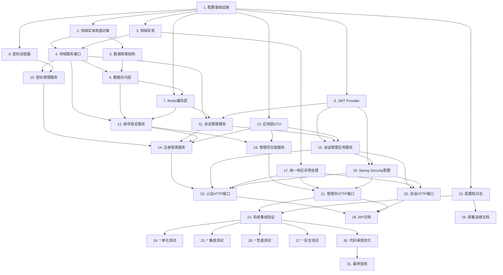

# 用户名密码登录 - 实施任务清单

**项目名称**: 用户名密码登录  
**文档版本**: v3.0.0  
**创建日期**: 2025-01-23  
**最后更新**: 2025-01-23  
**基于**: 设计文档 v1.0.0

---

## 任务说明

本任务清单严格按照 DDD 分层架构和最佳实践拆分，确保每个任务独立可执行。

**任务格式说明**：
- 使用简单数字编号（1., 2., 3.）
- 每个任务包含：目标描述、验证方法、需求追溯、依赖关系、工时估算
- 验证方法使用标签：【运行时验证】【单元测试】【构建验证】【静态检查】
- 验证优先级：运行时 > 单元测试 > 构建 > 静态

**任务状态**：
- `[ ]`：未开始
- `[x]`：已完成

**任务标记**：
- `*`：可选任务（测试相关）

---

## 阶段1：基础设施准备（3个任务，2小时）

- [x] 1. 配置基础设施和项目结构
  - 添加 Spring Security、JWT、Redis 相关依赖
  - 配置 Redis 连接和序列化方式
  - 创建 DDD 分层包结构（domain/application/interface/infrastructure）
  - **验证方法**:
    - 【构建验证】执行 `mvn clean compile`，构建成功
    - 【运行时验证】执行 `mvn spring-boot:run`，应用成功启动
    - 【运行时验证】访问 `http://localhost:8080/actuator/health`，返回 UP 状态
    - 【运行时验证】访问任意 API 端点，返回 401 Unauthorized（Spring Security 生效）
    - 【运行时验证】RedisTemplate 能正常注入并连接 Redis
  - _需求: REQ-FR-004, REQ-FR-005, REQ-FR-007_
  - _依赖: 无_
  - _工时: 2小时_

---

## 阶段2：Domain Layer - 领域模型（6个任务，5小时）

- [x] 2. 实现领域实体和值对象
  - 创建 Account 实体（包含 id, username, email, password, role, status 等字段）
  - 创建 Session 实体和 DeviceInfo 值对象
  - 创建 PasswordStrengthResult 和 AccountLockInfo 值对象
  - 创建 AccountRole 和 AccountStatus 枚举
  - 实现实体的业务方法（isActive, isLocked, canLogin, isExpired 等）
  - **验证方法**:
    - 【构建验证】执行 `mvn clean compile`，编译成功
    - 【单元测试】执行 `mvn test -Dtest=*Entity*Test`，所有实体测试通过
    - 【单元测试】验证业务方法逻辑正确（如 isExpired 判断过期时间）
  - _需求: REQ-FR-003, REQ-FR-005, REQ-FR-007, REQ-FR-008, REQ-FR-012_
  - _依赖: 任务1_
  - _工时: 2小时_

- [x] 3. 定义领域异常体系
  - 创建认证相关异常类（AuthenticationException, AccountLockedException 等）
  - 创建会话相关异常类（SessionExpiredException, SessionNotFoundException）
  - 创建数据冲突异常类（DuplicateUsernameException, DuplicateEmailException）
  - 所有异常包含错误码和详细消息
  - **验证方法**:
    - 【构建验证】执行 `mvn clean compile`，编译成功
    - 【静态检查】检查所有异常类继承关系正确
    - 【静态检查】检查所有异常包含错误码和消息字段
  - _需求: 错误处理设计_
  - _依赖: 任务1_
  - _工时: 0.5小时_

- [x] 4. 定义领域服务接口
  - 定义 AuthDomainService 接口（密码管理、会话管理、账号锁定）
  - 定义 AccountRepository 接口（账号数据访问）
  - 定义 SessionRepository 接口（会话数据访问）
  - 所有接口方法包含完整 JavaDoc 注释
  - **验证方法**:
    - 【构建验证】执行 `mvn clean compile`，编译成功
    - 【静态检查】检查所有接口方法签名符合 DDD 规范
    - 【静态检查】检查所有方法包含 JavaDoc 注释
  - _需求: REQ-FR-001 到 REQ-FR-012_
  - _依赖: 任务2, 任务3_
  - _工时: 1.5小时_

---

## 阶段3：Infrastructure Layer - 基础设施（5个任务，9小时）

- [x] 5. 创建数据库表结构
  - 创建 account 表（包含唯一索引：username, email）
  - 创建 session 表作为降级方案（包含索引：user_id, expires_at）
  - 创建数据库迁移脚本（Flyway 或 Liquibase）
  - **验证方法**:
    - 【运行时验证】执行数据库迁移脚本，表创建成功
    - 【运行时验证】查询数据库，验证表结构和索引符合设计
    - 【运行时验证】执行 `INSERT INTO account` 测试语句，验证约束生效
  - _需求: REQ-FR-003, REQ-FR-007_
  - _依赖: 任务2_
  - _工时: 1小时_

- [x] 6. 实现数据访问层
  - 实现 AccountRepository（使用 MyBatis-Plus）
  - 实现 SessionRepository（降级方案）
  - 实现所有 CRUD 方法（findById, findByUsername, findByEmail, save, delete 等）
  - **验证方法**:
    - 【单元测试】执行 `mvn test -Dtest=*Repository*Test`，所有测试通过
    - 【单元测试】验证 findByUsername 能正确查询用户
    - 【单元测试】验证 save 方法支持新增和更新
    - 【单元测试】验证 Optional 正确处理空结果
  - _需求: REQ-FR-001, REQ-FR-002, REQ-FR-003, REQ-FR-007_
  - _依赖: 任务4, 任务5_
  - _工时: 3小时_

- [x] 7. 实现 Redis 缓存层
  - 实现 LoginAttemptCache（登录失败计数，TTL 30分钟）
  - 实现 SessionCache（会话存储，支持不同 TTL）
  - 实现 Redis 降级到 MySQL 的逻辑
  - 配置 Redis Key 前缀和序列化方式
  - **验证方法**:
    - 【单元测试】执行 `mvn test -Dtest=*Cache*Test`，所有测试通过
    - 【运行时验证】启动应用，验证 Redis 连接成功
    - 【运行时验证】模拟 Redis 故障，验证降级到 MySQL
    - 【运行时验证】检查 Redis 中的 Key 格式正确（login:fail:*, session:*）
  - _需求: REQ-FR-005, REQ-FR-007, REQ-FR-008, REQ-FR-009_
  - _依赖: 任务1, 任务6_
  - _工时: 4小时_

- [x] 8. 实现 JWT Token 提供者
  - 实现 JWT Token 生成、验证和解析功能
  - 支持不同的过期时间（2小时 vs 30天）
  - 处理 Token 过期、无效等异常情况
  - 配置签名密钥（从配置文件读取）
  - **验证方法**:
    - 【单元测试】执行 `mvn test -Dtest=JwtTokenProviderTest`，所有测试通过
    - 【单元测试】验证生成的 Token 包含用户信息
    - 【单元测试】验证过期 Token 抛出 ExpiredJwtException
    - 【单元测试】验证无效 Token 抛出 JwtException
  - _需求: REQ-FR-007, REQ-FR-008_
  - _依赖: 任务1_
  - _工时: 2小时_

- [x] 9. 配置密码加密器
  - 配置 BCryptPasswordEncoder（Work Factor = 10）
  - 注册为 Spring Bean
  - **验证方法**:
    - 【单元测试】执行 `mvn test -Dtest=BCryptPasswordEncoderTest`，测试通过
    - 【单元测试】验证加密后的密码长度为 60 字符
    - 【单元测试】验证相同密码加密结果不同（盐值生效）
    - 【单元测试】验证单次加密/验证时间 < 500ms
  - _需求: REQ-FR-004, REQ-NFR-PERF-003_
  - _依赖: 任务1_
  - _工时: 0.5小时_

---

## 阶段4：Domain Service - 领域服务实现（3个任务，8小时）

- [x] 10. 实现密码管理领域服务
  - 实现密码加密和验证（使用 BCrypt）
  - 实现密码强度验证（长度、字符类型、用户信息检查、弱密码检测）
  - 返回详细的验证结果和错误信息
  - **验证方法**:
    - 【单元测试】执行 `mvn test -Dtest=*PasswordService*Test`，所有测试通过
    - 【单元测试】验证密码加密后无法反向解密
    - 【单元测试】验证相同密码验证成功，不同密码验证失败
    - 【单元测试】验证弱密码被正确识别（如 "password123", "12345678"）
    - 【单元测试】验证包含用户名的密码被拒绝
  - _需求: REQ-FR-004, REQ-FR-012_
  - _依赖: 任务4, 任务9_
  - _工时: 3小时_

- [x] 11. 实现会话管理领域服务
  - 实现会话创建（生成 UUID、JWT Token、设置过期时间）
  - 实现会话验证（检查 Token 有效性、会话存在性、过期时间）
  - 实现会话失效（删除缓存和数据库记录）
  - 实现会话互斥（使旧会话失效，创建新会话）
  - **验证方法**:
    - 【单元测试】执行 `mvn test -Dtest=*SessionService*Test`，所有测试通过
    - 【单元测试】验证 rememberMe=true 时会话有效期为 30 天
    - 【单元测试】验证 rememberMe=false 时会话有效期为 2 小时
    - 【单元测试】验证过期会话抛出 SessionExpiredException
    - 【单元测试】验证会话互斥逻辑（新登录使旧会话失效）
  - _需求: REQ-FR-007, REQ-FR-008, REQ-FR-009, REQ-FR-010_
  - _依赖: 任务4, 任务7, 任务8_
  - _工时: 3小时_

- [x] 12. 实现账号锁定领域服务
  - 实现登录失败记录（增加计数、设置 TTL）
  - 实现账号锁定检查（判断是否达到阈值）
  - 实现账号锁定和解锁（更新状态、清除计数）
  - 实现失败计数重置
  - **验证方法**:
    - 【单元测试】执行 `mvn test -Dtest=*LockService*Test`，所有测试通过
    - 【单元测试】验证连续 5 次失败后账号被锁定
    - 【单元测试】验证锁定期间返回剩余时间
    - 【单元测试】验证成功登录后计数重置为 0
    - 【单元测试】验证管理员解锁后账号状态变为 ACTIVE
  - _需求: REQ-FR-005, REQ-FR-006_
  - _依赖: 任务4, 任务6, 任务7_
  - _工时: 2小时_

---

## 阶段5：Application Layer - 应用服务（4个任务，10小时）

- [x] 13. 定义应用层接口和 DTO
  - 定义 AuthApplicationService 接口（包含所有业务方法）
  - 创建请求 DTO（RegisterRequest, LoginRequest, ForceLogoutRequest）
  - 创建响应 DTO（RegisterResult, LoginResult, SessionValidationResult, UserInfo）
  - 添加验证注解（@NotNull, @Size, @Email 等）
  - **验证方法**:
    - 【构建验证】执行 `mvn clean compile`，编译成功
    - 【静态检查】检查所有 DTO 包含必要的验证注解
    - 【静态检查】检查所有接口方法包含 JavaDoc 注释
  - _需求: 应用层设计_
  - _依赖: 任务1_
  - _工时: 1小时_

- [x] 14. 实现用户注册和登录应用服务
  - 实现用户注册流程（唯一性验证、密码强度验证、加密存储）
  - 实现用户登录流程（账号锁定检查、密码验证、会话创建、失败处理）
  - 协调领域服务和数据访问层
  - 记录审计日志
  - **验证方法**:
    - 【单元测试】执行 `mvn test -Dtest=*AuthApplicationService*Test`，所有测试通过
    - 【单元测试】验证注册时用户名重复抛出 DuplicateUsernameException
    - 【单元测试】验证登录成功返回 JWT Token
    - 【单元测试】验证连续 5 次登录失败后账号被锁定
    - 【单元测试】验证登录成功后失败计数重置
  - _需求: REQ-FR-001, REQ-FR-002, REQ-FR-003, REQ-FR-005, REQ-FR-012_
  - _依赖: 任务10, 任务11, 任务12, 任务13_
  - _工时: 5小时_

- [x] 15. 实现会话管理应用服务
  - 实现用户登出流程（会话失效、审计日志）
  - 实现会话验证流程（Token 解析、会话检查、用户信息查询）
  - 实现强制登出其他设备流程（密码验证、旧会话失效、新会话创建）
  - **验证方法**:
    - 【单元测试】执行 `mvn test -Dtest=*AuthApplicationService*Test`，所有测试通过
    - 【单元测试】验证登出后会话失效
    - 【单元测试】验证过期 Token 抛出 SessionExpiredException
    - 【单元测试】验证强制登出后返回新的 JWT Token
  - _需求: REQ-FR-007, REQ-FR-009, REQ-FR-010_
  - _依赖: 任务8, 任务11, 任务13_
  - _工时: 3小时_

- [x] 16. 实现管理员功能应用服务
  - 实现管理员手动解锁账号流程（权限验证、账号检查、解锁操作）
  - 记录管理员操作审计日志
  - **验证方法**:
    - 【单元测试】执行 `mvn test -Dtest=*AdminApplicationService*Test`，所有测试通过
    - 【单元测试】验证非管理员无法解锁账号
    - 【单元测试】验证解锁后账号状态变为 ACTIVE
    - 【单元测试】验证解锁操作记录到审计日志
  - _需求: REQ-FR-006_
  - _依赖: 任务12, 任务13_
  - _工时: 1小时_

---

## 阶段6：Interface Layer - HTTP 接口（5个任务，11小时）

- [x] 17. 实现统一响应和异常处理
  - 创建统一响应类（ApiResponse, ErrorResponse）
  - 创建全局异常处理器（@RestControllerAdvice）
  - 映射领域异常到 HTTP 状态码
  - 处理验证异常并返回详细错误信息
  - **验证方法**:
    - 【构建验证】执行 `mvn clean compile`，编译成功
    - 【运行时验证】启动应用，触发异常，验证返回统一格式
    - 【运行时验证】提交无效参数，验证返回 400 和字段错误信息
    - 【运行时验证】访问不存在的资源，验证返回 404
  - _需求: REQ-NFR-SEC-004_
  - _依赖: 任务3_
  - _工时: 1.5小时_

- [x] 18. 配置 Spring Security 和 JWT 认证
  - 实现 JWT 认证过滤器（提取 Token、验证、设置 SecurityContext）
  - 配置 Spring Security（STATELESS、URL 规则、权限要求）
  - 配置公开接口和受保护接口
  - 配置异常处理（AuthenticationEntryPoint, AccessDeniedHandler）
  - **验证方法**:
    - 【运行时验证】启动应用，访问 `/api/v1/auth/login` 不需要认证
    - 【运行时验证】访问 `/api/v1/session/validate` 需要认证，无 Token 返回 401
    - 【运行时验证】使用有效 Token 访问受保护接口，返回 200
    - 【运行时验证】使用过期 Token 访问受保护接口，返回 401
    - 【运行时验证】普通用户访问管理员接口，返回 403
  - _需求: REQ-FR-007, REQ-NFR-SEC-001, REQ-NFR-SEC-002_
  - _依赖: 任务8, 任务15_
  - _工时: 3小时_

- [x] 19. 实现认证相关 HTTP 接口
  - 实现用户注册接口（POST /api/v1/auth/register）
  - 实现用户登录接口（POST /api/v1/auth/login）
  - 实现用户登出接口（POST /api/v1/auth/logout）
  - 添加参数验证和接口文档注解
  - **验证方法**:
    - 【运行时验证】执行 `curl -X POST http://localhost:8080/api/v1/auth/register -d '{"username":"test","email":"test@example.com","password":"Test@123"}'`，返回 201
    - 【运行时验证】使用注册的账号登录，返回 JWT Token
    - 【运行时验证】使用 Token 登出，返回 200
    - 【运行时验证】登出后使用相同 Token 访问受保护接口，返回 401
    - 【运行时验证】访问 `/swagger-ui.html`，查看 API 文档
  - _需求: REQ-FR-001, REQ-FR-002, REQ-FR-003, REQ-FR-010_
  - _依赖: 任务14, 任务15, 任务17, 任务18_
  - _工时: 3.5小时_

- [x] 20. 实现会话管理 HTTP 接口
  - 实现会话验证接口（GET /api/v1/session/validate）
  - 实现强制登出其他设备接口（POST /api/v1/session/force-logout-others）
  - 添加接口文档注解
  - **验证方法**:
    - 【运行时验证】使用有效 Token 验证会话，返回用户信息和过期时间
    - 【运行时验证】在设备 A 登录，在设备 B 登录，设备 A 的 Token 失效
    - 【运行时验证】调用强制登出接口，返回新的 JWT Token
    - 【运行时验证】旧 Token 失效，新 Token 有效
  - _需求: REQ-FR-007, REQ-FR-009_
  - _依赖: 任务15, 任务17, 任务18_
  - _工时: 2小时_

- [x] 21. 实现管理员功能 HTTP 接口
  - 实现管理员解锁账号接口（POST /api/v1/admin/accounts/{id}/unlock）
  - 添加权限验证注解（@PreAuthorize）
  - 添加接口文档注解
  - **验证方法**:
    - 【运行时验证】使用普通用户 Token 访问管理员接口，返回 403
    - 【运行时验证】使用管理员 Token 解锁账号，返回 200
    - 【运行时验证】解锁后账号可以正常登录
    - 【运行时验证】解锁操作记录到审计日志
  - _需求: REQ-FR-006_
  - _依赖: 任务16, 任务17, 任务18_
  - _工时: 1小时_

---

## 阶段7：配置和集成（2个任务，2小时）

- [x] 22. 配置多环境和日志
  - 配置多环境配置文件（local, dev, test, prod）
  - 配置 JWT 密钥、过期时间、Redis、MySQL 连接信息
  - 配置 Logback 结构化日志（JSON 格式）
  - 配置审计日志格式和轮转策略
  - **验证方法**:
    - 【运行时验证】使用 `--spring.profiles.active=local` 启动，验证加载本地配置
    - 【运行时验证】检查日志文件，验证 JSON 格式输出
    - 【运行时验证】执行登录操作，验证审计日志包含时间戳、用户ID、IP、结果
    - 【运行时验证】检查日志轮转策略生效（按大小或时间）
  - _需求: REQ-FR-011, REQ-NFR-MAINT-003, 部署架构设计_
  - _依赖: 任务1_
  - _工时: 1.5小时_

- [x] 23. 系统集成验证（Checkpoint）
  - 验证项目完整编译和打包
  - 验证应用正常启动
  - 验证所有接口可访问
  - 验证认证和授权机制生效
  - 验证日志输出正常
  - **验证方法**:
    - 【构建验证】执行 `mvn clean compile`，编译成功
    - 【构建验证】执行 `mvn clean package`，打包成功
    - 【运行时验证】执行 `mvn spring-boot:run`，应用在 15 秒内启动成功
    - 【运行时验证】访问 `http://localhost:8080/actuator/health`，返回 {"status":"UP"}
    - 【运行时验证】访问 `/api/v1/auth/login` 不需要认证
    - 【运行时验证】访问 `/api/v1/session/validate` 无 Token 返回 401
    - 【运行时验证】完整测试注册、登录、登出流程
    - 【运行时验证】检查日志文件包含审计日志
  - _需求: 系统集成验证_
  - _依赖: 任务21, 任务22_
  - _工时: 0.5小时_

---

## 阶段8：测试（可选，4个任务，14小时）

- [x] 24. * 编写单元测试
  - 为领域服务编写单元测试（密码管理、会话管理、账号锁定）
  - 为应用服务编写单元测试（注册、登录、登出）
  - 测试覆盖率达到 80%
  - **验证方法**:
    - 【单元测试】执行 `mvn test`，所有测试通过
    - 【单元测试】执行 `mvn jacoco:report`，查看覆盖率报告
    - 【单元测试】验证核心业务逻辑覆盖率 > 80%
  - _需求: 测试策略_
  - _依赖: 任务10-16_
  - _工时: 4小时_

- [x] 25. * 编写集成测试
  - 为所有 HTTP 接口编写集成测试
  - 使用 TestContainers 启动 MySQL 和 Redis
  - 测试完整的业务流程
  - **验证方法**:
    - 【单元测试】执行 `mvn verify`，所有集成测试通过
    - 【单元测试】验证注册、登录、登出完整流程
    - 【单元测试】验证防暴力破解机制（5次失败锁定）
    - 【单元测试】验证会话互斥机制
  - _需求: 测试策略_
  - _依赖: 任务19-21_
  - _工时: 4小时_

- [x] 26. * 编写性能测试
  - 使用 JMeter 或 Gatling 编写性能测试脚本
  - 测试登录接口性能（1000并发用户）
  - 测试 BCrypt 性能（< 500ms）
  - **验证方法**:
    - 【运行时验证】执行性能测试脚本，生成报告
    - 【运行时验证】验证登录响应时间 P95 < 2秒
    - 【运行时验证】验证 BCrypt 单次验证 < 500ms
    - 【运行时验证】验证系统支持 1000 并发用户
  - _需求: REQ-NFR-PERF-001, REQ-NFR-PERF-002, REQ-NFR-PERF-003_
  - _依赖: 任务23_
  - _工时: 3小时_

- [x] 27. * 编写安全测试
  - 使用 OWASP ZAP 或 Burp Suite 执行安全测试
  - 测试 SQL 注入、XSS、CSRF 防护
  - 测试暴力破解防护和 Token 安全
  - **验证方法**:
    - 【运行时验证】执行安全扫描，生成报告
    - 【运行时验证】验证 SQL 注入攻击被阻止
    - 【运行时验证】验证 XSS 攻击被阻止
    - 【运行时验证】验证连续 5 次失败后账号锁定
    - 【运行时验证】验证伪造 Token 被拒绝
    - 【运行时验证】所有高危漏洞已修复
  - _需求: REQ-NFR-SEC-001 到 REQ-NFR-SEC-006_
  - _依赖: 任务23_
  - _工时: 3小时_

---

## 阶段9：文档和完善（4个任务，7小时）

- [x] 28. 完善 API 文档
  - 为所有接口添加 Swagger/OpenAPI 注解
  - 为所有 DTO 添加字段说明
  - 生成 Swagger UI 页面
  - 导出 OpenAPI 规范文件
  - **验证方法**:
    - 【运行时验证】访问 `http://localhost:8080/swagger-ui.html`，查看 API 文档
    - 【运行时验证】验证所有接口包含完整的描述和示例
    - 【运行时验证】在 Swagger UI 中测试接口，验证功能正常
    - 【静态检查】导出 OpenAPI JSON 文件，验证格式正确
  - _需求: 文档完善_
  - _依赖: 任务19-21_
  - _工时: 1.5小时_

- [x] 29. 编写部署和运维文档
  - 编写部署指南（环境准备、配置说明、部署步骤）
  - 编写运维手册（监控指标、告警规则、故障排查）
  - 编写数据库初始化脚本说明
  - 编写常见问题 FAQ
  - **验证方法**:
    - 【静态检查】检查部署文档包含所有必要步骤
    - 【静态检查】检查运维手册包含监控指标和告警规则
    - 【静态检查】检查 FAQ 覆盖常见问题
  - _需求: 部署架构设计_
  - _依赖: 任务22_
  - _工时: 2小时_

- [x] 30. 代码审查和优化
  - 执行代码审查，确保符合编码规范
  - 优化数据库查询和索引
  - 优化 Redis 缓存策略
  - 执行静态代码分析（SonarQube）
  - **验证方法**:
    - 【静态检查】执行 `mvn sonar:sonar`，检查代码质量
    - 【静态检查】验证所有 public 方法包含 JavaDoc 注释
    - 【静态检查】验证无未使用的代码和导入
    - 【运行时验证】执行性能测试，验证优化效果
  - _需求: 代码质量要求_
  - _依赖: 任务23_
  - _工时: 2小时_

- [x] 31. 最终验收测试
  - 按照需求文档执行完整的验收测试
  - 验证所有功能需求和非功能需求
  - 生成验收测试报告
  - 获取产品负责人签字确认
  - **验证方法**:
    - 【运行时验证】执行所有功能需求的验收标准（REQ-FR-001 到 REQ-FR-012）
    - 【运行时验证】验证性能需求（响应时间、并发支持）
    - 【运行时验证】验证安全需求（SQL注入、XSS、CSRF防护）
    - 【运行时验证】验证可用性需求（Redis降级、错误处理）
    - 【静态检查】生成验收测试报告，包含所有测试结果
  - _需求: 所有需求_
  - _依赖: 任务30_
  - _工时: 1.5小时_

---

## 任务依赖关系图

---

## 任务统计

**总任务数**: 31 个任务
- 必须任务：27 个
- 可选任务（测试相关）：4 个（任务 24-27，标记为 *）

**按阶段统计**:
- 阶段1（基础设施准备）：1 个任务，2小时
- 阶段2（Domain Layer - 领域模型）：3 个任务，4小时
- 阶段3（Infrastructure Layer - 基础设施）：5 个任务，10.5小时
- 阶段4（Domain Service - 领域服务）：3 个任务，8小时
- 阶段5（Application Layer - 应用服务）：4 个任务，10小时
- 阶段6（Interface Layer - HTTP接口）：5 个任务，11小时
- 阶段7（配置和集成）：2 个任务，2小时
- 阶段8（测试，可选）：4 个任务，14小时
- 阶段9（文档和完善）：4 个任务，7.5小时

**预计总工时**:
- 必须任务：约 55 小时（约 2 周，每天 5.5 小时）
- 可选任务：约 14 小时
- 总计：约 69 小时

**关键路径**:
任务1 → 任务2 → 任务4 → 任务6 → 任务10/11/12 → 任务14/15/16 → 任务18 → 任务19/20/21 → 任务22 → 任务23 → 任务31

**并行机会**:
- 阶段2：任务2和任务3可并行
- 阶段3：任务5、任务8、任务9可并行
- 阶段4：任务10、任务11、任务12可并行
- 阶段5：任务14、任务15、任务16可并行
- 阶段6：任务19、任务20、任务21可并行
- 阶段9：任务28、任务29可并行

---

## 实施建议

### MVP 优先策略

**第一阶段（核心功能，约 2 周）**：
- 完成任务 1-23（必须任务）
- 跳过可选测试任务（任务 24-27）
- 完成任务 28-31（文档和验收）
- **目标**：2周内完成核心功能，可以上线使用

**第二阶段（测试完善，约 1 周）**：
- 补充任务 24-27（测试任务）
- 根据测试结果优化代码
- **目标**：1周内完成测试，提升代码质量

### 团队协作建议

**单人开发**：
- 按照任务顺序执行
- 重点关注关键路径任务
- 利用并行机会提高效率（如阶段3的任务5、8、9）

**多人开发**：
- 阶段1-2：顺序执行（基础设施和领域模型）
- 阶段3-6：并行开发（基础设施、领域服务、应用服务、接口层）
- 阶段7-9：顺序执行（集成、测试、文档）

### 质量保证建议

**代码审查**：
- 每完成一个阶段，进行代码审查
- 重点关注安全性、性能、可维护性

**持续集成**：
- 配置 CI/CD 流水线
- 每次提交自动执行编译和测试
- 自动部署到测试环境

**监控和告警**：
- 配置监控指标和告警规则
- 实时监控系统运行状态
- 及时发现和处理问题

### 验证方式说明

本任务清单使用以下验证方式标签：
- **【运行时验证】**：通过启动应用并实际运行来验证（最优先）
- **【单元测试】**：通过执行单元测试来验证（次优先）
- **【构建验证】**：通过编译和构建项目来验证（第三优先）
- **【静态检查】**：通过检查文件和代码来验证（最后）

验证优先级：运行时验证 > 单元测试 > 构建验证 > 静态检查

---

**文档版本**: v3.0.0  
**创建日期**: 2025-01-23  
**最后更新**: 2025-01-23  
**审核状态**: 待审核

---

## 变更记录

**v3.0.0 (2025-01-23)**：
- 重构任务编号格式（从 TASK-XXX 改为简单数字编号）
- 为所有验收标准添加验证方式标签
- 简化任务描述，关注"做什么"而非"怎么做"
- 合并过小的任务，优化任务粒度
- 添加具体的验证命令和步骤
- 从 51 个任务优化为 31 个任务
- 预计工时从 74 小时优化为 69 小时

**v2.0.0 (2025-01-23)**：
- 初始版本，基于设计文档 v1.0.0 创建
